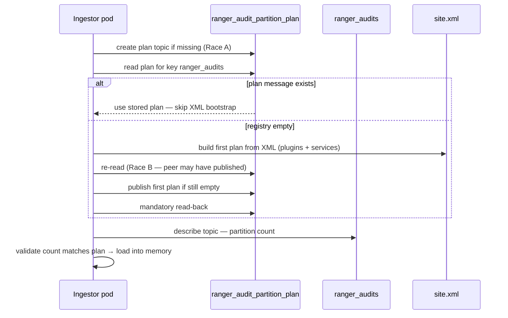
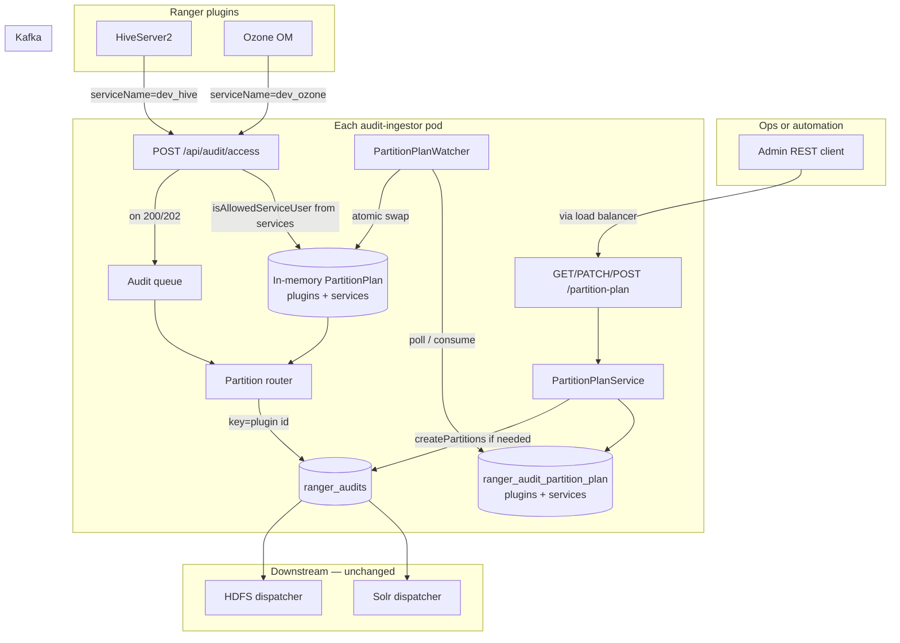
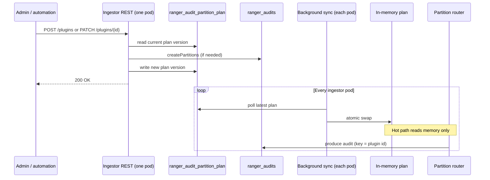
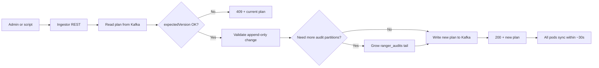

<!--
Licensed to the Apache Software Foundation (ASF) under one
or more contributor license agreements.  See the NOTICE file
distributed with this work for additional information
regarding copyright ownership.  The ASF licenses this file
to you under the Apache License, Version 2.0 (the
"License"); you may not use this file except in compliance
with the License.  You may obtain a copy of the License at

  http://www.apache.org/licenses/LICENSE-2.0

Unless required by applicable law or agreed to in writing,
software distributed under the License is distributed on an
"AS IS" BASIS, WITHOUT WARRANTIES OR CONDITIONS OF ANY
KIND, either express or implied.  See the License for the
specific language governing permissions and limitations
under the License.
-->

# Dynamic ingestor registry for Ranger audit-ingestor — guide for everyone

This guide explains **why** and **how** Ranger moves from **static** ingestor configuration (XML at startup) to a **dynamic unified registry** at runtime — **without restarting** audit-ingestor.

It covers both:

1. **Kafka partition routing** — which plugin uses which `ranger_audits` partitions  
2. **Service allowlist** — which principals may `POST /api/audit/access` for each Ranger repo  

Both live in one Kafka document on **`ranger_audit_partition_plan`** (`plugins`, `buffer`, and `services`). One REST API: **`/api/audit/partition-plan`**.

It is written for operators, architects, and reviewers who need a shared mental model — **without reading the codebase**.

**Confluence:** [Dynamic Ingestor Registry Guide (Ranger Audit Ingestor)](https://cloudera.atlassian.net/wiki/spaces/ENG/pages/12043681813) (child of [Ranger Engineering](https://cloudera.atlassian.net/wiki/spaces/ENG/pages/759726545/Ranger+Engineering))

**Related design docs:** [README-DYNAMIC-SERVICE-ALLOWLIST-DESIGN.md](README-DYNAMIC-SERVICE-ALLOWLIST-DESIGN.md) · [DESIGN-KAFKA-DYNAMIC-PARTITIONING.md](DESIGN-KAFKA-DYNAMIC-PARTITIONING.md)

## 1. What problem are we solving?

Ranger plugins (HDFS, Hive, Trino, Ozone OM, etc.) send audit events to **audit-ingestor**, which writes them to Kafka (`ranger_audits`).

Ingestor performs **two** configuration jobs:

| Job | Question | Static today | Dynamic goal |
|-----|----------|--------------|--------------|
| **Service allowlist** | May this Kerberos principal POST audits claiming repo `R`? | XML `service.<repo>.allowed.users` at startup | `services` map in unified registry |
| **Partition routing** | After accept, which Kafka partition? | XML `configured.plugins` at startup | `plugins` / `buffer` in unified registry |

**Today (static mode):**

- Allowlist and partition layout are defined in **XML** at startup.
- Adding a repo or plugin usually means: edit XML → **restart ingestor** on every pod.

**Goal (dynamic mode):**

- Change allowlist **and** partition assignments **while ingestor is running**.
- Onboard a new plugin/repo without reshuffling existing partition assignments (append-only).
- Keep all ingestor replicas consistent via one shared Kafka compacted topic.

---

## 2. Core ideas (plain language)

### Kafka topic partitions

Think of a Kafka topic as a queue split into numbered lanes: partition `0`, `1`, `2`, …

- Each audit event is routed to **one** partition based on the plugin id (Kafka record **key**).
- More partitions → more parallel consumption downstream (Solr/HDFS dispatchers).

Kafka allows **increasing** partition count; it does **not** support shrinking.

### Plugin id

The plugin id (also called agent id / app id) identifies the source of the audit — e.g. `hdfs`, `hiveServer2`, `trino`.

### Partition plan (unified registry document)

A **partition plan** is a versioned JSON document stored in `ranger_audit_partition_plan`. It answers:

- For each known plugin: **which partition numbers** may receive its audits? (`plugins` + `buffer`)
- For each Ranger service repo: **which short usernames** may `POST /access`? (`services`)
- What is the current **`topicPartitionCount`** (must match Kafka)?

Example (simplified):

```json
{
  "topic": "ranger_audits",
  "version": 12,
  "topicPartitionCount": 48,
  "plugins": {
    "hdfs":        { "partitions": [0, 1, 2, 3, 4, 5] },
    "hiveServer2": { "partitions": [6, 7, 8, 9, 10, 11] }
  },
  "buffer": { "partitions": [12, 13, 14, "... through 47 ..."] },
  "services": {
    "dev_hive":  { "allowedUsers": ["hive"] },
    "dev_ozone": { "allowedUsers": ["om", "ozone"] },
    "dev_trino": { "allowedUsers": ["trino"] }
  }
}
```

The `version` field increments on every successful admin change (optimistic locking) — **one version** for routing and allowlist mutations.

Every ingestor pod uses the **same** document so routing and authorization stay consistent.

### Service allowlist (`POST /api/audit/access`)

Plugins authenticate (Kerberos/JWT), then ingestor checks `services[serviceName].allowedUsers` (short names after `auth_to_local`). Failure → **403** before any Kafka produce. This check is **orthogonal** to partition routing but stored in the **same** registry document when dynamic mode is on.

### Unified registry (source of truth)

The live plan lives in **durable shared storage** that all ingestor replicas read — a Kafka **compacted** topic (`ranger_audit_partition_plan`).

- No new database or ZooKeeper dependency.
- Survives pod restarts.
- All replicas see the same latest plan.

### Append-only growth

When a plugin needs more capacity:

1. Increase the audit topic’s partition count (add lanes at the **tail**).
2. Assign **only the new** partition numbers to that plugin.
3. **Do not** move partitions away from other plugins.

### Buffer partitions

Plugins not yet in the plan (or newly appearing in the fleet) go to **buffer** partitions until an operator **promotes** them to dedicated partitions.

---

## 3. Today vs proposed (at a glance)

| | Static (today) | Dynamic (unified registry) |
|---|----------------|---------------------------|
| **Where config lives** | XML on each pod at startup | `ranger_audit_partition_plan` (`plugins` + `services`) |
| **Change allowlist or routing** | Edit XML + restart | `/api/audit/partition-plan` REST; no restart |
| **Add new plugin/repo** | XML + restart | `POST .../plugins` (onboard with mandatory `services`) |
| **Scale hot plugin** | Edit overrides + restart | `PATCH .../plugins/{pluginId}` (append-only tail partitions) |
| **Multi-replica ingestor** | Same XML if synced via ConfigMap | All pods watch same Kafka document |
| **Feature flag** | Default behavior | `ranger.audit.ingestor.kafka.partition.plan.dynamic.enabled=true` |

---

## 4. Static → dynamic cutover — direct answers

**Goal:** Turn on dynamic mode so each plugin keeps sending audits to the **same Kafka partitions** it uses today — no surprise rerouting on cutover day.

### When dynamic mode is off

| Question | Answer |
|----------|--------|
| Is `ranger_audit_partition_plan` created? | **No** — the plan topic is not created or used. |
| How is routing decided? | From XML at startup (static mode), same as today. |
| Is there a background plan sync? | **No**. |

### When dynamic mode is on

| Question | Answer |
|----------|--------|
| Is the plan topic created? | **Yes** — on first startup that needs the registry. |
| Where does every ingestor get the plan? | From `ranger_audit_partition_plan` (compacted topic), kept in memory on each pod. |
| Can XML edits change live routing? | **No** (once a plan message exists in Kafka). Runtime changes go through REST. |

### How “same partitions per plugin” is achieved on cutover

Ingestor does **not** read Kafka to discover which plugin owns which partition. Kafka stores audit **records**, not plugin ownership.

Preservation works because the **first published plan** uses the **same layout rules as static mode**:

| Piece | Static today | Dynamic (first plan from XML) |
|-------|--------------|-------------------------------|
| Plugin order | `configured.plugins` list | Same list |
| Partitions per plugin | Default + per-plugin overrides | Same |
| Layout | Contiguous ranges (hdfs → 0–2, next → 3–5, … buffer tail) | Same ranges as explicit partition ID lists |
| Within-plugin pick | Round-robin per plugin id | Same round-robin |
| Unknown plugin | Hash into buffer | Same buffer pool |

**What Kafka is used for at bootstrap:**

| Step | Reads from | Purpose |
|------|------------|---------|
| Build first plan (empty registry) | **XML only** | Plugin list, overrides, buffer → partition lists |
| Install plan (every pod) | **Kafka AdminClient** on `ranger_audits` | **Total** partition count only — must match `topicPartitionCount` in plan |
| Route each audit | **In-memory plan** | No per-event Kafka read |

**Brownfield (existing production cluster):** Auto-bootstrap from XML is safe only when **XML, ingestor startup logs, and `kafka-topics --describe ranger_audits` all agree**. If they differ, **pre-load the plan into Kafka before enabling dynamic** (operator publishes JSON to the plan topic while dynamic is still off).

### Plan already in Kafka vs empty registry



| Situation | What each pod does |
|-----------|-------------------|
| Plan **message** already in `ranger_audit_partition_plan` | Read and use it; **do not** publish a new plan from XML |
| Plan topic exists but **no message** yet | One pod publishes the first plan; others re-read and adopt the same plan (**Race B**) |
| Several pods create the plan **topic** at once | Idempotent create — **Race A**; “already exists” is success |

**Bootstrap logic (summary):** read plan → if missing, build from XML → re-read → publish if still missing → mandatory read-back → validate partition count → install in memory.

After the first plan is stored in Kafka, **Kafka is the source of truth** for routing.

### Multi-pod race — is it implemented?

| Race | Scenario | Resolution |
|------|----------|------------|
| **A** | Several pods create `ranger_audit_partition_plan` topic together | Idempotent topic create |
| **B** | Several pods publish the **first** plan when registry is empty | Re-read before and after publish; all pods install the same plan from Kafka |

**Your rule:** *If the plan topic exists but no plan message → add the plan; otherwise use the plan from the topic* — **Yes, implemented** via the bootstrap flow above.

---

## 5. How dynamic mode works (end-to-end)

| Plane | Kafka topic | Traffic | Who reads/writes |
|-------|-------------|---------|------------------|
| **Data** | `ranger_audits` | High — every audit event | Plugins → ingestor → dispatchers |
| **Control (unified registry)** | `ranger_audit_partition_plan` (compacted) | Low — rare routing + allowlist changes | `/api/audit/partition-plan` REST + `PartitionPlanWatcher` |

The registry is **configuration**, not audit data. Ingestor keeps the current document **in memory**; only the watcher and REST handlers touch the plan topic.

### Architecture (control plane vs data plane)



### First startup — seeding the plan (once per cluster)

When dynamic mode starts and the plan registry is **empty**:

1. Ingestor enables dynamic mode.
2. Watcher finds no document in `ranger_audit_partition_plan`.
3. Ingestor reads XML (`configured.plugins` if set, else buffer-only bootstrap from `kafka.topic.partitions`; overrides, buffer, and `service.*.allowed.users`).
4. Ingestor builds and publishes the **first document** (`plugins` + `services`) to the compacted topic.
5. Ingestor loads that document into memory and begins enforcing allowlist + routing.

**After that:** additional pods and restarts **read Kafka only** — they do not re-build from XML.

### Every audit — the hot path

The plan topic is **not** read on this path.

```text
Plugin POST /api/audit/access?serviceName=dev_hive&appId=hiveServer2
        │
        ├─ 401  Authentication failed
        ├─ 403  services[dev_hive] does not include short username → STOP
        └─ 200/202  Allowlist passed → partition router → ranger_audits
```

1. Plugin POSTs audit to ingestor (authenticate).
2. `isAllowedServiceUser` reads **in-memory** `services` map (or static XML when dynamic off).
3. Partition router reads **in-memory** `plugins` / `buffer`.
4. Known plugin → round-robin within its partition list; unknown → buffer.
5. Record written to `ranger_audits`.

### Changing the plan — admin or automation

**On the pod that receives the REST call:**

1. Read current plan from Kafka.
2. Validate append-only rules.
3. Grow `ranger_audits` tail if needed (Kafka AdminClient).
4. Write new plan **version** to compacted topic.
5. Return **200 OK** or **409 Conflict** (stale `expectedVersion`).

**On every ingestor pod (~30s sync interval):**

1. Background sync picks up new plan version.
2. Validates against live `ranger_audits` partition count.
3. Swaps plan in memory — **no restart**.



### Rules to remember

- **Two topics, two jobs** — plan topic = unified config (`plugins` + `services`); audit topic = data.
- **Memory on the hot path** — no per-audit read of the plan topic.
- **Kafka is the source of truth** after the first document is published.
- **Append-only growth** — new partitions only at the tail of `ranger_audits`.
- **All pods must agree** — every ingestor syncs from the same compacted topic.
- **Allowlist and routing are separate checks** — 403 on `/access` is allowlist; wrong partition is routing.

---

## 6. Admin REST API (control plane)

When dynamic mode is on, operators change routing **and** allowlists through **`/api/audit/partition-plan`** on **any** pod (usually via load balancer). Mutations are written to `ranger_audit_partition_plan`; every pod picks up changes through `PartitionPlanWatcher` (~30s).

**Auth:** Kerberos or JWT. When `kafka.partition.plan.allowed.users` is set, only those short names may call partition-plan REST (plugin users must not). Dynamic mode off → all partition-plan calls return **503**.

### Endpoints (three only)

| Method | Path | Purpose |
|--------|------|---------|
| `GET` | `/api/audit/partition-plan` | Read current plan (`plugins`, `buffer`, `services`, `version`) |
| `POST` | `/api/audit/partition-plan/plugins` | **Onboard** plugin: dedicated partitions + service allowlists (one version bump) |
| `PATCH` | `/api/audit/partition-plan/plugins/{pluginId}` | **Update** onboarded plugin: scale and/or service allowlist mutations |

Base URL example: `https://<ingestor-host>:7081/api/audit/partition-plan`

All mutations require **`expectedVersion`** from the last `GET`. Stale version → **409 Conflict** + current plan in body.

**Removed (consolidated above):** `PATCH /api/audit/partition-plan`, `POST /api/audit/partition-plan/services`, separate promote-only / scale-only flows.

> **Future work (not implemented):** bootstrap **v0** split — seeding `services` from XML separately from plugin partition assignments. Current bootstrap still publishes a single v1 plan from XML.

### Common operations

**Read plan**

```http
GET /api/audit/partition-plan
→ 200 + JSON plan (note the "version" field)
```

**Onboard plugin** — dedicated partitions + allowlists in one call (`services` is **required** and must be non-empty):

```json
POST /api/audit/partition-plan/plugins
{
  "pluginId": "hiveServer2",
  "partitionCount": 3,
  "expectedVersion": 1,
  "services": {
    "dev_hive":  { "allowedUsers": ["hive"] },
    "dev_hive2": { "allowedUsers": ["hive2"] }
  }
}
```

Each service entry is stored with `pluginId` for ownership tracking.

**Update plugin** — scale and/or mutate allowlists scoped to `{pluginId}` (at least one delta required):

```json
PATCH /api/audit/partition-plan/plugins/hiveServer2
{
  "expectedVersion": 2,
  "addServices":    { "dev_hive3": { "allowedUsers": ["hive3"] } },
  "removeServices": ["dev_hive2"],
  "additionalPartitions": 2
}
```

| Field | Purpose |
|-------|---------|
| `additionalPartitions` | int ≥ 1 — append tail partition IDs (append-only) |
| `addServices` | map repo → `{ "allowedUsers": [...] }` |
| `updateServices` | map repo → `{ "allowedUsers": [...] }` — replace allowlist for repos owned by `{pluginId}` |
| `removeServices` | list of repo names to remove (scoped to `{pluginId}`) |

Success → **200** + updated plan JSON (version incremented on change).  
Repeating the same onboard or update delta (with matching `expectedVersion`) → **200** + current plan JSON with **no** registry write or version bump.  
State conflict (resource exists but request differs, e.g. different partition count) → **400**.  
Stale version → **409** + current plan in body.

### What happens inside one REST call



| Step | What the ingestor does |
|------|------------------------|
| 1 | Authenticate caller; check `kafka.partition.plan.allowed.users` when configured |
| 2 | Read current plan from `ranger_audit_partition_plan` |
| 3 | Reject if `expectedVersion` does not match |
| 4 | Compute new plugin lists (append-only — no reshuffling existing slots) |
| 5 | If new partition IDs are needed → grow `ranger_audits` **first** |
| 6 | Publish new plan version to Kafka |
| 7 | Return updated plan JSON |

**GET** is cheap (memory). **POST / PATCH** always goes through Kafka so all pods converge on the same plan.

---

## 7. Operator workflow: onboarding a plugin or repo

**Recommended:** one `POST /api/audit/partition-plan/plugins` with a **non-empty `services` map** — allowlist and dedicated partitions in one plan version.

### Stage 0 — Create service in Ranger Admin

1. Create service `dev_trino` in Policy Manager; set `policy.download.auth.users`.
2. Configure plugin audit destination → ingestor URL (`:7081`).

### Stage 1 — Onboard via unified registry

```http
POST /api/audit/partition-plan/plugins
```

Include `pluginId`, `partitionCount`, `expectedVersion`, and at least one repo in `services` (see [§6](#6-admin-rest-api-control-plane)).

All ingestors apply within ~30s. **No restart** required.

### Stage 2 — Verify plugin POST

Expect **200/202** on `/access`, not **403**.

### Stage 3 — Scale or change allowlists (optional)

Call `PATCH /api/audit/partition-plan/plugins/{pluginId}` to add tail partitions, add/update/remove repos, or combine all in one version bump.

**Do not** edit `ranger-audit-ingestor-site.xml` on one pod for runtime changes. XML is only for **initial bootstrap** when the registry is empty.

---

## 8. Operator workflow: partition-only changes

Use when an onboarded plugin already has allowlists and you only need routing changes (scale tail partitions).

### Stage 0 — Plugin appears (unknown)

- Audits use **buffer** partitions.
- Monitor volume per plugin id.

### Stage 1 — Onboard plugin (partitions + allowlists)

- Call `POST /api/audit/partition-plan/plugins` with mandatory `services` (see [§6](#6-admin-rest-api-control-plane)).
- All ingestors apply within ~30s. **No restart** required.

### Stage 2 — Scale a hot plugin

- Call `PATCH /api/audit/partition-plan/plugins/{pluginId}` with `additionalPartitions`.
- Dispatchers rebalance automatically when the audit topic grows.

**Do not** edit `ranger-audit-ingestor-site.xml` on one pod for runtime changes. XML is only for **initial bootstrap** when the plan registry is empty.

---

## 9. Configuration (dynamic mode)

| Property | Purpose | Example |
|----------|---------|---------|
| `ranger.audit.ingestor.kafka.partition.plan.dynamic.enabled` | Turn dynamic unified registry on/off | `false` (default) = static XML |
| `ranger.audit.ingestor.kafka.partition.plan.topic` | Compacted registry topic name | `ranger_audit_partition_plan` |
| `ranger.audit.ingestor.kafka.partition.plan.refresh.interval.ms` | How often pods reload plan | `30000` |
| `ranger.audit.ingestor.kafka.partition.plan.allowed.users` | Who may call partition-plan REST | `admin,ops` |
| `ranger.audit.ingestor.service.<repo>.allowed.users` | Static bootstrap per-repo allowlist | `hive`, `om,ozone`, … |
| `ranger.audit.ingestor.auth.to.local` | Principal → short name rules | Same as Hadoop `hadoop.security.auth_to_local` |

When dynamic is **off**, routing and allowlist are fixed from XML at startup; the plan topic is not used.

When dynamic is **on** and the registry is **empty**, the first ingestor pod seeds the plan (`plugins` + `services`) from XML. Later pods and restarts read **Kafka only**.

---

## 10. FAQ

### Basics

**Why plugin-based partitioning?**  
Hot plugins (HDFS, Hive) can get dedicated Kafka lanes so they do not starve others. Unknown plugins share a buffer until you promote them.

**What is the difference between static and dynamic mode?**  
Static: routing is computed once from XML at startup; changes need restart. Dynamic: routing lives in Kafka; admins change it via REST while ingestor keeps running.

**Why not store the plan in Postgres or ZooKeeper?**  
Ingestor already requires Kafka. A compacted plan topic adds no new infrastructure.

**Why not edit XML on a running pod?**  
Each pod has its own copy; edits are not shared, not durable, and are lost on restart. Runtime changes belong in the plan topic via REST.

**Can I change routing by editing XML while dynamic mode is on?**  
No for live routing. Ingestor uses the Kafka plan in memory, not XML edits on disk. Update XML only when preparing static rollback or documenting the intended layout.

**Can I decrease `ranger_audits` partition count?**  
No. Kafka does not support shrinking partitions. You can only add partitions at the tail.

### Two topics and sync

**What are the two Kafka topics?**  
`ranger_audits` = audit data (high volume). `ranger_audit_partition_plan` = routing config (low volume, compacted).

**Does every audit POST read the plan topic?**  
No. Each audit uses the plan already in **memory** on that pod. Only background sync and REST mutations touch the plan topic.

**How do all ingestor pods stay in sync?**  
Every pod watches the same compacted plan topic (default every 30s) and swaps the new plan into memory.

**What happens when a pod restarts?**  
It reads the latest plan from Kafka (if dynamic is on). The plan survives in Kafka across crashes.

**Do Solr and HDFS dispatchers need the partition plan?**  
No. They consume **all** partitions of `ranger_audits`. Only ingestor uses the plan to **choose** which partition to write to.

**Will changing the plan break consumers?**  
Adding partitions triggers normal consumer rebalance. Existing plugin slots keep the same partition numbers if you follow append-only promote/scale rules.

### Plan content and routing

**What is the buffer?**  
Partitions reserved for plugins that are not yet promoted (or newly seen plugin ids). Promote moves a plugin from buffer to dedicated slots.

**What does append-only mean?**  
When scaling, only **new** partition numbers at the end of `ranger_audits` are assigned. Existing plugins keep the same partition IDs in the same order.

**How is a partition chosen inside a plugin’s list?**  
Round-robin per plugin id — same behavior as static mode.

**Where does an unknown plugin send audits?**  
To the buffer partition pool (hash-based pick within buffer list in dynamic mode).

### REST and concurrency

**Do I need to restart ingestor after promote or scale?**  
No. Background sync applies the new plan within about one refresh interval (~30s).

**What is `expectedVersion`?**  
The plan `version` you believe is current when you write. If someone else published first, your version is stale and you get **409**.

**What should I do on HTTP 409?**  
Another writer published a newer plan. Use the plan in the 409 response (or `GET` again), note the new `version`, and retry your change with that `expectedVersion`.

**Why grow `ranger_audits` before publishing a new plan?**  
The plan must not reference partition IDs that do not exist yet. The server grows the audit topic tail first, then writes the plan.

**Why does promote return 400?**  
Common cases: plugin already has dedicated partitions, invalid partition count, or plugin id missing. Scale returns 400 if the plugin is not in the plan yet (promote it first).

**What do the HTTP status codes mean?**  
**503** — dynamic mode is off, or the server could not grow `ranger_audits` (Kafka admin failure). **400** — validation failed (bad shape, append-only violation, `topicPartitionCount` ≠ Kafka). **409** — version conflict; retry with the plan body returned in the response.

**Do dispatchers need reconfiguration after scale?**  
No. Consumer groups rebalance automatically when partition count increases. Tune consumer threads only if you see sustained lag.

### Cutover and bootstrap

**When is `ranger_audit_partition_plan` created?**  
Only when dynamic mode is enabled. With dynamic off, the topic is not created or used.

**Does bootstrap read Kafka to learn plugin → partition mapping?**  
No. The first plan is built from XML (same layout as static mode). Kafka is used for **total** partition count validation and as the durable registry.

**Can I publish the plan to Kafka before enabling dynamic mode?**  
Yes — recommended for brownfield clusters. Ingestor will read your pre-loaded plan and will not replace it with a fresh XML bootstrap.

**Greenfield vs brownfield cutover — what is different?**  
Greenfield: enable dynamic on an empty registry; first pod seeds from XML (empty `configured.plugins` → buffer-only plan sized by `kafka.topic.partitions`). Brownfield: export static layout, pre-seed the plan topic (or set `configured.plugins` in XML to match production), then enable dynamic and verify every pod shows the same plan.

**Does the `configured.plugins` XML list still matter in dynamic mode?**  
Yes for **bootstrap only** when the registry is empty. After the first plan exists, runtime routing changes go through REST, not by editing that list.

**How do I verify cutover succeeded?**  
`GET /api/audit/partition-plan` on every pod (same `version`); plugin lists match your saved static logs; `topicPartitionCount` matches `kafka-topics --describe ranger_audits`.

**How do I roll back to static mode?**  
Export current plan via `GET`, align XML to that layout if needed, set `dynamic.enabled=false`, rolling restart. Plan topic remains but is ignored.

**What if multiple pods start together with an empty registry?**  
Race A: idempotent plan-topic create. Race B: re-read before/after first publish; all pods install the same plan. See [§4](#4-static--dynamic-cutover--direct-answers).

### Troubleshooting

**Ingestor fails startup after enabling dynamic — what now?**  
Often Kafka unreachable or cannot create/read the plan topic. Fix Kafka connectivity; keep dynamic off until Kafka is healthy. With Kafka down at startup, ingestor should **not** come up healthy in dynamic mode.

**Pods show different plan versions — what now?**  
Wait one refresh interval after a change. If still mismatched, check plan topic readability and watcher logs on the lagging pod.

**Does audit recovery / local spool behavior change?**  
No. Per-pod spool and retry when Kafka is briefly unavailable works as today.

**Does this replace producer throughput tuning?**  
No. Batch size, linger, and compression are separate settings.

**Who can call partition-plan REST?**  
Ops principals in `kafka.partition.plan.allowed.users` when configured (Kerberos/JWT). Plugin users (`hive`, `om`) send audits via `/access` — they must **not** mutate the registry.

### Service allowlist (`POST /api/audit/access`)

**Why do we need an allowlist if Kerberos already authenticates the plugin?**  
Authentication proves *who* connected. Authorization proves they may **claim audits for this repo**. Kerberos success alone would let any daemon POST as any `serviceName`.

**Does dynamic partition plan remove the allowlist check?**  
**No.** Partition routing runs **after** `/access` accepts the batch. **403** on `/access` is always a **service allowlist** failure (not routing).

**What is `serviceName`?**  
The Ranger Policy Manager **repo name** (e.g. `dev_hive`), not the service type (`hive`).

**What goes in `allowedUsers`?**  
Short names after `auth_to_local` — same values as `policy.download.auth.users` on the Ranger service (or a subset).

**Consistency rule (ops discipline):**  
`allowedUsers for repo R ⊆ { short names from policy.download.auth.users for R in Ranger Admin }`. Ranger Admin does not auto-sync in Phase 1; ingestor may reject REST writes that violate subset rules (strict mode).

**Three layers — do not merge:**

| Layer | Who | Purpose |
|-------|-----|---------|
| **Service allowlist** (plugin POST) | Daemons (`hive`, `om`, …) | May this principal POST audits for repo `R`? |
| **Partition plan** (Kafka routing) | Ingestor internal | Which Kafka partition after accept? |
| **Admin REST APIs** | Ops (`admin`, `ops`, …) | Who may change the unified registry via `/api/audit/partition-plan`? |

**If you see…**

| Symptom | Layer | Fix |
|---------|-------|-----|
| **401** on `/access` | Authentication | Plugin / ingestor Kerberos, keytabs, SPNEGO |
| **403** on `/access` | **Service allowlist** | Add repo via `POST .../plugins` (onboard) or `PATCH .../plugins/{pluginId}` (`addServices` / `updateServices`) |
| Audits accepted but wrong Kafka partition | **Partition plan** | `POST .../plugins` (onboard) / `PATCH .../plugins/{pluginId}` (scale) |
| New repo in Admin, audits still **403** | Allowlist not onboarded | `POST .../plugins` or `PATCH .../plugins/{pluginId}` with `addServices` |
| Allowlist OK, audits in buffer partition | Partition plan not onboarded | `POST .../plugins` with `partitionCount` + `services` |

**Plugin gets 403 but Kerberos works — what now?**  
Short name not in `services[repo].allowedUsers`, wrong `serviceName`, or `auth_to_local` mismatch.

**New repo in Admin UI, still 403?**  
Creating the service in Admin does not auto-update ingestor (Phase 1). Call `POST /api/audit/partition-plan/plugins` (new plugin) or `PATCH .../plugins/{pluginId}` with `addServices`.

**Do I need both allowlist and partition plan for a new plugin?**  
Yes for full production onboarding. `POST /api/audit/partition-plan/plugins` requires a non-empty `services` map and assigns dedicated partitions in **one** plan version.

**Is there a bundled API?**  
`POST /api/audit/partition-plan/plugins` registers `services[repo]` allowlists and promotes plugin partitions atomically.

---

## 11. Docs

| Doc | Purpose |
|-----|---------|
| [README-DYNAMIC-SERVICE-ALLOWLIST-DESIGN.md](README-DYNAMIC-SERVICE-ALLOWLIST-DESIGN.md) | Service allowlist design (unified `services` map) |
| [DESIGN-KAFKA-DYNAMIC-PARTITIONING.md](DESIGN-KAFKA-DYNAMIC-PARTITIONING.md) | Partition plan architecture |
| [README-KAFKA-PARTITION-PLAN-REGISTRY-REST.md](README-KAFKA-PARTITION-PLAN-REGISTRY-REST.md) | Partition-plan Kafka topic + REST |
| [README-KAFKA-PARTITION-PLAN-IMPLEMENTATION.md](README-KAFKA-PARTITION-PLAN-IMPLEMENTATION.md) | Partition-plan implementation phases |
| [DESIGN-KAFKA-AUDIT-SERVER.md](DESIGN-KAFKA-AUDIT-SERVER.md) | End-to-end audit pipeline |
| [PR #1017](https://github.com/apache/ranger/pull/1017) (RANGER-5645) | Static Docker allowlist fix |
