<!--
Licensed to the Apache Software Foundation (ASF) under one
or more contributor license agreements.  See the NOTICE file
distributed with this work for additional information
regarding copyright ownership.  The ASF licenses this file
to you under the Apache License, Version 2.0 (the
"License"); you may not use this file except in compliance
with the License.  You may obtain a copy of the License at
  http://www.apache.org/licenses/LICENSE-2.0
Unless required by applicable law or agreed to in writing,
software distributed under the License is distributed on an
"AS IS" BASIS, WITHOUT WARRANTIES OR CONDITIONS OF ANY
KIND, either express or implied.  See the License for the
specific language governing permissions and limitations
under the License.
-->

# Kafka-backed partition plan registry + REST (detailed design)

> **Consolidated design (start here for review):** [DESIGN-KAFKA-DYNAMIC-PARTITIONING.md](DESIGN-KAFKA-DYNAMIC-PARTITIONING.md) — architecture, flows, diagrams, brownfield migration, and Q&A in one document. This README is the deep dive on Kafka registry + REST semantics.

This document describes the **recommended** approach for **dynamic plugin onboarding** and **dynamic partition scaling** in `audit-ingestor` without Postgres or ZooKeeper.

**Related docs:**

- **Consolidated design:** [DESIGN-KAFKA-DYNAMIC-PARTITIONING.md](DESIGN-KAFKA-DYNAMIC-PARTITIONING.md)
- Current static partitioning: `README-KAFKA-PLUGIN-PARTITIONING.md`
- Design summary + checklist: `README-KAFKA-PLUGIN-PARTITIONING-DYNAMIC-DESIGN.md`
- **Phased implementation plan:** [README-KAFKA-PARTITION-PLAN-IMPLEMENTATION.md](README-KAFKA-PARTITION-PLAN-IMPLEMENTATION.md)
- Producer performance gaps: `README-KAFKA-PRODUCER-PERFORMANCE.md`
- Solr/HDFS consumers: `README-KAFKA-DISPATCHERS.md`

---

## Problem we are solving

Today (`README-KAFKA-PLUGIN-PARTITIONING.md`):

- Plugin → partition mapping is computed once at ingestor startup from XML.
- Changing `configured.plugins` or overrides requires restart.
- Contiguous-range allocation **reshuffles** later plugins when an early plugin’s count changes.

Goal:

- **Onboard** plugins (e.g. trino) and **scale** hot plugins (e.g. hiveServer2) **without restart**.
- **No new infra** (no Postgres/ZooKeeper).
- **All ingestor replicas** use the same routing after a change.
- **Survive pod crash/restart** without losing the plan.

---

## High-level architecture

### In plain terms

There are **two separate Kafka topics** and **two different jobs**:

| Topic | What it stores | Who cares |
|-------|----------------|-----------|
| **`ranger_audit_partition_plan`** | Small JSON: which plugin uses which partition IDs | **Ingestor only** (config) |
| **`ranger_audits`** | Actual audit events | **Ingestor produces**, **Solr/HDFS consume** |

**Ingestor pods do three things:**

1. **Serve audits** — plugins POST `/access` → pick partition from **in-memory plan** → write to `ranger_audits` (fast; no Kafka read per audit).
2. **Watch the plan** — background thread reads `ranger_audit_partition_plan` and updates memory when the plan changes.
3. **Admin REST** — ops call `GET /api/audit/partition-plan`, `POST .../plugins` (onboard), or `PATCH .../plugins/{pluginId}` (update).

Solr and HDFS dispatchers **never read the plan**. They read **all** partitions of `ranger_audits`.

---

### Picture (control plane vs data plane)

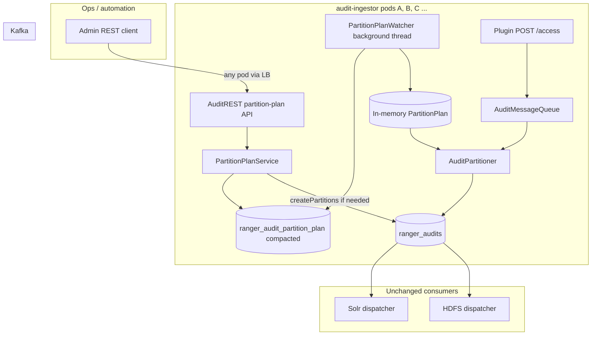

**Takeaway:** plan topic = **slow, rare config**; audit topic = **high volume data**. Only REST + watcher touch the plan topic.

---

### The three flows (step by step)

---

#### Flow 1 — Admin changes the plan

**When:** You onboard a plugin (e.g. trino) or give a hot plugin more partitions (e.g. hiveServer2).  
**How often:** Rare — ops or automation, not every audit.

| Step | What happens |
|------|----------------|
| 1 | Admin sends REST to **any** ingestor pod (`GET` to read, `POST .../plugins` to onboard, `PATCH .../plugins/{pluginId}` to update). |
| 2 | That pod reads the current plan from **`ranger_audit_partition_plan`** (e.g. version 4). |
| 3 | If more partitions are needed, pod grows **`ranger_audits`** via Kafka AdminClient. |
| 4 | Pod writes the **new plan** (version 5) to the compacted topic. |
| 5 | Pod returns **200 OK** to admin (or **409** if another pod updated first — retry with new version). |
| 6 | **Every ingestor pod** — background watcher loads version 5 into memory (~30s or on Kafka message). |
| 7 | **Solr / HDFS** — no config change; they rebalance only if `ranger_audits` got more partitions. |

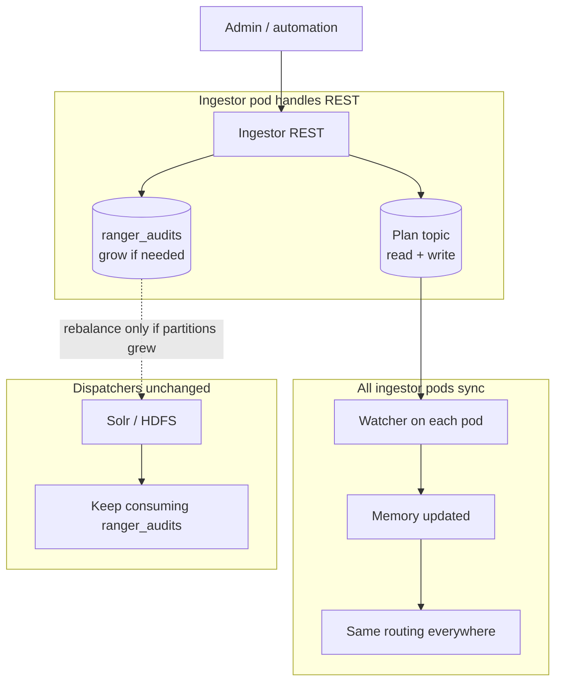

---

#### Flow 2 — Plugin sends an audit

**When:** Every time a Ranger plugin reports an access event.  
**How often:** High volume — this is the hot path.

| Step | What happens |
|------|----------------|
| 1 | Plugin sends **POST `/access`** to ingestor (any pod via load balancer). |
| 2 | Ingestor reads the plan **already in memory** (not from Kafka). |
| 3 | Ingestor finds partitions for this plugin id (`agentId`), e.g. hive → `[4,5,6,7,8,9]`. |
| 4 | Ingestor picks one partition (round-robin within that list). |
| 5 | Ingestor writes the audit event to **`ranger_audits`**. |

**Important:** This path **never** reads `ranger_audit_partition_plan`. Fast and cheap.

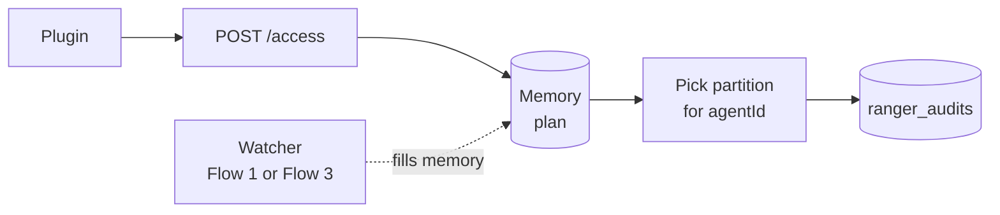

---

#### Flow 3 — Pod startup (first pod vs others)

**When:** Ingestor pod starts or restarts.  
**Goal:** Every pod ends up with the **same plan in memory**.

**Prerequisite for XML → Kafka bootstrap:** `ranger.audit.ingestor.kafka.partition.plan.dynamic.enabled=true`. If `false` or absent, legacy XML-only mode applies and **`ranger_audit_partition_plan` is not populated**.

| Situation | What the pod does |
|-----------|-------------------|
| **Pod 1** — plan topic is **empty** | Read XML → build plan **v1** → **write v1 to `ranger_audit_partition_plan`** → load into memory. |
| **Pod 2, 3, …** — plan **already in Kafka** | **Read plan from Kafka only** → load into memory. **Do not** use XML for routing. |
| **Any pod restarts** | Same as Pod 2+ — read from Kafka, not XML. |

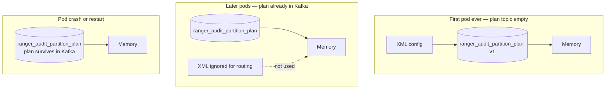

**Rule of thumb:** After v1 exists in Kafka, **Kafka is the source of truth** — not XML on the pod.

**Full bootstrap details** (XML properties, example v1 JSON, when bootstrap does *not* run): [Bootstrap and multi-pod startup → First pod: XML populates the plan topic](#first-pod-xml-populates-the-plan-topic).

---

### Who talks to what (quick reference)

| Actor | Reads plan topic | Writes plan topic | Reads/writes ranger_audits |
|-------|------------------|-------------------|----------------------------|
| Plugin audit POST | No | No | Produce only |
| PartitionPlanWatcher | Yes (background) | No | No |
| REST GET/POST/PATCH | Yes | Yes (POST/PATCH mutations) | AdminClient grow only |
| Solr dispatcher | No | No | Consume all partitions |
| HDFS dispatcher | No | No | Consume all partitions |

---

## Code map: design vs `audit-server` today

The dynamic partition plan is **design + README only** — the classes below marked **Proposed** do not exist in the repo yet. This section maps the design to **current audit-ingestor code** so you can see what to extend.

### Module layout

| Module | Path | Role |
|--------|------|------|
| **audit-ingestor** | `audit-server/audit-ingestor/` | HTTP REST, Kafka producer, recovery |
| **audit-common** | `audit-server/audit-common/` | Shared constants, `AuditMessageQueueUtils` (AdminClient) |
| **audit-dispatcher** | `audit-server/audit-dispatcher/` | Solr/HDFS consumers (unchanged by partition plan) |

### Design component → Java / config (exists today vs proposed)

| Design component | Status | Location in repo |
|------------------|--------|------------------|
| **`PartitionPlan`** (JSON model) | **Proposed** | New class, e.g. `audit-ingestor/.../partition/PartitionPlan.java` |
| **`PartitionPlanAllocator`** | **Proposed** | New — append-only tail allocation |
| **`PartitionPlanRegistry`** | **Proposed** | New — Kafka compacted topic read/write |
| **`PartitionPlanService`** | **Proposed** | New — REST handler logic |
| **`PartitionPlanWatcher`** | **Proposed** | New — background thread per pod |
| **`AuditPartitioner`** | **Exists** (static XML) | `audit-ingestor/.../kafka/AuditPartitioner.java` |
| **`AuditREST`** `/access` | **Exists** | `audit-ingestor/.../rest/AuditREST.java` |
| **`AuditREST`** `/partition-plan` | **Proposed** | Same file — new `@GET` / `@PATCH` / `@POST` methods |
| **`AuditMessageQueue`** | **Exists** | `audit-ingestor/.../kafka/AuditMessageQueue.java` |
| **`AuditProducer`** | **Exists** | `audit-ingestor/.../kafka/AuditProducer.java` |
| **Topic create + `createPartitions`** | **Exists** | `audit-common/.../AuditMessageQueueUtils.java` |
| **XML partition config** | **Exists** | `audit-ingestor/.../conf/ranger-audit-ingestor-site.xml` |
| **`partition.plan.dynamic.enabled`** etc. | **Proposed** | Not in `AuditServerConstants.java` or site XML yet |

---

### Flow 2 in code today (plugin POST → Kafka)

**Description:** Every plugin audit hits the same Java call chain today. Partition key is `agentId` (plugin id). `AuditPartitioner` picks the Kafka partition from **static XML** at startup (not from plan topic yet).

| Step | Class / file |
|------|----------------|
| 1 | `AuditREST.logAccessAudit()` — `audit-ingestor/.../rest/AuditREST.java` |
| 2 | `AuditDestinationMgr.logBatch()` — `audit-ingestor/.../producer/AuditDestinationMgr.java` |
| 3 | `AuditMessageQueue.log(batch)` — `audit-ingestor/.../kafka/AuditMessageQueue.java` |
| 4 | `AuditProducer.sendBatch()` — `audit-ingestor/.../kafka/AuditProducer.java` |
| 5 | `KafkaProducer` key=`agentId` → `AuditPartitioner.partition()` |
| 6 | Topic **`ranger_audits`** |

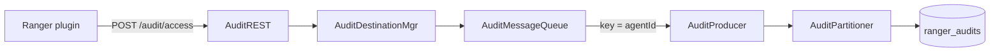

**Partition key** in `AuditMessageQueue.java` — `authzEvent.getAgentId()`.

**Custom partitioner** wired in `AuditProducer.java` when `configured.plugins` is set → `AuditPartitioner`.

---

### Static partitioning today (`AuditPartitioner` = future bootstrap v1 logic)

At startup, `configure()` reads the same XML properties the design uses for **first-pod bootstrap**. It builds **contiguous ranges** (not explicit JSON lists yet):

```56:102:audit-server/audit-ingestor/src/main/java/org/apache/ranger/audit/producer/kafka/AuditPartitioner.java
    public void configure(Map<String, ?> configs) {
        String propPrefix = AuditServerConstants.PROP_PREFIX_AUDIT_SERVER;

        String pluginsStr = getConfig(configs, propPrefix + AuditServerConstants.PROP_CONFIGURED_PLUGINS,  AuditServerConstants.DEFAULT_CONFIGURED_PLUGINS);
        configuredPlugins = pluginsStr.split(",");
        // ...
        defaultPartitionsPerPlugin = getIntConfig(configs, propPrefix + AuditServerConstants.PROP_TOPIC_PARTITIONS_PER_CONFIGURED_PLUGIN, ...);
        // ...
        for (int i = 0; i < configuredPlugins.length; i++) {
            String overrideKey = propPrefix + AuditServerConstants.PROP_PLUGIN_PARTITION_OVERRIDE_PREFIX + plugin;
            int partitionCount = getIntConfig(configs, overrideKey, defaultPartitionsPerPlugin);
            pluginPartitionCounts[i] = partitionCount;
        }
        // contiguous ranges → configuredPluginPartitionStart/End, bufferPartitionStart/Count
```

**Runtime routing** (round-robin for configured plugin, hash for buffer):

```117:151:audit-server/audit-ingestor/src/main/java/org/apache/ranger/audit/producer/kafka/AuditPartitioner.java
    public int partition(String topic, Object key, byte[] keyBytes, Object value, byte[] valueBytes, Cluster cluster) {
        // ...
        int pluginIndex = indexOfConfiguredPlugin(appId);
        if (pluginIndex >= 0) {
            // round-robin within plugin range
            return start + subPartition;
        } else {
            // Unconfigured plugin - use buffer partitions
            int p = Math.abs(appId.hashCode() % count) + start;
            return Math.min(p, numPartitions - 1);
        }
    }
```

**Dynamic design change:** replace fixed `int[]` ranges with `AtomicReference<PartitionPlan>` and explicit `[0,1,2,...]` lists from Kafka.

---

### Topic size + `AdminClient.createPartitions` (reuse for REST POST/PATCH)

Topic creation and partition **increase** already exist — the proposed `PartitionPlanService` should call the same patterns:

```49:116:audit-server/audit-common/src/main/java/org/apache/ranger/audit/utils/AuditMessageQueueUtils.java
    public static String createAuditsTopicIfNotExists(Properties props, String propPrefix) {
        // ...
        int    partitions           = getPartitions(props, propPrefix);
        // AdminClient.createTopics or updateExistingTopicPartitions
```

```230:249:audit-server/audit-common/src/main/java/org/apache/ranger/audit/utils/AuditMessageQueueUtils.java
            if (partitions > currentPartitions) {
                // ...
                newPartitionsMap.put(topicName, NewPartitions.increaseTo(partitions));
                CreatePartitionsResult createPartitionsResult = admin.createPartitions(newPartitionsMap);
                createPartitionsResult.all().get();
```

**Partition count from XML** (same inputs as bootstrap v1 JSON):

```330:365:audit-server/audit-common/src/main/java/org/apache/ranger/audit/utils/AuditMessageQueueUtils.java
    private static int getPartitions(Properties prop, String propPrefix) {
        String configuredPlugins = MiscUtil.getStringProperty(prop, propPrefix + "." + AuditServerConstants.PROP_CONFIGURED_PLUGINS, ...);
        if (configuredPlugins == null || configuredPlugins.trim().isEmpty()) {
            totalPartitions = MiscUtil.getIntProperty(prop, propPrefix + "." + AuditServerConstants.PROP_TOPIC_PARTITIONS, ...);
        } else {
            for (String plugin : configuredPlugins.split(",")) {
                int partitionCount = MiscUtil.getIntProperty(prop, overrideKey, defaultPartitionsPerPlugin);
                totalPartitions += partitionCount;
            }
            totalPartitions += bufferPartitions;
        }
        return totalPartitions;
    }
```

---

### REST today vs proposed admin API

**Exists** — plugin audit ingestion only:

| Endpoint | File |
|----------|------|
| `GET /audit/health` | `AuditREST.java` |
| `GET /audit/status` | `AuditREST.java` |
| `POST /audit/access` | `AuditREST.java` — auth via `allowed.users` per service |

**Proposed** — not in code yet:

| Endpoint | Intended location |
|----------|-------------------|
| `GET /api/audit/partition-plan` | `AuditREST.java` |
| `POST /api/audit/partition-plan/plugins` | `PartitionPlanService.onboardPlugin` |
| `PATCH /api/audit/partition-plan/plugins/{pluginId}` | `PartitionPlanService.updatePlugin` |

---

### Configuration constants today (`AuditServerConstants`)

Properties used for **legacy / bootstrap** partitioning (no `partition.plan.*` yet):

```56:85:audit-server/audit-common/src/main/java/org/apache/ranger/audit/server/AuditServerConstants.java
    public static final String PROP_TOPIC_PARTITIONS                         = "kafka.topic.partitions";
    public static final String PROP_PARTITIONER_CLASS                        = "kafka.partitioner.class";
    public static final String PROP_CONFIGURED_PLUGINS                       = "kafka.configured.plugins";
    public static final String PROP_TOPIC_PARTITIONS_PER_CONFIGURED_PLUGIN   = "kafka.topic.partitions.per.configured.plugin";
    public static final String PROP_PLUGIN_PARTITION_OVERRIDE_PREFIX         = "kafka.plugin.partition.overrides.";
    public static final String PROP_BUFFER_PARTITIONS                        = "kafka.topic.partitions.buffer";
    // ...
    public static final int    DEFAULT_PARTITIONS_PER_CONFIGURED_PLUGIN      = 3;
    public static final int    DEFAULT_BUFFER_PARTITIONS                     = 9;
```

**Sample XML** — `audit-ingestor/src/main/resources/conf/ranger-audit-ingestor-site.xml`:

- `ranger.audit.ingestor.kafka.configured.plugins`
- `ranger.audit.ingestor.kafka.topic.partitions.per.configured.plugin`
- `ranger.audit.ingestor.kafka.topic.partitions.buffer`
- `ranger.audit.ingestor.kafka.plugin.partition.overrides.*`

---

### Where new code plugs in

**Description:** Solid boxes = **exists today**. Dashed = **proposed**. Audit hot path unchanged; dynamic plan adds watcher + admin REST + plan topic.

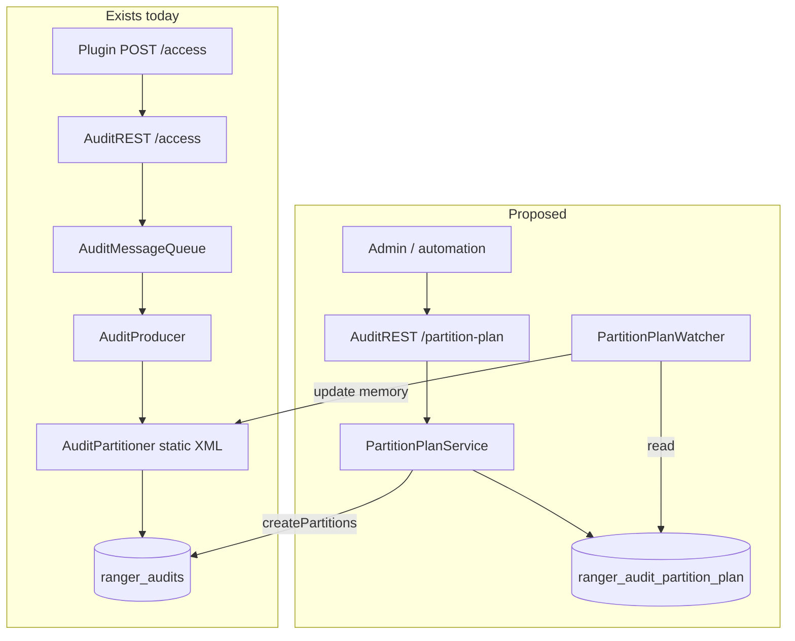

---

## Core components (new code)

| Component | Responsibility |
|-----------|----------------|
| **`PartitionPlan`** | Immutable snapshot: plugin → explicit partition ID list, buffer list, `version`, `topicPartitionCount`, `updatedAt` |
| **`PartitionPlanAllocator`** | Append-only rules: assign new tail partitions; never remove/reassign existing plugin partitions |
| **`PartitionPlanRegistry`** | Read/write plan to Kafka compacted topic |
| **`PartitionPlanService`** | Orchestrates GET/POST/PATCH: validate, allocate, AdminClient, registry write |
| **`PartitionPlanWatcher`** | Background thread on **every** ingestor pod; refreshes in-memory plan |
| **`AuditPartitioner` (modified)** | Route by plan: configured plugin → round-robin within its list; unknown → buffer list |
| **`AuditREST` (new endpoints)** | Admin API; AuthZ like `/access` |

### Existing code to reuse (already in repo)

**Description:** Build new partition-plan components on these classes — do not rewrite topic admin or produce plumbing.

| Reuse | Path | Use for |
|-------|------|---------|
| `AuditMessageQueueUtils.createAuditsTopicIfNotExists()` | `audit-common/.../AuditMessageQueueUtils.java` | Pattern for `createPlanTopicIfNotExists()` |
| `AuditMessageQueueUtils.updateExistingTopicPartitions()` | same | REST POST/PATCH → grow `ranger_audits` |
| `AuditProducer` | `audit-ingestor/.../kafka/AuditProducer.java` | Existing Kafka producer; plan topic produce |
| `AuditPartitioner` | `audit-ingestor/.../kafka/AuditPartitioner.java` | Add `AtomicReference<PartitionPlan>` |
| `AuditREST` + `isAllowedServiceUser()` | `audit-ingestor/.../rest/AuditREST.java` | Admin AuthZ pattern for `/partition-plan` |

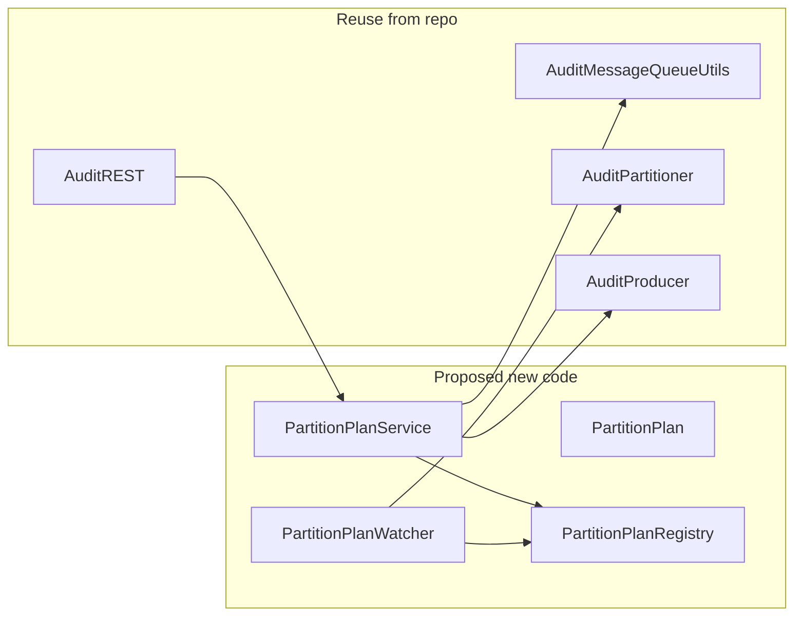

---

## Partition plan topic (`ranger_audit_partition_plan`)

Why a **separate** topic from `ranger_audits`:

- Audit topic carries high-volume events; plan is low-volume config.
- Compacted config topic gives durable “latest value per key” semantics (like Kafka’s own `__consumer_offsets` pattern).

Suggested topic config:

```properties
partitions=1
cleanup.policy=compact
min.compaction.lag.ms=0   # optional: faster visibility of new plan
```

**Key:** `ranger_audits` (audit topic name — allows multiple audit topics in future)  
**Value:** JSON `PartitionPlan`

When `dynamic.enabled=true`, each ingestor pod ensures this topic exists at startup via **`createPartitionPlanTopicIfNotExists()`** (implemented in `AuditMessageQueueUtils`; same AdminClient pattern as `createAuditsTopicIfNotExists()` for `ranger_audits`). If the topic is missing, the pod creates it with **1 partition** and **`cleanup.policy=compact`**.

---

## Compacted topic semantics: append, retention, and performance

This section documents how plan **writes** and **reads** behave on `ranger_audit_partition_plan` — use it when reviewing or extending the design (Phase 2 registry, Phase 3 watcher).

### Does `writePlan` update the same record?

**No — Kafka does not update records in place.** Each `writePlan` (REST POST onboard / PATCH update, bootstrap publish) **appends a new record** to partition 0:

```text
offset 10: key=ranger_audits  value=plan v1
offset 11: key=ranger_audits  value=plan v2
offset 12: key=ranger_audits  value=plan v3
```

| Concept | Meaning |
|---------|---------|
| **Physical write** | Always **append** (new offset) |
| **Logical update** | Same **key** (`ranger_audits`) + compaction → only **latest value per key** matters |
| **`version` in JSON** | Application-level optimistic locking (REST `expectedVersion`); not a Kafka in-place edit |

With `cleanup.policy=compact`, the log cleaner eventually **removes older records for the same key** and retains the **latest** value. After compaction, you typically have **~one record per audit topic key**, not an ever-growing history.

### Phase 2 read strategy (`KafkaPartitionPlanRegistry.readPlan`)

Current implementation (admin/bootstrap reads — **not** the audit hot path):

1. Assign partition 0, `seekToBeginning`.
2. Poll until empty; for each record with matching key, parse JSON into `latest`.
3. Return **last matching record** (highest offset) — correct even if compaction has not run yet.

This is intentionally simple for **rare** reads (startup, REST GET with force-read, compare-and-swap before POST/PATCH produce).

### Will growing records hurt performance?

**Not in normal Ranger use.** This topic is unlike `ranger_audits`:

| Dimension | `ranger_audit_partition_plan` | `ranger_audits` |
|-----------|-------------------------------|-----------------|
| Write rate | Rare (ops: bootstrap, onboard, update) | Very high (every audit) |
| Typical keys | **1** (`ranger_audits`) | N/A (data topic) |
| Records retained (after compaction) | **~1 per key** | Full retention window |
| Audit POST hot path | **Does not read** this topic | Produces every audit |

**Cost of `readPlan` full scan** ≈ number of records still on disk for that key before compaction:

```text
~100 uncompacted versions × ~2 KB JSON ≈ 200 KB → usually well under 100 ms
```

Audit ingest throughput is **unaffected** — `AuditPartitioner` reads an in-memory plan only.

### When record growth could matter (edge cases)

| Situation | Risk | Mitigation |
|-----------|------|------------|
| Automation hammers PATCH/POST mutations (many versions per minute) | Full scan reads more uncompacted records | Rate-limit ops; rely on compaction; Phase 3 watcher uses **incremental** consume |
| Compaction lag / misconfigured topic | Old versions accumulate on disk | Monitor compaction; set `min.compaction.lag.ms` if needed; verify `cleanup.policy=compact` |
| Many independent audit topic keys on one partition | More keys × versions before compact | Unusual today; one key per deployment is the default design |
| Using full `seekToBeginning` on every watcher poll (anti-pattern) | Unnecessary IO every 30s | Phase 3: consume **new offsets only** after initial load |

### Phase 3 watcher (planned — do not full-scan every refresh)

| Phase | Read pattern | When |
|-------|--------------|------|
| **Phase 2** (`readPlan`) | Full compacted log scan | Rare: bootstrap, REST, admin debug |
| **Phase 3** (`PartitionPlanWatcher`) | Initial load once; then **incremental** consumer poll | Every `refresh.interval.ms` (default 30s) |

Watcher should **not** repeat `seekToBeginning` on every refresh. After startup, track consumer offset and apply only **new** plan records.

### Ops guardrails (design assumptions)

- Plan changes are **infrequent** (human or CI), not per-request.
- Default deployment: **one** compacted key (`ranger_audits`) on **one** partition.
- Runtime routing uses **memory**; Kafka is control plane only.
- If plan update frequency ever approaches “every few seconds,” revisit watcher incremental consume and compaction tuning — not audit producer tuning.

**Implementation reference:** `KafkaPartitionPlanRegistry` in `audit-ingestor/.../partition/` (Phase 2). See [README-KAFKA-PARTITION-PLAN-IMPLEMENTATION.md](README-KAFKA-PARTITION-PLAN-IMPLEMENTATION.md) Phase 2–3.

---

## Partition plan JSON (canonical compacted-topic value)

The compacted topic stores **one JSON document per audit topic key** — nothing else. This is the **only** durable source of truth when `dynamic.enabled=true`.

**Key:** `ranger_audits` (audit topic name)  
**Value:** JSON `PartitionPlan` (fields below — no extra metadata required):

```json
{
  "topic": "ranger_audits",
  "version": 5,
  "topicPartitionCount": 28,
  "updatedAt": "2026-06-02T12:00:00Z",
  "updatedBy": "admin@example.com",
  "plugins": {
    "hdfs":        { "partitions": [0, 1, 2, 3] },
    "hiveServer2": { "partitions": [4, 5, 6, 7, 8, 9] },
    "trino":       { "partitions": [10, 11, 12, 13, 14, 15, 16, 17, 18] }
  },
  "buffer": {
    "partitions": [19, 20, 21, 22, 23, 24, 25, 26, 27]
  }
}
```

| Field | Purpose |
|-------|---------|
| `topic` | Audit topic this plan applies to (matches compacted topic **key**) |
| `version` | Monotonic integer; optimistic locking on REST POST/PATCH mutations |
| `topicPartitionCount` | Must match Kafka partition count for `topic` |
| `updatedAt` / `updatedBy` | Audit trail (optional but recommended) |
| `plugins` | Map plugin id (`agentId`) → explicit partition ID list |
| `buffer` | Partition IDs for unknown / unconfigured plugins |

**Create or update:** only via **REST** (`POST .../plugins` / `PATCH .../plugins/{pluginId}`) or **one-time bootstrap publish** when the topic is empty (see below). Producers and audit POST handlers **never** write to this topic.

**Routing rules in `AuditPartitioner`:**

1. Lookup `agentId` in `plan.plugins`.
2. If found → round-robin across that plugin’s partition list.
3. If not found → hash into `plan.buffer.partitions`.
4. Validate all partition IDs exist in `cluster.partitionsForTopic(topic)` before applying plan.

---

## Bootstrap and multi-pod startup

When `dynamic.enabled=true`, **Kafka compacted topic wins** over XML whenever a plan message already exists.

### First pod: XML populates the plan topic

On the **first ingestor startup** with dynamic mode enabled, if `ranger_audit_partition_plan` has **no message** for key `ranger_audits`, the first pod **builds v1 from XML and publishes it** to the compacted topic. That is how the plan registry is initially filled.

#### When bootstrap-from-XML runs

| Condition | Bootstrap from XML → plan topic? |
|-----------|----------------------------------|
| `dynamic.enabled=true` **and** plan topic empty | **Yes** — first pod publishes v1 |
| `dynamic.enabled=true` **and** plan already in Kafka | **No** — read Kafka only |
| `dynamic.enabled=false` or property absent | **No** — legacy XML at startup; plan topic unused |

#### XML properties used to build v1

| XML property | Role in v1 plan |
|--------------|-----------------|
| `ranger.audit.ingestor.kafka.configured.plugins` | Plugin ids → keys in `plan.plugins` (order defines initial contiguous ranges) |
| `ranger.audit.ingestor.kafka.plugin.partition.overrides.<plugin>` | Partition count for that plugin (length of its `partitions` list) |
| `ranger.audit.ingestor.kafka.topic.partitions.per.configured.plugin` | Default count per plugin when no override (typically **3**) |
| `ranger.audit.ingestor.kafka.topic.partitions.buffer` | Size of `plan.buffer.partitions` (typically **9**) |

The bootstrap step **converts** today’s contiguous-range layout into **explicit partition ID lists** in JSON (same shape as REST-managed plans).

#### Example: XML → v1 in `ranger_audit_partition_plan`

**XML (simplified):** `configured.plugins=hdfs,hiveServer2`, default 3 partitions each, buffer 9.

**Kafka compacted topic** — key `ranger_audits`, value:

```json
{
  "topic": "ranger_audits",
  "version": 1,
  "topicPartitionCount": 15,
  "updatedAt": "2026-06-02T10:00:00Z",
  "updatedBy": "bootstrap",
  "plugins": {
    "hdfs":        { "partitions": [0, 1, 2] },
    "hiveServer2": { "partitions": [3, 4, 5] }
  },
  "buffer": {
    "partitions": [6, 7, 8, 9, 10, 11, 12, 13, 14]
  }
}
```

After this one-time publish, **all routing and later changes** use the plan in Kafka (REST onboard/update), not XML edits.

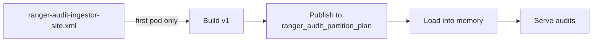

---

### Pod 1 (first ingestor, empty plan topic)

**Description:** First pod with `dynamic.enabled=true` creates plan topic (if needed), seeds **v1 from XML** into Kafka, loads into memory. XML is used **once**.

| Step | Action |
|------|--------|
| 1 | `PartitionPlanWatcher` starts |
| 2 | `createPlanTopicIfNotExists()` — idempotent ([Race A](#race-a--multiple-pods-create-the-plan-topic-at-the-same-time)) |
| 3 | Read plan topic → no message for key `ranger_audits` |
| 4 | Build v1 from XML → explicit partition lists |
| 5 | Publish v1 to `ranger_audit_partition_plan` ([Race B](#race-b--multiple-pods-publish-plan-v1-when-topic-exists-but-has-no-message)) |
| 6 | Re-read compacted topic → install v1 in memory |
| 7 | Serve audits (memory only on hot path) |

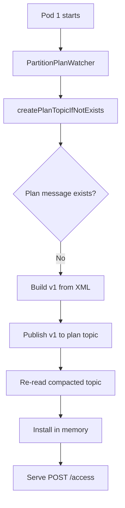

**Alternative:** wait for first admin POST onboard instead of auto-publish — possible, but auto-publish is recommended for pod 2+.

### Pod 2+ (later ingestors, plan already in Kafka)

**Description:** Plan already in Kafka — **read only**, never re-bootstrap from XML for routing.

| Step | Action |
|------|--------|
| 1 | `PartitionPlanWatcher` starts |
| 2 | `createPlanTopicIfNotExists()` — usually no-op (topic exists) |
| 3 | Read plan version **N** from compacted topic |
| 4 | Install into memory — **ignore XML** |
| 5 | Serve audits |

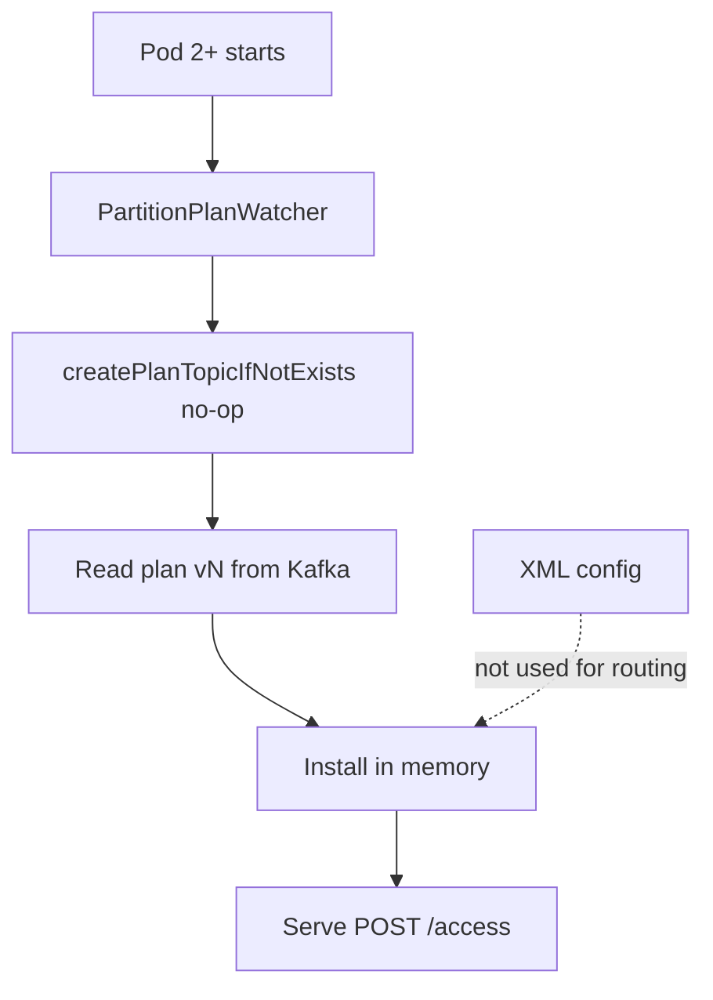

**Do not** bootstrap-from-XML again if a plan message exists — avoids ConfigMap drift across pods.

---

### Race A — multiple pods create the plan **topic** at the same time

Several ingestor pods can start together when `ranger_audit_partition_plan` **does not exist yet**. Each pod may call `listTopics()`, see nothing, and call `createTopics()` — same class of race as `ranger_audits` creation in `AuditMessageQueueUtils.createAuditsTopicIfNotExists()`.

**Required behavior (idempotent topic create):**

**Description:** Multiple pods may call `createTopics()` at once. **Already exists = success.** Only fail on real errors (ACL, Kafka down).

| Step | Action |
|------|--------|
| 1 | `listTopics()` — if topic exists → OK, continue |
| 2 | `createTopics(1 partition, cleanup.policy=compact)` |
| 3 | Success → `waitUntilTopicReady` → continue |
| 4 | Failure **already exists** → treat as success, `describe` topic, continue |
| 5 | Other failure → fail startup with clear error |

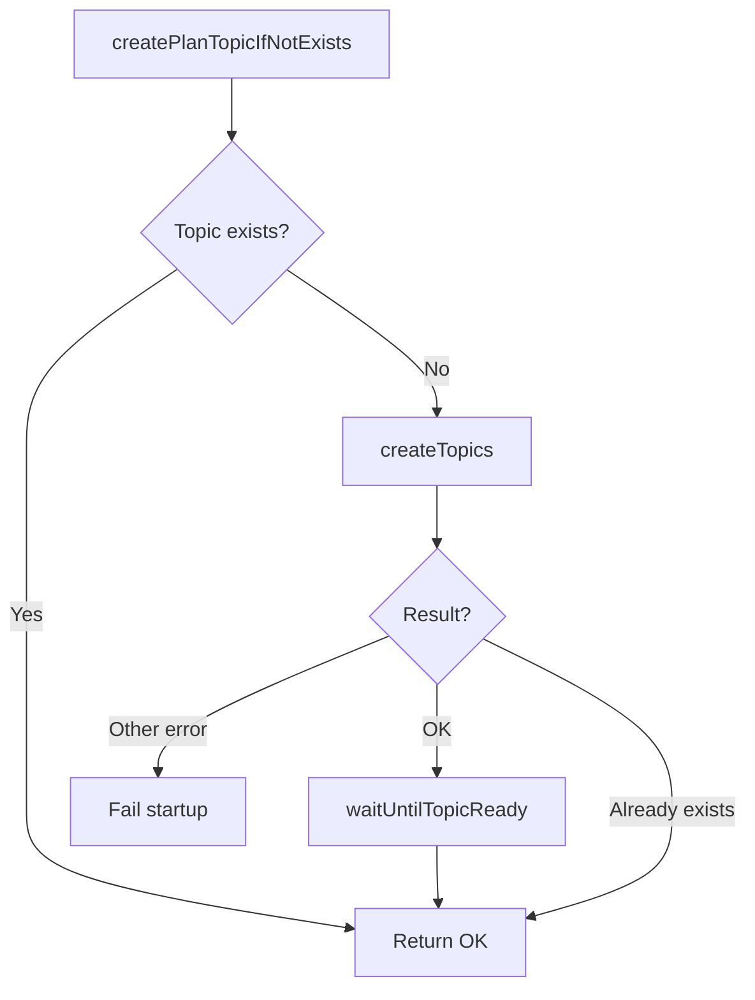

| Outcome | Pod behavior |
|---------|----------------|
| This pod creates topic | Log info, proceed to read/publish plan |
| Peer created topic first | Catch already-exists, describe topic, proceed |
| Create fails for other reason | Fail startup (Kafka unreachable, ACL denied) |

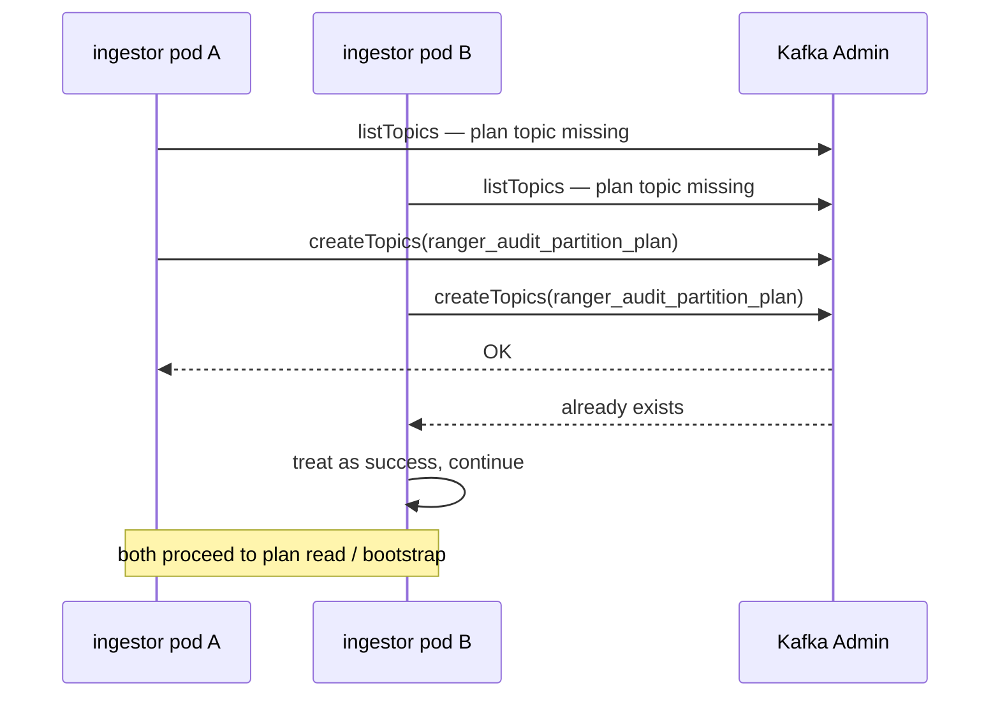

**Implementation note:** reuse or factor shared logic from `audit-common/.../AuditMessageQueueUtils.java` (`createAuditsTopicIfNotExists`) and add explicit **already-exists** handling if not present today (concurrent `createTopics` on `ranger_audits` has the same gap).

---

### Race B — multiple pods publish plan **v1** when topic exists but has no message

**Description:** Topic exists but no plan message yet. Both pods may build v1 — **re-read before/after produce**; mandatory read-back; adopt Kafka’s plan.

| Step | Action |
|------|--------|
| 1 | Both pods: `ensurePlanTopicExists()` (Race A done) |
| 2 | Read plan → null |
| 3 | Build v1 from XML |
| 4 | **Re-read** — if v1 appeared → install, skip publish |
| 5 | Produce local v1 (first wins on offset) |
| 6 | **Mandatory re-read** → install stored plan (not local object only) |

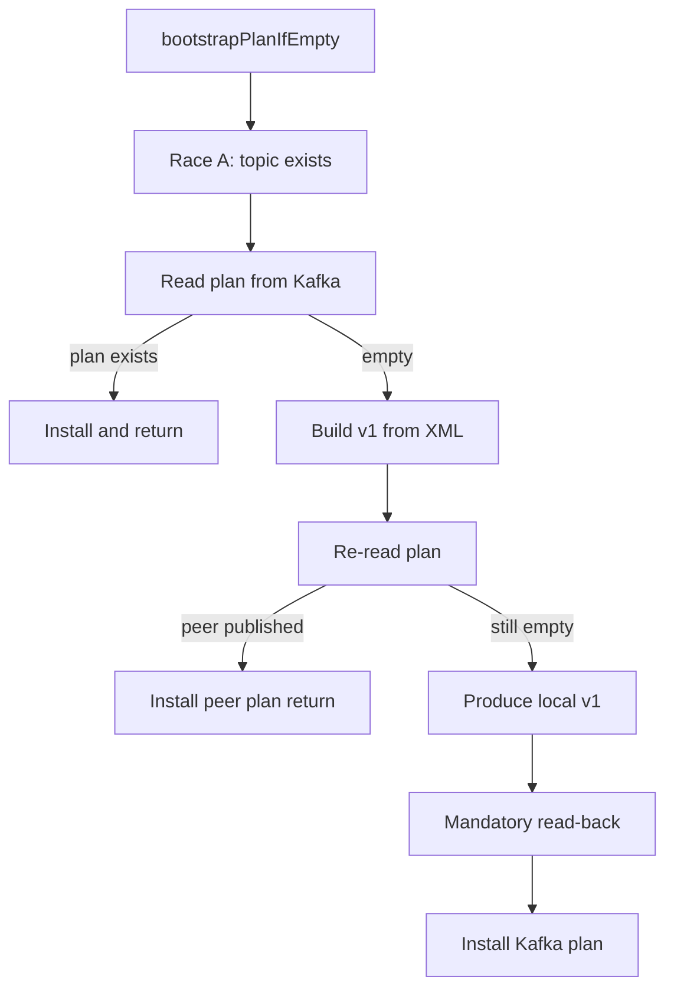

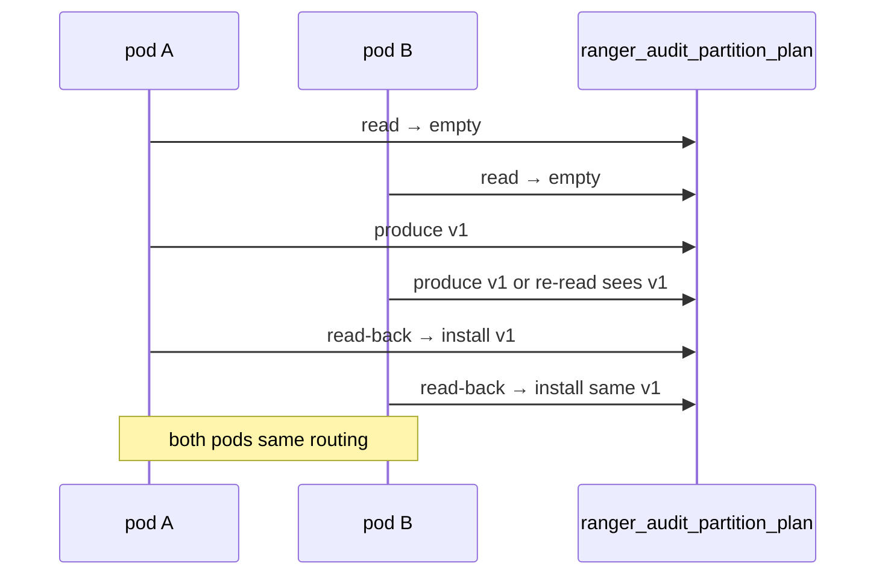

This preserves backward compatibility with `ranger-audit-ingestor-site.xml` for greenfield installs.

---

## Kafka read load (REST + background thread only)

The plan topic is **low volume** (config, not audit events). Avoid reading it on the hot audit path.

| Code path | Reads plan topic? | Notes |
|-----------|-------------------|--------|
| Plugin audit POST → `AuditMessageQueue` → `AuditPartitioner.partition()` | **No** | Reads `AtomicReference<PartitionPlan>` in memory only |
| `PartitionPlanWatcher` (background thread) | **Yes** | Poll / consume on interval or on compacted message |
| REST `GET /api/audit/partition-plan` | **Yes** | Admin read; may return cached in-memory plan if fresh |
| REST POST/PATCH plugins | **Yes** | Read current version, then produce new version |
| Audit produce to `ranger_audits` | **No** | Unrelated topic |

**Design rule:** at most **one background consumer per ingestor pod** plus **occasional REST reads/writes**. No per-request Kafka access for partition routing.

Recommended watcher behavior:

- **Startup:** one read to load initial plan (from compacted topic, or bootstrap-then-read).
- **Runtime:** consumer poll with long interval (`refresh.interval.ms`, default 30s) **or** event-driven on new compacted message — not tight spin loops.
- **On failure:** keep **last known good** plan in memory; do not block audit POST.

With a single-partition compacted topic and ~30s refresh, Kafka load from N ingestor pods is negligible compared to `ranger_audits` traffic.

**Append vs update:** each plan write adds a record; compaction + “latest per key” semantics mean the effective store is one current plan. See [Compacted topic semantics: append, retention, and performance](#compacted-topic-semantics-append-retention-and-performance).

---

## REST API (control plane)

The partition-plan admin API exposes **three endpoints**. All mutation requests use optimistic locking via `expectedVersion` (current plan version from `GET`). Reject with `409 Conflict` when stale; response body includes the current plan.

**Auth:** Kerberos/JWT + admin role (not the same as plugin audit POST users). When `kafka.partition.plan.allowed.users` is configured, only those short names may call these endpoints.

### GET `/api/audit/partition-plan`

Returns the current plan from the in-memory holder (same JSON shape as the compacted Kafka value).

### POST `/api/audit/partition-plan/plugins` — onboard plugin

Onboards a plugin from the buffer to dedicated partitions and registers service allowlists in **one** plan version bump.

**Required fields:** `pluginId`, `partitionCount`, `expectedVersion`, `services`

**`services` map:** repo name → `{ "allowedUsers": [...] }`. Must be non-empty. Each entry is tagged with `pluginId` in the stored plan.

```json
{
  "pluginId": "hiveServer2",
  "partitionCount": 3,
  "expectedVersion": 1,
  "services": {
    "dev_hive":  { "allowedUsers": ["hive"] },
    "dev_hive2": { "allowedUsers": ["hive2"] }
  }
}
```

Server: takes partition IDs from buffer (or grows `ranger_audits` tail), adds plugin assignment, merges services with `pluginId`, writes plan v(N+1).

### PATCH `/api/audit/partition-plan/plugins/{pluginId}` — update plugin

Updates an onboarded plugin: scale tail partitions and/or mutate service allowlists scoped to `{pluginId}` in one version bump.

**Required:** `expectedVersion`

**At least one of:**

| Field | Purpose |
|-------|---------|
| `additionalPartitions` | int ≥ 1 — append tail partition IDs (same append-only semantics as legacy scale) |
| `addServices` | map repo → `{ "allowedUsers": [...] }` — add repos tagged with path `pluginId` |
| `updateServices` | map repo → `{ "allowedUsers": [...] }` — replace allowlist for repos owned by path `pluginId` (or legacy entries with no `pluginId`) |
| `removeServices` | list of repo names — remove allowlist entries owned by path `pluginId` (or legacy entries with no `pluginId`) |

**Example — Hive multi-repo lifecycle** (onboard two repos, add a third, remove one, scale):

```bash
# 1) Onboard hiveServer2 with dev_hive + dev_hive2 (plan v1 → v2)
curl -X POST .../api/audit/partition-plan/plugins -d '{
  "pluginId": "hiveServer2",
  "partitionCount": 3,
  "expectedVersion": 1,
  "services": {
    "dev_hive":  { "allowedUsers": ["hive"] },
    "dev_hive2": { "allowedUsers": ["hive2"] }
  }
}'

# 2) Add dev_hive3, remove dev_hive2 (plan v2 → v3)
curl -X PATCH .../api/audit/partition-plan/plugins/hiveServer2 -d '{
  "expectedVersion": 2,
  "addServices":    { "dev_hive3": { "allowedUsers": ["hive3"] } },
  "removeServices": ["dev_hive2"]
}'

# 3) Scale +2 tail partitions (plan v3 → v4)
curl -X PATCH .../api/audit/partition-plan/plugins/hiveServer2 -d '{
  "expectedVersion": 3,
  "additionalPartitions": 2
}'
```

Stored service entries include optional `"pluginId": "hiveServer2"` for ownership tracking.

**Removed endpoints** (consolidated above): `PATCH /api/audit/partition-plan`, `POST /api/audit/partition-plan/services`, and separate promote-only / scale-only semantics.

> **Future work (not in this change):** bootstrap **v0** split — seeding `services` from XML separately from plugin partition assignments. Current bootstrap still publishes a single v1 plan from XML as today.

---

## Mutation handler flow (POST onboard / PATCH update)

**Description:** Admin POST/PATCH on any ingestor pod. Grow `ranger_audits` **before** publishing plan that references new partition IDs. Server assigns `version = N+1`; client sends `expectedVersion` only.

| Step | Action |
|------|--------|
| 1 | Authenticate + authorize admin |
| 2 | Load plan from compacted topic (version **N**) |
| 3 | If `expectedVersion != N` → **409** + current plan |
| 4 | Validate + allocate (onboard: partitions + services; update: scale and/or service mutations) |
| 5 | If needed → `AdminClient.createPartitions(ranger_audits)` |
| 6 | **Re-read** plan — still **N**? else **409** |
| 7 | Produce plan **N+1** to plan topic |
| 8 | **Read-back** — matches intent? else **409** |
| 9 | Return **200** + full plan |

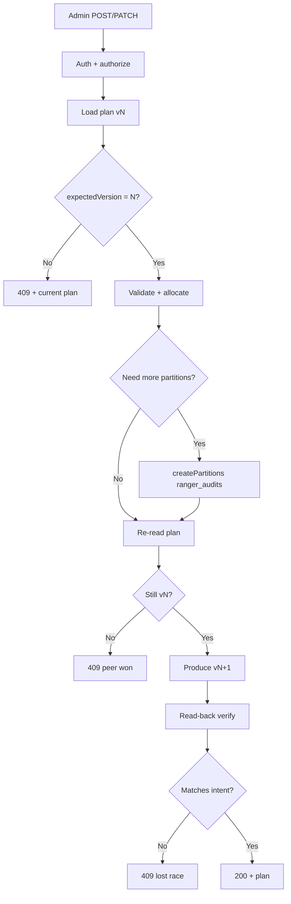

**Order matters:** increase audit topic **before** plan references new IDs.

**Version is server-assigned** — clients must not set the new version number.

---

## Concurrent updates from multiple ingestor pods

REST is exposed on **every** ingestor pod behind a load balancer. Two admins (or automation jobs) can hit **different pods at the same time**. Writes must not double-allocate partition IDs or overwrite each other silently.

### Recommended approach: optimistic concurrency + compare-and-swap

This is the **default** implementation — no leader election required.

| Mechanism | Role |
|-----------|------|
| **`expectedVersion` in request** | Client declares which plan it based its change on |
| **Early reject** | If compacted topic already at version ≠ `expectedVersion` → **409 Conflict** before allocation |
| **Re-read before produce** | After `createPartitions` (if any), re-read topic; if version changed → **409** without producing |
| **Single-partition plan topic** | All plan writes are totally ordered by Kafka offset |
| **Read-back after produce** | Confirm the compacted value is the plan this handler intended; else **409** |
| **Client retry** | On 409: `GET` latest plan, re-apply intent with new `expectedVersion` |

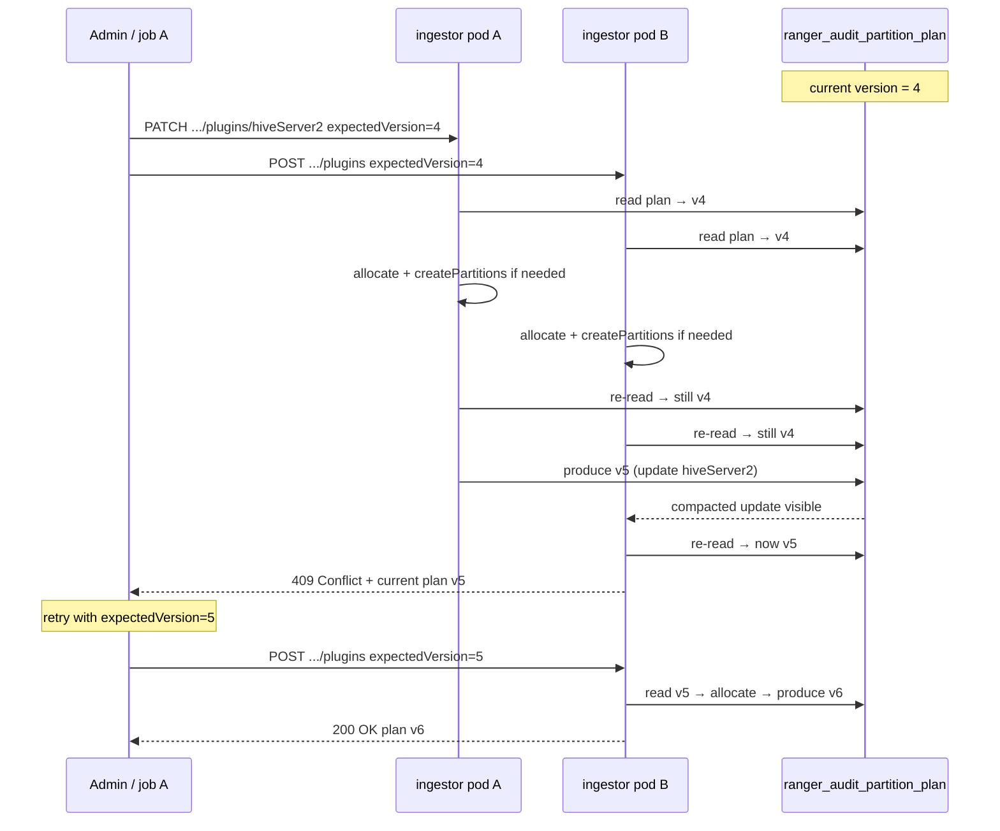

### What each outcome means

| HTTP | Meaning | Client action |
|------|---------|---------------|
| **200** | This handler’s plan v(N+1) is in the compacted topic | Done |
| **409 Conflict** | Stale `expectedVersion` or lost compare-and-swap race | `GET` plan, merge intent, retry with new `expectedVersion` |
| **503** | `createPartitions` failed or Kafka produce failed | Retry same request (idempotent if version unchanged) |

**409 response body** should include the **current plan** (version, plugins, buffer) so callers can retry without a separate GET.

### Why this is safe for partition allocation

Two pods both scaling from v4 might temporarily compute overlapping tail IDs in memory — only one produce wins the compare-and-swap. The loser gets **409** and must **re-read v5** and allocate from the **new tail**, not reuse its stale allocation. Append-only validation on POST/PATCH rejects plans that steal IDs already assigned in the current version.

### Residual race: both produce before either re-reads

**Description:** Plan topic has **one partition** — Kafka orders writes by offset. Only one v5 survives in compaction; loser returns **409**, client retries on winning plan.

| Step | What happens |
|------|----------------|
| 1 | Pod A and B both pass re-read at v4 |
| 2 | Both produce v5 — higher **offset wins** in compacted topic |
| 3 | Loser read-back ≠ intended plan → **409** to client (not 200) |
| 4 | All watchers load **single** winning v5 |

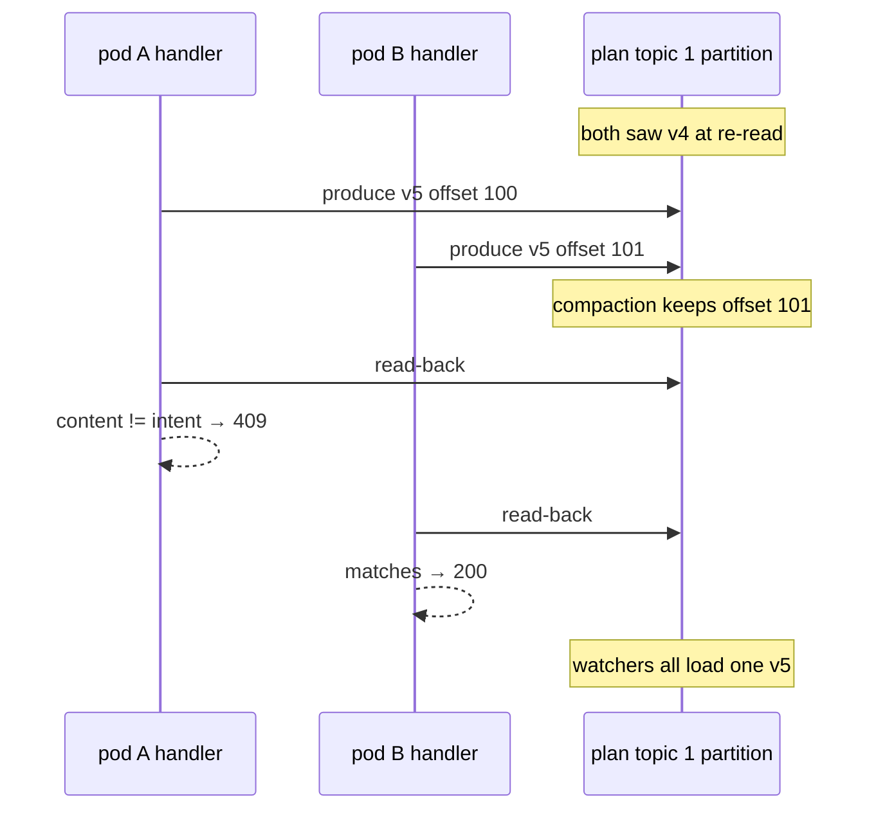

No silent split-brain — one plan version in registry; loser retries with `expectedVersion=5`.

### Optional: stricter serialization (if you want zero client retry)

| Approach | When to use |
|----------|-------------|
| **K8s Lease** (`partition-plan-writer`) | Only the lease holder executes PATCH/POST mutations; other pods return **503 Retry on leader** or proxy internally |
| **Single admin job / CI** | Human or pipeline serializes changes — sufficient for many ops teams |
| **Dedicated single-replica “admin” ingestor** | Extreme isolation; usually unnecessary |

Start with **optimistic concurrency + compare-and-swap + client retry**. Add leader lease only if automation cannot tolerate 409 retries.

### What ingestor pods do *not* do

- **No cross-pod locking** on the audit POST path.
- **No per-pod plan writes** from the watcher (watchers are **read-only**).
- **No merge of concurrent admin intent on the server** — conflicts are explicit 409; the client or operator merges.

---

## How every ingestor pod stays in sync

**Description:** Each pod runs **`PartitionPlanWatcher`** (background only). `AuditPartitioner` reads memory — never plan topic on audit POST.

| Option | Behavior |
|--------|----------|
| **A — Consumer (recommended)** | Group `ranger_audit_partition_plan_watcher`; on message → validate → `partitionPlanRef.set()` |
| **B — Periodic poll** | Every `refresh.interval.ms` (default 30s) read latest compacted value |

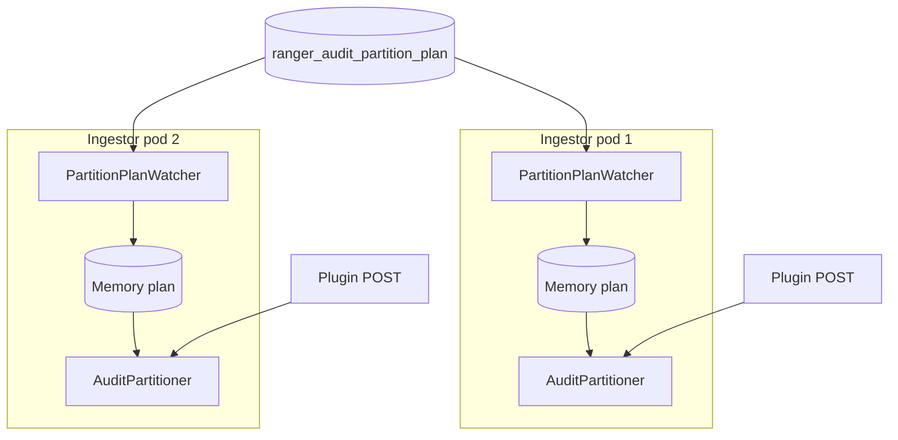

**Latency:** all pods converge within ~30s or on Kafka message. **No restart** when plan changes.

---

## Pod crash / restart

**Description:** Same as **Pod 2+** — memory lost on crash; plan survives in Kafka compacted topic.

| Step | Action |
|------|--------|
| 1 | Pod dies — in-memory plan lost |
| 2 | New pod starts |
| 3 | Watcher reads plan **vN** from Kafka |
| 4 | Install memory — routing restored |

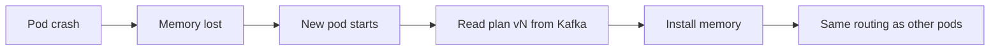

Plan is **not** on pod disk — Kafka compacted topic is durable store.

---

## Worked example: hdfs + hiveServer2, then onboard trino

**Initial plan (v1)** — from bootstrap:

| Plugin | Partitions |
|--------|------------|
| hdfs | [0,1,2] |
| hiveServer2 | [3,4,5] |
| buffer | [6..14] (9 partitions) |

Topic: **15** partitions.

**Unknown plugin `trino` sends audits** → routes to buffer (hash among [6..14]).

**Admin: POST .../plugins — onboard trino (partitionCount=3, mandatory services)**

```json
{
  "pluginId": "trino",
  "partitionCount": 3,
  "expectedVersion": 1,
  "services": {
    "dev_trino": { "allowedUsers": ["trino"] }
  }
}
```

1. Allocator takes IDs [6,7,8] from buffer (or adds tail if buffer policy prefers grow-first).
2. buffer becomes [9..14]; `dev_trino` allowlist merged with `pluginId: trino`.
3. Plan v2 published.
4. All ingestors pick up v2 within refresh interval.
5. **No ingestor restart.**

**Later: PATCH .../plugins/hiveServer2 — additionalPartitions=3**

1. Increase topic 15 → 18 if needed.
2. Append partition IDs [15,16,17] to hiveServer2 list (append-only — hdfs and trino lists unchanged).
3. Plan v3 published.

This fixes the “change hdfs override reshuffles everyone” problem from static contiguous allocation.

---

## Solr / HDFS dispatchers

Dispatchers (`README-KAFKA-DISPATCHERS.md`) **ignore** the partition plan:

- They subscribe to **all** partitions of `ranger_audits`.
- When audit topic grows 15 → 18, both consumer groups rebalance and assign new partitions.
- No dispatcher code or config change for plugin onboarding.

You may need to scale dispatcher `thread.count` / replicas if partition count grows significantly.

---

## Failure modes and handling

| Failure | Behavior |
|---------|----------|
| Plan topic unreadable | Keep **last known good** plan in memory; log error; `/status` shows degraded |
| Invalid plan JSON | Reject write at REST; do not apply on read |
| AdminClient partition increase fails | Do **not** publish new plan; return 503 to caller |
| Partial write (partitions increased but plan not written) | Retry POST/PATCH idempotently; allocator sees higher topic count |
| Two concurrent POST/PATCH (different pods) | `expectedVersion` + re-read before produce + read-back → one **200**, one **409**; client retries on latest version |
| Plugin sends audits during plan swap | `AtomicReference` swap is atomic; brief mix of old/new routing acceptable for audits |

---

## Feature flag: backward compatibility (old vs dynamic behavior)

**Description:** Dynamic mode is **opt-in**. Property **missing** or **`false`** → legacy behavior (today). **`true`** → Kafka plan topic + watcher + REST.

Dynamic mode is **disabled** when:

- `ranger.audit.ingestor.kafka.partition.plan.dynamic.enabled` is **`false`**, or
- the property is **missing / not set** (default = **false**)

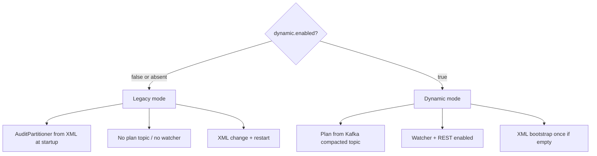

### When dynamic mode is OFF (default — today’s behavior)

| Area | Behavior |
|------|----------|
| Partition mapping | `AuditPartitioner.configure()` at startup from XML: `configured.plugins`, overrides, contiguous ranges + buffer |
| Topic partitions | Created/updated via `AuditMessageQueueUtils.getPartitions()` from XML (sum + buffer) |
| Changes | Update XML → restart audit-ingestor |
| REST `/api/audit/partition-plan` | **Not registered** or returns `404` / `503 Feature disabled` |
| `PartitionPlanWatcher` | **Not started** |
| Plan topic `ranger_audit_partition_plan` | **Not used** (may be omitted from cluster) |

This preserves **100% backward compatibility** for existing deployments with no config change.

### When dynamic mode is ON (`dynamic.enabled=true`)

| Area | Behavior |
|------|----------|
| Partition mapping | Runtime `PartitionPlan` from Kafka compacted topic (XML seeds bootstrap only if plan topic empty) |
| Topic partitions | AdminClient increase driven by plan / REST |
| Changes | REST → Kafka plan topic; all pods refresh via watcher — **no restart** |
| REST partition-plan endpoints | **Enabled** (admin AuthZ) |
| `PartitionPlanWatcher` | **Started** on every ingestor pod |

### Recommended default in code and sample XML

```xml
<property>
  <name>ranger.audit.ingestor.kafka.partition.plan.dynamic.enabled</name>
  <value>false</value>
  <description>
    Enable Kafka-backed dynamic partition plan (registry topic + REST + watcher).
    Default false: use legacy XML-based AuditPartitioner behavior at startup.
    If property is absent, treat as false.
  </description>
</property>
```

Only set to `true` after `ranger_audit_partition_plan` topic exists and ops are ready to manage plans via REST.

### Property defaults when `dynamic.enabled=true`

If dynamic mode is on, missing optional properties use **built-in defaults** (do not fall back to legacy XML routing):

| Property | If absent | Effective value |
|----------|-----------|-----------------|
| `partition.plan.topic` | Use default | **`ranger_audit_partition_plan`** |
| `partition.plan.refresh.interval.ms` | Use default | **`30000`** (30 seconds) |

**Startup behavior with defaults:**

**Description:** When `dynamic.enabled=true`, optional properties default as below. Fail startup if Kafka/plan topic unavailable — do not silently fall back to legacy XML.

| Step | Action |
|------|--------|
| 1 | Resolve plan topic → **`ranger_audit_partition_plan`** (unless overridden) |
| 2 | **`createPlanTopicIfNotExists()`** — idempotent ([Race A](#race-a--multiple-pods-create-the-plan-topic-at-the-same-time)) |
| 3 | Start **`PartitionPlanWatcher`** |
| 4 | If no plan message → bootstrap v1 from XML ([Race B](#race-b--multiple-pods-publish-plan-v1-when-topic-exists-but-has-no-message)) |

```mermaid
flowchart TD
  Start[Ingestor startup dynamic=true] --> Topic[Resolve plan topic name]
  Topic --> Create[createPlanTopicIfNotExists Race A]
  Create --> Watcher[Start PartitionPlanWatcher]
  Watcher --> Empty{Plan message empty?}
  Empty -->|Yes| Boot[Bootstrap v1 from XML Race B]
  Empty -->|No| Load[Load plan from Kafka]
  Boot --> Ready[Ready serve audits]
  Load --> Ready
```

**You do not need** to set `partition.plan.topic` unless using a non-default name.

**Misconfiguration:** If `dynamic.enabled=true` but Kafka unreachable → **fail startup** (avoid split routing across pods).

---

## What stays in XML (bootstrap only)

| Property | Role after dynamic mode |
|----------|-------------------------|
| `configured.plugins` | Initial plan seed only (first pod bootstrap when plan topic empty) |
| `plugin.partition.overrides.*` | Initial counts when seeding v1 |
| `topic.partitions.buffer` | Initial buffer list size when seeding v1 |
| `topic.partitions.per.configured.plugin` | Default per-plugin count when seeding v1 (if no override) |
| `partitioner.class` | Still `AuditPartitioner` at JVM startup |
| `partition.plan.topic` | Compacted registry topic name; **default `ranger_audit_partition_plan`** if unset |
| `partition.plan.dynamic.enabled` | **`false` by default** — set `true` to enable dynamic mode |

When `dynamic.enabled` is **false** or **unset**, XML properties above drive **legacy startup behavior** (not bootstrap-only).

Runtime changes (when dynamic enabled) go through **REST → Kafka plan topic**, not XML edits.

---

## Bootstrap configuration (new properties)

```xml
<!-- partition.plan.topic optional when dynamic=true; default ranger_audit_partition_plan -->
<property>
  <name>ranger.audit.ingestor.kafka.partition.plan.topic</name>
  <value>ranger_audit_partition_plan</value>
</property>
<property>
  <name>ranger.audit.ingestor.kafka.partition.plan.refresh.interval.ms</name>
  <value>30000</value>
</property>
<property>
  <name>ranger.audit.ingestor.kafka.partition.plan.dynamic.enabled</name>
  <value>false</value>
  <description>Default false. Set true to enable dynamic partition plan. If absent, use legacy XML behavior.</description>
</property>
```

Existing `configured.plugins` / overrides remain **bootstrap** when the compacted topic has no plan yet.

---

## Implementation order (recommended)

**Description:** Build bottom-up — model and registry first, then partitioner + watcher, then REST and ops.

| Phase | Deliverable |
|-------|-------------|
| 1 | `PartitionPlan` model + allocator tests (append-only) |
| 2 | Registry read/write + `createPlanTopicIfNotExists` (Race A) |
| 3 | Plan-aware `AuditPartitioner` + watcher + bootstrap (Race B) |
| 4 | REST GET (inspect plan) |
| 5 | REST GET / POST / PATCH plugins | `PartitionPlanService` |
| 6 | AuthZ + `/status` (`plan.version`, watcher timestamp) |
| 7 | Ops runbook — REST only when dynamic=true → [README-KAFKA-PARTITION-PLAN-OPS-RUNBOOK.md](README-KAFKA-PARTITION-PLAN-OPS-RUNBOOK.md) |
| 8 | Migrate deployments — publish v1 from current XML |

```mermaid
flowchart LR
  P1[1 Model + allocator] --> P2[2 Registry + topic create]
  P2 --> P3[3 Partitioner + watcher]
  P3 --> P4[4 REST GET]
  P4 --> P5[5 REST POST/PATCH plugins]
  P5 --> P6[6 AuthZ + status]
  P6 --> P7[7 Runbook]
  P7 --> P8[8 Migration v1]
```

---

## Design rationale and tradeoffs

**Assessment:** This is a **sound approach** for Ranger audit-ingestor: Kafka is already required, partition-plan changes are infrequent (ops events, not per-request), and the design keeps the audit hot path off Kafka. It is not the only valid design, but the tradeoffs fit the problem well.

### Why this design works

| Principle | How this design delivers |
|-----------|--------------------------|
| **Established pattern** | Kafka compacted topic as config store (same idea as Connect/Streams config topics): one key → latest plan, durable across restarts |
| **Hot path stays fast** | `AuditPartitioner.partition()` reads `AtomicReference` only; plan topic touched by watcher + REST, not every audit POST |
| **Append-only explicit lists** | Avoids reshuffling later plugins when an early plugin scales (main limitation of static contiguous XML allocation) |
| **Multi-pod consistency** | Pod 1 seeds Kafka from XML once; pod 2+ and restarts read Kafka; all replicas converge on the same JSON |
| **Safe rollout** | `dynamic.enabled` defaults to `false` — existing deployments unchanged |
| **Clean consumer boundary** | Solr/HDFS dispatchers consume all partitions; plan is producer-side only |

### Acceptable tradeoffs

| Concern | Severity | Mitigation in this design |
|---------|----------|---------------------------|
| Kafka required at startup when dynamic=true | Medium | Fail startup with clear error; do not silently fall back to legacy XML (would split routing across pods) |
| Two pods bootstrap race on empty plan topic | Low | **Race A:** idempotent `createPlanTopicIfNotExists` + already-exists OK; **Race B:** re-read before/after v1 produce |
| Watcher refresh lag (~30s default) | Low | Acceptable for plugin onboarding; tune `refresh.interval.ms` if needed |
| Ops edit XML expecting live effect | Medium | When dynamic=true, runbook: change plan via REST, not XML (XML is bootstrap-only) |
| `createPartitions` succeeds but plan write fails | Medium | Increase audit topic **before** publishing plan; retry POST/PATCH idempotently |
| ConfigMap drift between pods | Low | Kafka is source of truth once v1 exists |

These are normal distributed-config caveats, not fundamental flaws.

### When this approach is a poor fit

Avoid dynamic mode (or reconsider the registry) if:

- Plan changes happen **very frequently** (seconds) — watcher lag and consumer rebalance churn add cost.
- Kafka is **unavailable or not part of the stack** — use legacy XML or an external config store instead.
- You operate **many independent audit topics** with separate plans — still workable (one compacted key per topic) but REST and ops complexity grow.
- You require **strict per-plugin ordering across plan migrations** — append-only reduces reshuffle risk, but any partition reassignment still needs operational care.

For typical Ranger deployments (infrequent plugin onboard/scale, Kafka already present), none of these apply strongly.

### Alternatives considered

| Option | Tradeoff vs this design |
|--------|-------------------------|
| **XML + restart only** (today) | Simplest; no dynamic onboarding without downtime |
| **Postgres / ZooKeeper** | Stronger CRUD and consistency; extra infra this design deliberately avoids |
| **K8s ConfigMap + watch** | K8s-centric; awkward for mixed environments, multi-cluster, or REST-driven automation |
| **Leader pod writes local XML** | Breaks with multiple replicas — rejected |

Given **no new infra**, **multi-replica ingestor**, **REST-driven ops**, and **survive pod restart**, Kafka compacted topic + REST + background watcher is a strong fit.

### Implementation guardrails

1. **Bootstrap:** `createPlanTopicIfNotExists()` must be idempotent (Race A); after plan publish, always re-read compacted topic (Race B).
2. **GET `/partition-plan`:** prefer in-memory plan for normal reads; optional force-read from Kafka for debugging.
3. **`/status`:** expose `plan.version` and watcher last-updated timestamp.
4. **Mutation validation:** optional strict mode — reject writes that shrink or reassign existing plugin partition IDs.
5. **Runbook:** document that when `dynamic.enabled=true`, runtime changes go through REST, not XML edits.

---

## Summary

| Question | Answer |
|----------|--------|
| Postgres/ZK needed? | **No** — use Kafka compacted topic + AdminClient |
| Update XML in pod? | **No** for runtime — XML is bootstrap only |
| REST endpoint? | **Yes** — writes plan to Kafka + increases partitions via AdminClient |
| Pod crash/restart? | Re-read plan from Kafka compacted topic |
| Other pods notified? | All pods watch same topic / poll same plan |
| Dispatchers affected? | Rebalance only when partition count grows; no plan API needed |
