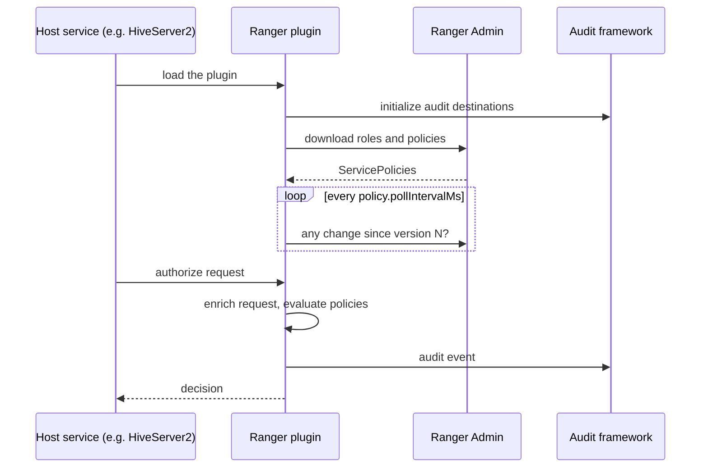
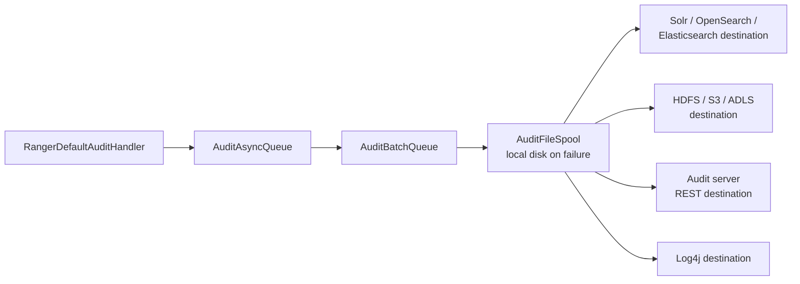

<!---
  Licensed to the Apache Software Foundation (ASF) under one or more
  contributor license agreements.  See the NOTICE file distributed with
  this work for additional information regarding copyright ownership.
  The ASF licenses this file to You under the Apache License, Version 2.0
  (the "License"); you may not use this file except in compliance with
  the License.  You may obtain a copy of the License at

      http://www.apache.org/licenses/LICENSE-2.0

  Unless required by applicable law or agreed to in writing, software
  distributed under the License is distributed on an "AS IS" BASIS,
  WITHOUT WARRANTIES OR CONDITIONS OF ANY KIND, either express or implied.
  See the License for the specific language governing permissions and
  limitations under the License.
-->

# Plugin Architecture

A Ranger plugin is the piece of Ranger that lives inside the service being protected. When you
configure the Hive plugin, for example, you add a set of jars and configuration files to HiveServer2
so that, on every query, Hive asks Ranger's embedded policy engine whether the user may run it. The plugin
downloads policies from Ranger Admin in the background, keeps them in memory and on local disk, and
sends audit records for each decision. Nothing on the query path calls out to Ranger Admin.

All plugins share the same core, `RangerBasePlugin` from the `agents-common` module, and a
service-specific adapter that translates the host's authorization callback (Hive's
`HiveAuthorizer`, HDFS's `INodeAttributeProvider`, a Kafka `Authorizer`, an HBase coprocessor, and
so on) into Ranger's request model. This page describes that shared core: lifecycle, configuration,
policy refresh, the request and result objects, context enrichers and condition evaluators, the
service-definition model, class-loader isolation, and auditing. If you want to write a plugin for
your own application, read this page first and then Custom plugins.

## Lifecycle



1. The host service loads the plugin through the shim (see
   [Shim and class loader](#shim-and-class-loader-isolation)), which reads
   `ranger-<type>-security.xml`, `ranger-<type>-audit.xml` and the TLS settings file from the classpath.
2. The plugin initializes the audit framework, then downloads roles and policies from Ranger Admin
   before serving its first request, falling back to the local cache when Admin is unreachable.
3. A background refresher polls Ranger Admin at the configured interval. Each new policy set becomes a
   new policy engine that is swapped in atomically; in-flight requests finish on the old engine.
4. For each operation the host asks the plugin for an access decision (and, for services that support
   them, for data-mask and row-filter decisions). Every result becomes an audit event.
5. When the host shuts down, the plugin stops its background threads.

## Embedding Ranger in your own application

New integrations should use the
authorization API rather than `RangerBasePlugin` directly. The
`ranger-authz-api` module defines a small, stable interface: build a request from the user, the
resource and the permissions wanted, and get back a decision together with any row filter or data mask
to apply. Two implementations exist, chosen by configuration:

* `authz-embedded` evaluates policies in-process. Behind the interface it runs the same policy engine,
  policy refresher and audit pipeline that the plugins on this page use, one per Ranger service.
* `authz-remote` sends the same request to a Ranger PDP server over REST,
  for applications that cannot or should not embed the engine.

```java
Properties props = new Properties();
props.load(new FileInputStream("ranger-authz.properties"));

// ranger.authorizer.impl.class selects RangerEmbeddedAuthorizer (default) or RangerRemoteAuthorizer
RangerAuthorizer authorizer = RangerAuthorizerFactory.createAuthorizer(props);
authorizer.init();

RangerUserInfo      user    = new RangerUserInfo("alice");
RangerAccessInfo    access  = new RangerAccessInfo("table:sales/customers/accounts", "QUERY", "select");
RangerAccessContext ctx     = new RangerAccessContext("hive", "dev_hive");

RangerAuthzResult result = authorizer.authorize(new RangerAuthzRequest(user, access, ctx));
```

The request and response model, the configuration of both implementations and a runnable sample are on
the Authorization API and PDP page. Apache Polaris integrates this way.

`RangerBasePlugin` remains the lower-level building block that the plugins shipped in this repository
(HDFS, Hive, HBase, Kafka, ...) and the `authz-embedded` library are built on. It is still the right
choice when a service exposes an authorizer extension point that expects the plugin's own request and
result objects, which is what Writing a custom plugin walks through.

## Configuration

The plugin reads three XML files for its service type from the classpath of the protected service:
`ranger-<type>-security.xml`, `ranger-<type>-audit.xml` and the TLS settings file. Three optional files
for a specific service name (`ranger-<type>-<serviceName>-security.xml` and so on) override them. Keys
start with `ranger.plugin.<type>`, where `<type>` is the service type (`hive`, `trino`, `kafka`, ...).

### ranger-&lt;type&gt;-security.xml { #security-xml }

Only two properties are mandatory: the name of the service in Ranger Admin whose policies the plugin
enforces, and the Ranger Admin URL. A policy cache directory is strongly recommended, so the service
can start and keep enforcing policies while Ranger Admin is unreachable. Every other property has a
working default; the plugin pages document the ones that matter for each
service, and the shipped templates, for example
[`ranger-hive-security.xml`](https://github.com/apache/ranger/blob/master/hive-agent/conf/ranger-hive-security.xml),
list the rest.

```xml title="ranger-trino-security.xml"
<configuration>
  <property>
    <name>ranger.plugin.trino.service.name</name>
    <value>dev_trino</value>
    <description>Name of the service in Ranger Admin whose policies this plugin enforces.</description>
  </property>
  <property>
    <name>ranger.plugin.trino.policy.rest.url</name>
    <value>http://ranger-admin:6080</value>
    <description>Ranger Admin URL. Separate several URLs with commas for Ranger Admin high
      availability.</description>
  </property>
  <property>
    <name>ranger.plugin.trino.policy.cache.dir</name>
    <value>/etc/ranger/dev_trino/policycache</value>
    <description>Recommended. Directory for the local copy of the downloaded policies, roles, tags
      and user store.</description>
  </property>
</configuration>
```

The plugin's REST client authenticates to Ranger Admin with Kerberos (SPNEGO) when the host process has
a Kerberos login, with HTTP Basic when a user name and password are configured, or with a bearer token
obtained from an environment variable, a file, a credential store or a token supplier that the host
registers in code; the token is fetched for every request, so it can be refreshed without restarting
the plugin.

### ranger-&lt;type&gt;-audit.xml { #audit-xml }

Audit properties keep the `xasecure.audit` prefix. A destination is switched on with
`xasecure.audit.destination.<name>=true` and configured with properties under the same prefix, where
`<name>` is one of `auditserver`, `solr`, `elasticsearch`, `opensearch`, `hdfs`, `log4j` and the other
destinations provided by `agents-audit`. The example sends audits to the audit server.

```xml title="ranger-trino-audit.xml"
<configuration>
  <property>
    <name>xasecure.audit.is.enabled</name>
    <value>true</value>
    <description>Master switch for auditing in this plugin.</description>
  </property>
  <property>
    <name>xasecure.audit.destination.auditserver</name>
    <value>true</value>
    <description>Set to true to enable the destination. Default: not set.</description>
  </property>
  <property>
    <name>xasecure.audit.destination.auditserver.url</name>
    <value>http://ranger-audit-ingestor:7081</value>
    <description>URL of the audit ingestor. Default: not set.</description>
  </property>
  <property>
    <name>xasecure.audit.destination.auditserver.batch.filespool.dir</name>
    <value>/var/log/trino/audit/auditserver/spool</value>
    <description>Local spool directory used when the destination is unavailable.
      Default: not set.</description>
  </property>
  <property>
    <name>xasecure.audit.provider.filecache.is.enabled</name>
    <value>false</value>
    <description>Write events to a local file cache first and forward from there.</description>
  </property>
</configuration>
```

The full property reference is on the Audit framework page.

## Policy refresher

The refresher is a background thread. At startup it downloads roles and policies synchronously so the
plugin has policies before serving its first request; after that it polls at the configured interval.

* **Download.** The refresher asks Ranger Admin for the service's policies, sending the last known
  version, the plugin id, the cluster name and whether it accepts deltas. Admin answers with a new
  `ServicePolicies` document only when the version changed.
* **Apply.** A new policy set becomes a new policy engine (or, with deltas, a copy of the current one
  with the changes applied), enrichers are attached, and the engine is swapped in.
* **Cache.** The applied policies are written to `<policy.cache.dir>/<appId>_<serviceName>.json`. If
  Admin cannot be reached at startup, the cache is read instead. If Admin reports that the service no
  longer exists, the cache file is renamed aside and the plugin runs with no policies.
* **Failure.** Any other error is logged and the plugin keeps the last known policies; the next poll
  tries again.
* **Roles, tags, user store, GDS.** Each of these has its own refresher that follows the same
  download-and-cache pattern against its own endpoint, with the polling interval from its enricher
  options.

Every download is reported back to Admin, which is what populates the **Audit > Plugins** and
**Plugin Status** tabs in the UI.

## Request and result

For every operation the host builds an access request and receives an access result. A request names
the resource as a map from resource level to value (for Hive: database, table, column), the access
type from the service definition (`select`, `write`, ...), the user with their groups and roles, and the
context of the access: when it happens, the client address, the cluster, and host-specific details
such as the SQL statement that are only recorded in audits. A request can ask about a resource and
everything below it, which is how "may this user access anything in this database" is answered, and
the special access type `_any` asks whether any access at all is allowed.

The result says whether a policy matched and whether the access is allowed, which policy and security
zone decided, whether the access must be audited, and, for data-mask and row-filter evaluations, the
mask or filter expression to apply. An undetermined result means no policy matched; the
[policy model](policy-model.md#evaluation-order) page explains how the host treats it.

The exact fields are in
[`RangerAccessRequest`](https://github.com/apache/ranger/blob/master/agents-common/src/main/java/org/apache/ranger/plugin/policyengine/RangerAccessRequest.java)
and
[`RangerAccessResult`](https://github.com/apache/ranger/blob/master/agents-common/src/main/java/org/apache/ranger/plugin/policyengine/RangerAccessResult.java).

## Context enrichers and condition evaluators

Policies can depend on more than the resource and the user. **Context enrichers** run before
evaluation and add that extra information to the request:

* the tags attached to the resource, downloaded from the tag service linked to the service;
* the attributes of users and groups from Ranger's user store, which also allows Ranger's own group
  membership to be used instead of, or in addition to, the groups the host supplies;
* the Governed Data Sharing datasets and projects that include the resource;
* optionally, the geographic location of the client address, from a lookup file.

A service definition declares which enrichers a plugin runs and how often each refreshes its data;
the tag, user-store and GDS enrichers can also be switched on by plugin configuration.

**Condition evaluators** decide whether a policy or policy item applies to a request beyond the
resource and access type. Ranger ships evaluators for the client IP address, the time of day,
validity schedules, the cluster the request came from, values placed in the request context, the
action named in the request, the presence or absence of tags, Hive resources used together in one
query, and free-form JavaScript expressions over the request, the resource, the user and the tags.
A service definition lists the conditions its policy editor offers and which evaluator backs each;
Policy conditions describes them from the policy author's
side, and Custom conditions and enrichers shows how to write
your own. The interfaces are
[`RangerContextEnricher`](https://github.com/apache/ranger/blob/master/agents-common/src/main/java/org/apache/ranger/plugin/contextenricher/RangerContextEnricher.java)
and
[`RangerConditionEvaluator`](https://github.com/apache/ranger/blob/master/agents-common/src/main/java/org/apache/ranger/plugin/conditionevaluator/RangerConditionEvaluator.java).

## Service definition model

A service definition is the JSON contract between a plugin, Ranger Admin's UI and the policy engine.
It is what makes Ranger generic: the engine and the UI know nothing about Hive tables or Kafka topics
except what the definition tells them. A definition describes:

* the identity of the service type, and the class Ranger Admin uses to test a connection and to look
  up resource names while a policy is being edited (a missing or wrong class falls back to a default
  that cannot test or look up anything, with a warning in the log);
* the resource hierarchy (for Hive: database, table, column, plus URL and UDF), and for each level
  whether wildcards, recursion and excludes are supported and how values are matched;
* the access types (permissions) with their labels, the grants each one implies (Hive `all` implies
  every other type) and their category;
* the properties an administrator fills in when creating a service, such as a connection URL and
  credentials;
* the policy conditions offered in the policy editor and the context enrichers the plugin runs;
* which access types and resources support data masking and row filtering, and the mask types
  available;
* service-wide options, for example whether deny policies and tag-based policies are enabled.

Every item carries an id that must stay stable across versions of the definition, because Ranger
Admin uses it to migrate existing policies when a definition changes. The shipped definitions live in
[`agents-common/src/main/resources/service-defs`](https://github.com/apache/ranger/tree/master/agents-common/src/main/resources/service-defs);
`ranger-servicedef-hive.json` is a good reference for a full definition with masking and row
filtering, and `ranger-servicedef-tag.json` for one whose only purpose is enrichers and conditions.
The Java model is
[`RangerServiceDef`](https://github.com/apache/ranger/blob/master/agents-common/src/main/java/org/apache/ranger/plugin/model/RangerServiceDef.java).

## Shim and class loader isolation

Plugins bring their own dependency versions (Jersey, Jackson, HTTP client, and so on) that may
conflict with the host service's. To avoid this, each plugin archive contains two layers:

* `lib/ranger-<type>-plugin-shim-<version>.jar` and `ranger-plugin-classloader-<version>.jar` go
  on the host's normal classpath. The shim contains only thin proxy classes.
* `lib/ranger-<type>-plugin-impl/` holds the real plugin (`ranger-<type>-plugin`,
  `ranger-plugins-common`, `ranger-audit-core`, `ranger-audit-dest-auditserver`,
  `ranger-authz-api`, `ranger-plugins-cred`, `ranger-common-utils`, `ugsync-util`) and all their
  dependencies.

The shim creates a class loader for the plugin type, which locates the `ranger-<type>-plugin-impl`
directory next to the shim jar and loads every jar in it. The class loader is child-first: it looks
in the impl directory before delegating to the host's class loader, so the plugin sees its own
dependency versions while still being able to load host classes (`HiveConf`, Hadoop
`UserGroupInformation`). Around every call into the implementation, the shim switches the thread's
context class loader to the plugin loader and restores it afterwards.

The shim and the implementation use the same fully qualified class name; only the class loader
differs. Plugins that run in a process without dependency conflicts (or that you embed in your own
application) can skip the shim and depend on `ranger-plugins-common` directly.

## Audit handler

The audit handler installed in the plugin turns every result that has auditing enabled into an
`AuthzAuditEvent` and hands it to the audit framework (`agents-audit`). The event fields, as
serialized to the audit store, are: `repoType`, `repo` (service name), `reqUser`, `evtTime`, `access`,
`resource`, `resType`, `action`, `result`, `agent`, `policy`, `policy_version`, `reason`, `enforcer`,
`sess`, `cliType`, `cliIP`, `reqData`, `agentHost`, `logType`, `id`, `seq_num`, `event_count`,
`event_dur_ms`, `tags`, `datasets`, `projects`, `cluster_name`, `zone_name`, and `additional_info`.
When the summary queue (`summary.interval.ms`) is enabled, repeated identical events within the
interval are collapsed into one record with `event_count` and `event_dur_ms`.

The framework pipeline is asynchronous so audit never blocks the request:



Hosts that need custom audit behavior (HDFS writes one event for the several checks of one file-system operation, Hive attaches the query
text, multi-resource requests log once) subclass `RangerDefaultAuditHandler` or use
`RangerMultiResourceAuditHandler`. Users, groups, or roles listed in the
`ranger.plugin.<type>.audit.exclude.*` properties are never audited; audit filters defined in the
service configuration (`ranger.plugin.audit.filters`) give finer control.

## Chained plugins

A plugin can consult the policies of another service after its own. The Hive plugin, for example,
can chain the HDFS plugin so that a Hive URL grant is checked against HDFS policies. Configure
`ranger.plugin.<type>.chained.services=<otherService>` and
`ranger.plugin.<type>.chained.services.<otherService>.impl=<RangerChainedPlugin subclass>`. The
chained plugin has its own refresher and policy engine; `RangerBasePlugin` merges its result with
the primary result. Set `ranger.plugin.<type>.bypass.chained.plugin.evaluation.if.access.is.determined=true`
to skip the chained evaluation once the primary engine has decided.

## Further reading

* [Policy model](policy-model.md): how the engine orders and combines policies.
* [Ranger architecture](architecture.md): where plugins sit in the overall system.
* Source: [`agents-common`](https://github.com/apache/ranger/tree/master/agents-common),
  [`ranger-plugin-classloader`](https://github.com/apache/ranger/tree/master/ranger-plugin-classloader),
  [`agents-audit`](https://github.com/apache/ranger/tree/master/agents-audit),
  [`ranger-examples/plugin-sampleapp`](https://github.com/apache/ranger/tree/master/ranger-examples/plugin-sampleapp).
