<!---
  Licensed to the Apache Software Foundation (ASF) under one or more
  contributor license agreements.  See the NOTICE file distributed with
  this work for additional information regarding copyright ownership.
  The ASF licenses this file to You under the Apache License, Version 2.0
  (the "License"); you may not use this file except in compliance with
  the License.  You may obtain a copy of the License at

      http://www.apache.org/licenses/LICENSE-2.0

  Unless required by applicable law or agreed to in writing, software
  distributed under the License is distributed on an "AS IS" BASIS,
  WITHOUT WARRANTIES OR CONDITIONS OF ANY KIND, either express or implied.
  See the License for the specific language governing permissions and
  limitations under the License.
-->

# Adventures in attribute-based access control (ABAC) - Part 1

*Barbara Eckman, Ph.D., Distinguished Architect, Comcast · Apr 29, 2023*

[← All blogs](blog.md)

## Introduction

Simply put, data access control enforces constraints on who is permitted to access the data. An access control policy
specifies 1) which data may be accessed by 2) which users and optionally 3) for how long[^1].

Data can be specified in access control policies in multiple ways:

1. Resource-based access control: data is specified by its logical identifier e.g., table name, column name, Kafka topic name, AWS S3 bucket name.
2. Tag-based access control (TBAC): data is specified by one or more of its properties, represented by a tag on its metadata, e.g., a Sales Region or Sensitivity Level.
3. Row access control: specifies rows/records that are visible to the user at run time by setting up filters based on the value of an attribute, e.g., Sales Region is "US".
4. Masking access control: specifies if the data should be masked before making it available the user.[^2]

Users can be specified in access control policies in multiple ways:

1. by their individual IDs, or by their group IDs.
2. by the roles the users belong to e.g., "USSalesPerson". This approach is generally called Role-Based Access Control (RBAC).

It's generally acknowledged that RBAC and TBAC are more maintainable, easier to understand, and therefore less error-prone than resource-based access control and identifying users by their IDs or group IDs. However, these are not sufficient for even moderately complex access control constraints, as we will see.

In this blog, we will consider various access control approaches for the following users in specified regions, having access to a given level of sensitive data. Users with access to Highly Sensitive data may also access Sensitive data.

| User | Region | Access Level |
|---|---|---|
| Bob | US | Highly Sensitive |
| Celestine | EMEA | Sensitive |

## Resource and Identity-based Access Control: USSales

Consider the following table containing data from the US sales region.

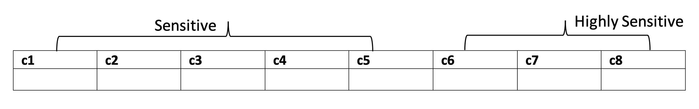

Resource and identity-based access-control policies might include:

- Allow Bob to access all columns because he's from the US and has access to Highly Sensitive data.
- Deny access to Celestine on the table because she's from EMEA, i.e., not from US.

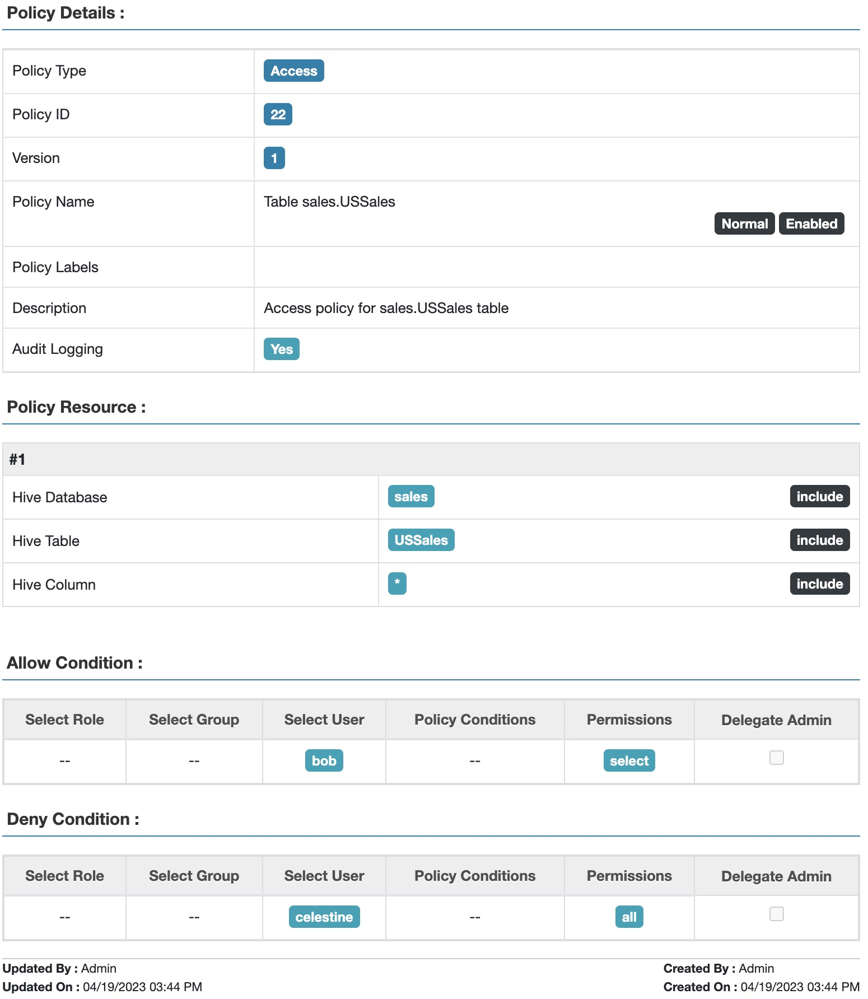

*Fig 1. Apache Ranger™ resource and identity-based access policy for table USSales*

This isn't too onerous with two users, one table, and two Sales Regions.

## Resource and Identity-based Access Control: GlobalSales

Let's add a bit of complexity. Consider the following table containing data from several sales regions, including US and EMEA.

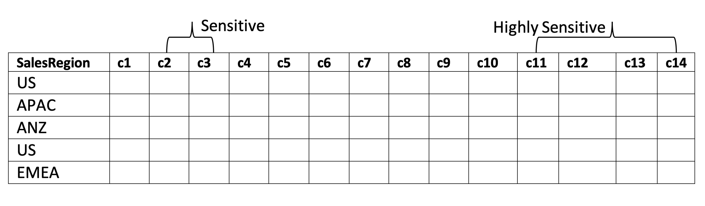

Resource-based and identity-based access-control policy might include:

- Allow Bob to access all columns in rows having salesRegion=US because he's from the US and has access to Highly Sensitive data.
- Allow Celestine to access columns c1-c10 in rows having salesRegion=EMEA because she's from EMEA and has access to Sensitive data.
- Deny users from non-matching regions any access to the table.

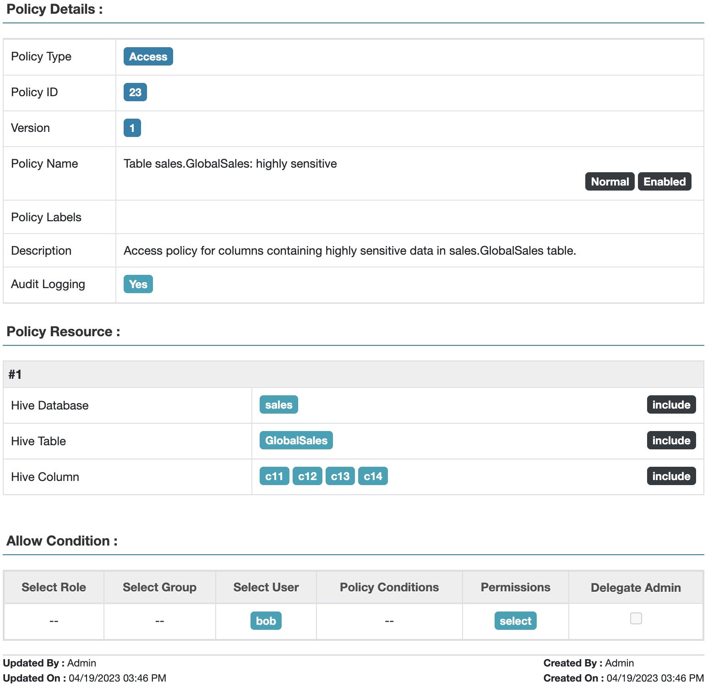

*Fig 2. Apache Ranger™ access policy for highly sensitive data in table GlobalSales*

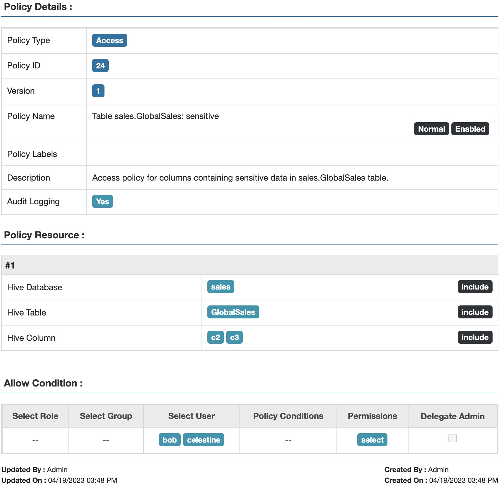

*Fig 3. Apache Ranger™ access policy for sensitive data in table GlobalSales*

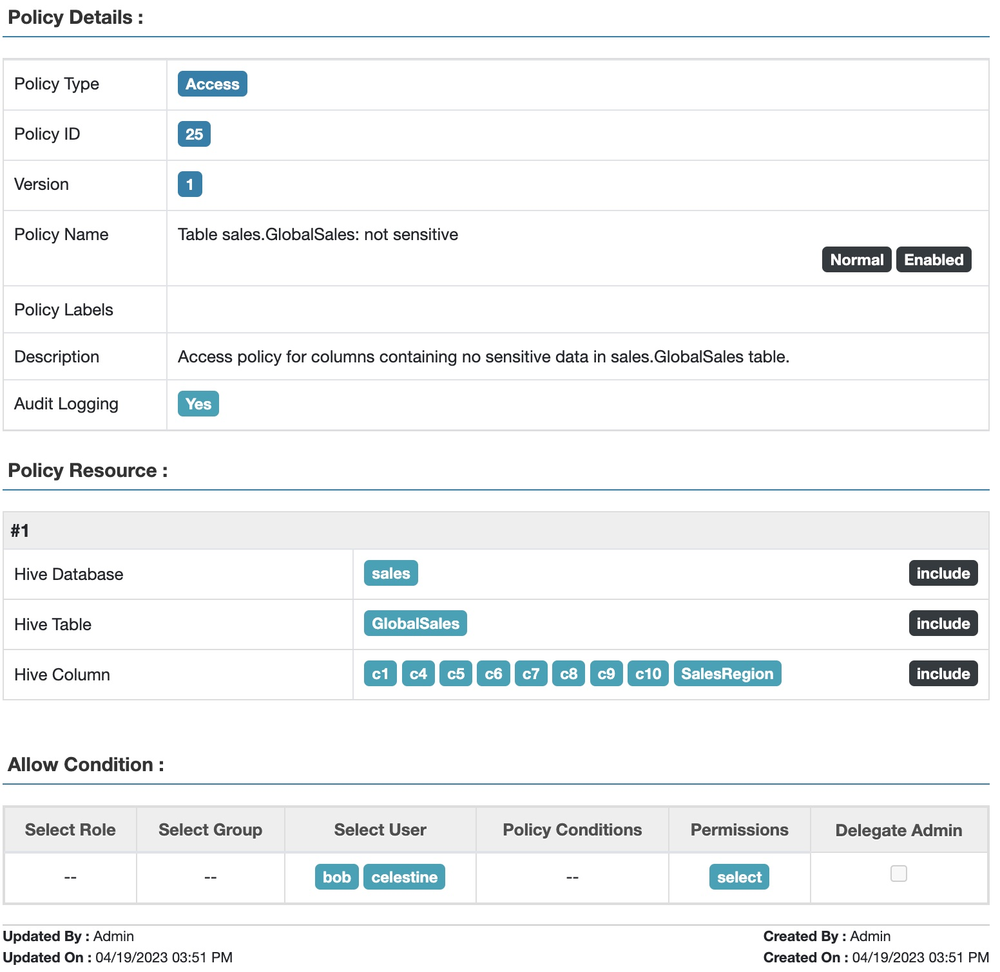

*Fig 4. Apache Ranger™ access policy for non-sensitive data in table GlobalSales*

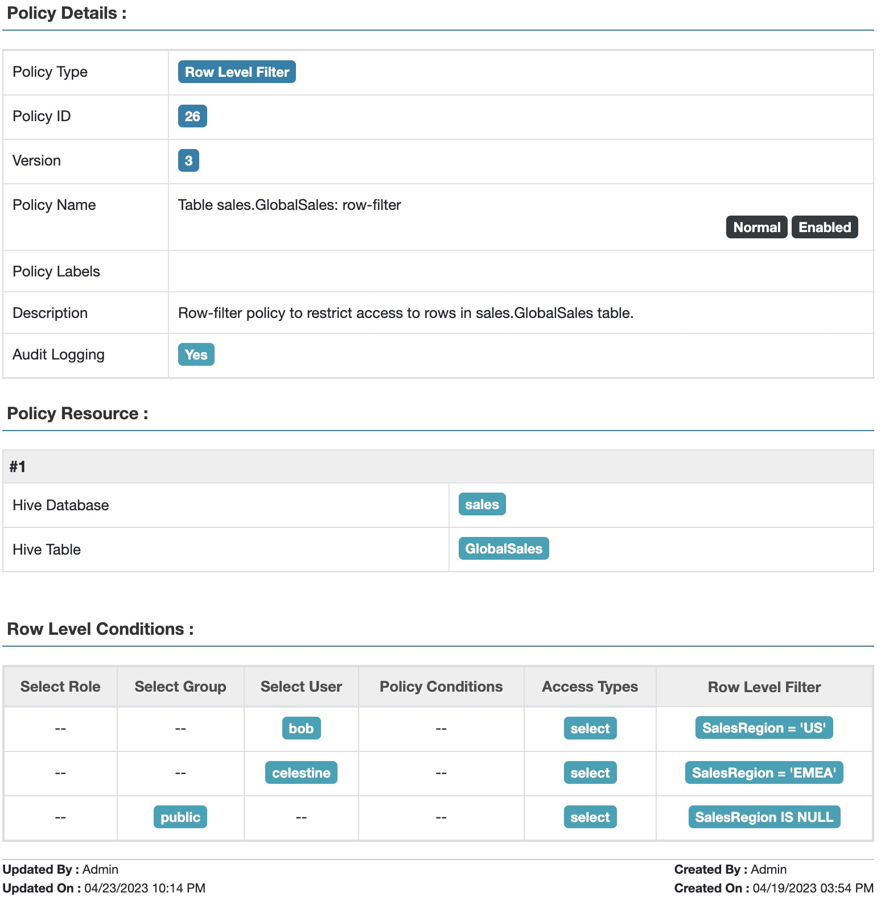

*Fig 5. Apache Ranger™ row-filter policy to restrict access to data in table GlobalSales based on sales region*

Note that the fact that Bob is from the US with access to highly sensitive data is not explicitly captured in the above policies. Nor are the sensitivity levels of the two sets of columns. This knowledge is implicit only, making the policies difficult to maintain over time as business rules change.

## Tag-based and Role-based Access Control: USSales

In this section we will explore using tags and roles (TBAC and RBAC) to set up access control on the USSales table.

Let's use tags to capture metadata relevant to access control, and assign them to tables and columns as shown below:

| Table/Columns | Tag | Tag Attribute |
|---|---|---|
| USSales | salesRegion | value="US" |
| c1, c2, c3, c4, c5 | sensitivityLevel | value="sensitive" |
| c6, c7, c8 | sensitivityLevel | value="highlySensitive" |

Let's use the following roles to capture users' access scope by sensitivity level and region, and assign users as members of the appropriate roles:

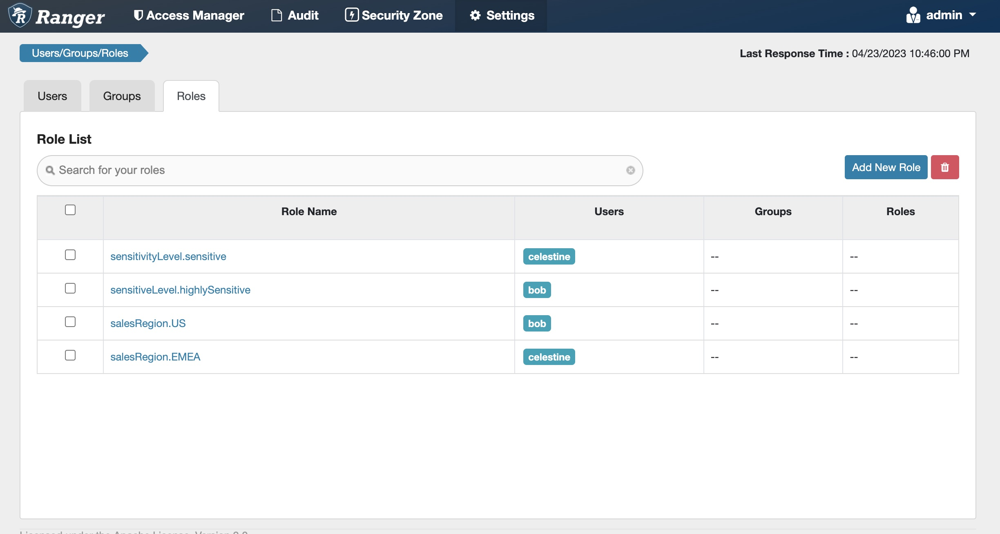

*Fig 6. Apache Ranger™ roles to capture sensitivity level and sales region for users*

Tag-based and role-based access-control policies might include:

1. Tag: salesRegion
    1. Allow users in role salesRegion.US to access resources tagged with salesRegion.value = "US"
    2. Allow users in role salesRegion.EMEA to access resources tagged with salesRegion.value = "EMEA"

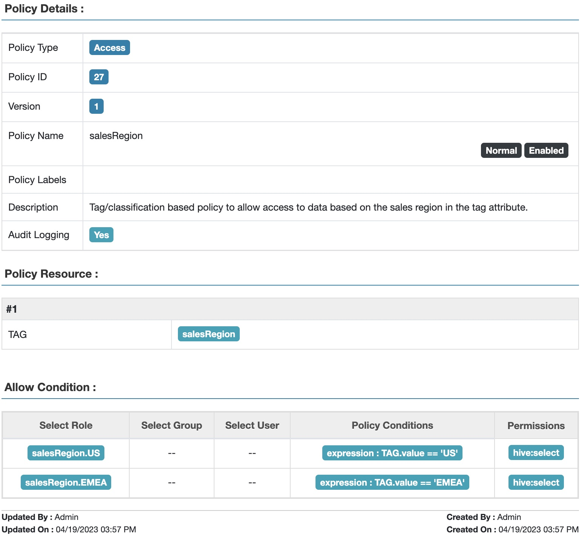

*Fig 7. Apache Ranger™ tag attribute-based access policy for sales region*

2. Tag: sensitivityLevel
    1. Allow users in role sensitivityLevel.sensitive to access resources tagged with sensitivityLevel.value = "sensitive", OR empty.
    2. Allow users in role sensitivityLevel.highlySensitive to access resources tagged with sensitivityLevel.value = "sensitive" OR "highlySensitive", OR empty.

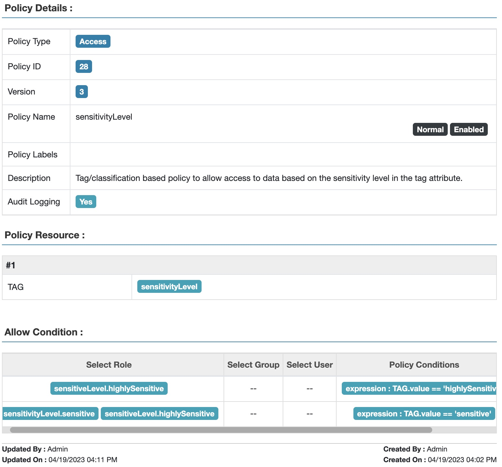

*Fig 8. Apache Ranger™ tag attribute-based access policy for sensitivity level*

Note that the knowledge needed for access control is now explicit: the columns' metadata is tagged with an explicit sensitivity level, and the users are explicitly members of the appropriate salesRegion role.

Note that these tag policies can be used to handle an EMEASales table as well as the USSales table, depending on whether the value of the tag is 'US' or 'EMEA'.

## Tag-based and Role-based Access Control: GlobalSales

In this section we return to the GlobalSales table. In this case we can't use a simple salesRegion tag on the table, since the table contains data from multiple regions including US and EMEA. A row-filter is needed, as in the resource-based policy above.

As before, let's use the following tags to capture metadata relevant to sensitivity access control, and have them assigned to columns as shown below:

| Columns | Tag | Tag Attribute |
|---|---|---|
| c2, c3 | sensitivityLevel | value="sensitive" |
| c11, c12, c13, c14 | sensitivityLevel | value="highlySensitive" |

Also, let's use the same roles listed in the previous use case, Fig. 6

Tag-based and role-based access-control policies might include:

1. Tag: sensitivityLevel: same policy as the previous use case, Fig. 8
2. Row filter Policy:
    1. Users in the salesRegion.US role have access to rows where salesRegion = "US"
    2. Users in the salesRegion.EMEA role have access to rows where salesRegion = "EMEA"

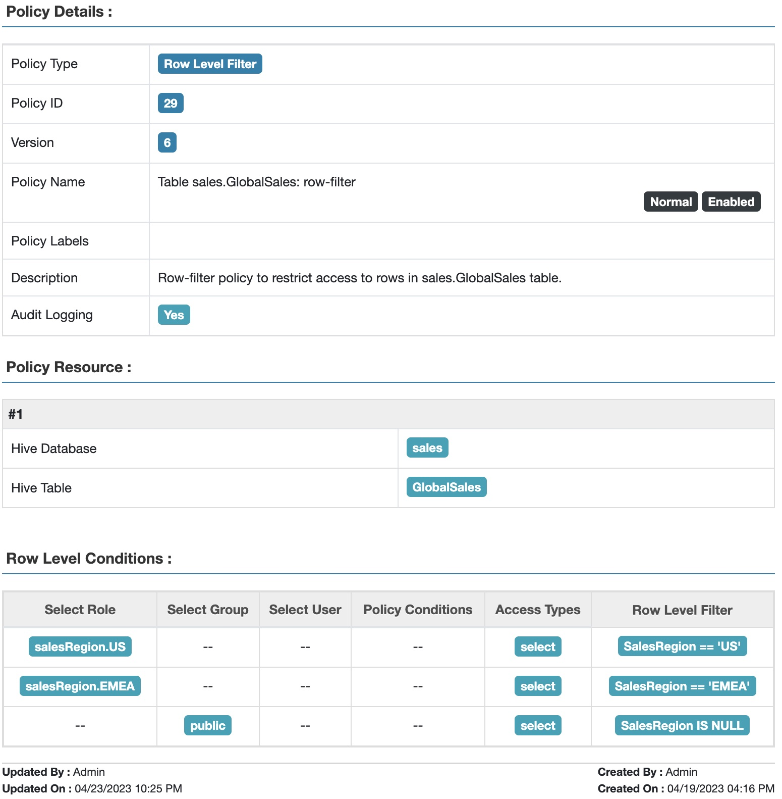

*Fig 9. Apache Ranger™ row-filter policy to restrict access to data in table GlobalSales based on sales region and user roles*

This policy controls access by any user who has been assigned to a salesRegion role, not simply bob or celestine.

## Beyond Tag-based and Role-based Access Control: GlobalSalesPartners

As our final level of complexity, in this section we will extend access control to a GlobalSalesPartners table that includes info on which business partner ("ABC" or "XYZ") produced the data.

The following additional conditions must be enforced for accessing data in this table:

1. Bob can see only data from partner "ABC"
2. Celestine can see data from both partners.

As before, let's use the following tags to capture metadata relevant to sensitivity level, and have them assigned to columns as shown below:

| Columns | Tag | Tag Attribute |
|---|---|---|
| c2, c3 | sensitivityLevel | value="sensitive" |
| c11, c12, c13, c14 | sensitivityLevel | value="highlySensitive" |

Let's use the following roles to capture the users' access scope by sensitivity level, region, and sales partner, and assign our users as members of the appropriate roles:

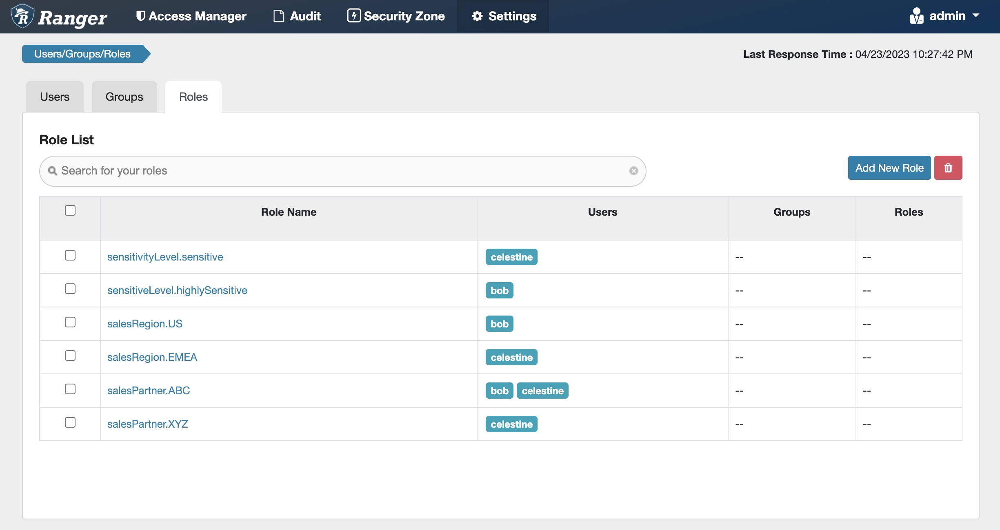

*Fig 10. Apache Ranger™ roles to capture sensitivity level, sales region and sales partners for users*

Tag-based and role-based access-control policies might include:

1. Tag: sensitivityLevel: same policy as earlier use case, Fig. 8
2. Row filter Policy:
    1. Users in salesRegion.US role have access to rows where salesRegion = "US"
    2. Users in salesRegion.EMEA role have access to rows where salesRegion = "EMEA"
    3. Users in salesPartner.ABC role have access to rows where salesPartner = "ABC"
    4. Users in salesPartner.XYZ role has access to rows where salesPartner = "XYZ"

*Fig 11. Apache Ranger™ row-filter policy to restrict access to data in table GlobalSalesPartners based on sales region and sales partner*

It is easy to see that as the numbers of salesRegions and salesPartners rise, the number of roles and row filter conditions increases combinatorially, and rapidly becomes difficult to manage.

As I said before, built-in Apache Ranger™ TBAC, RBAC, and row-filter based access policies are powerful, but they are not sufficient for complex access control constraints, like above. Join in to [part 2](abac-part-2.md) of this blog series to see how ABAC can answer these and other more complex constraint requirements, and do it…well, elegantly!

[^1]: Specifying expiration dates for access control policies where relevant. This is not specific to ABAC and so we won't discuss it further in this blog series.
[^2]: We will cover details of masking policies in a subsequent blog.
