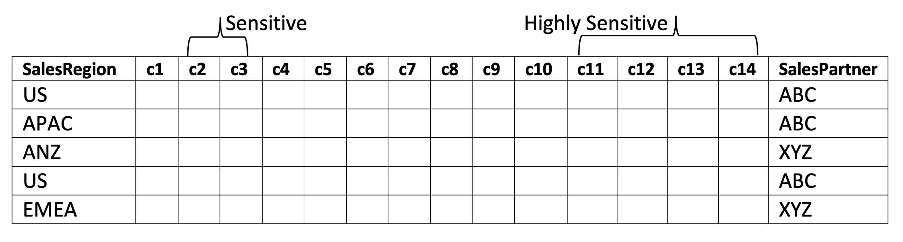
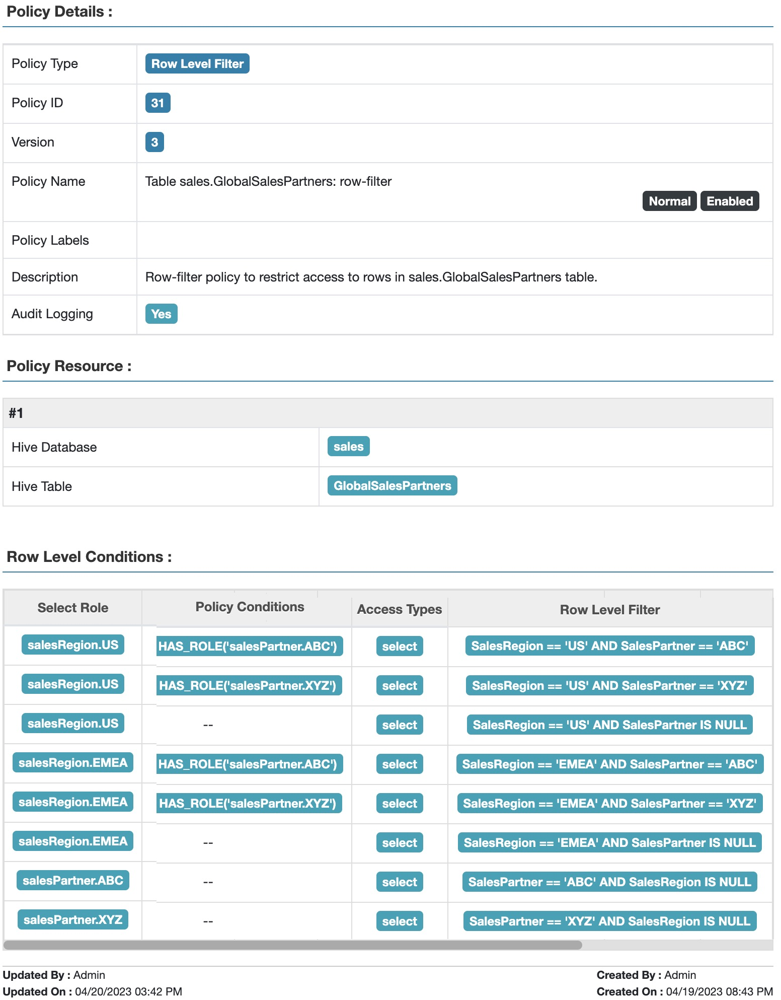
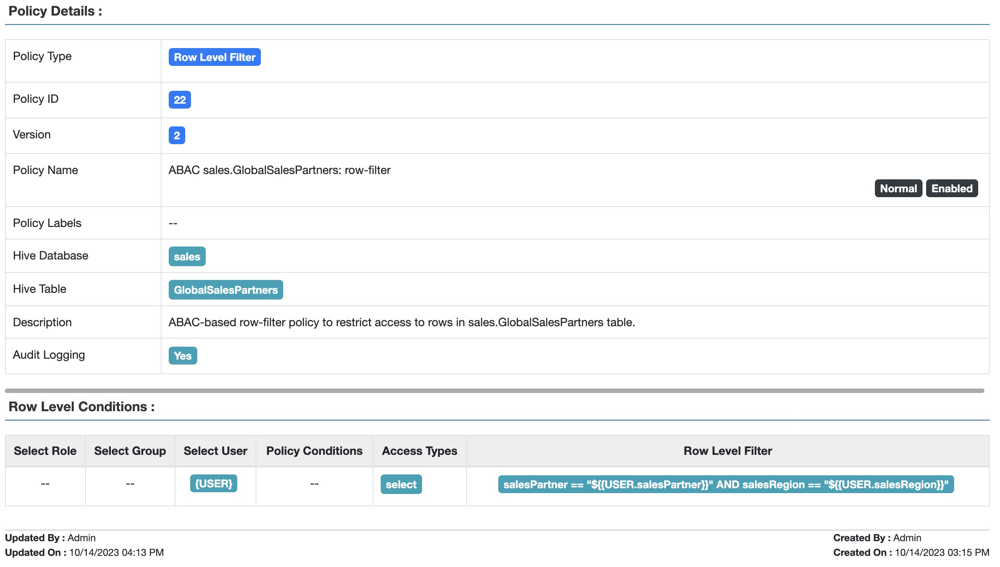
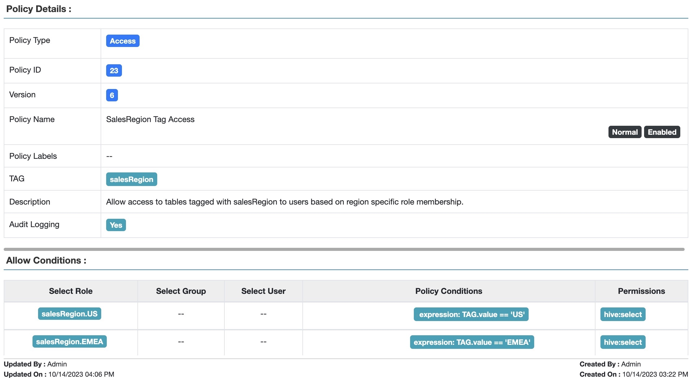
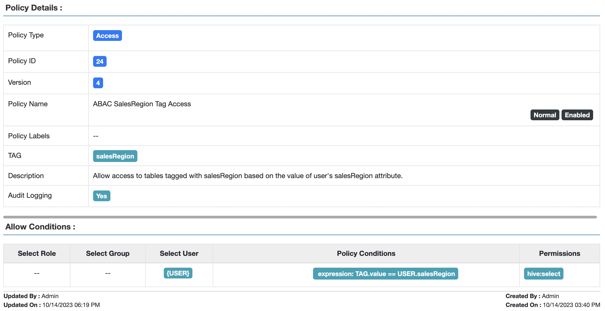

<!---
  Licensed to the Apache Software Foundation (ASF) under one or more
  contributor license agreements.  See the NOTICE file distributed with
  this work for additional information regarding copyright ownership.
  The ASF licenses this file to You under the Apache License, Version 2.0
  (the "License"); you may not use this file except in compliance with
  the License.  You may obtain a copy of the License at

      http://www.apache.org/licenses/LICENSE-2.0

  Unless required by applicable law or agreed to in writing, software
  distributed under the License is distributed on an "AS IS" BASIS,
  WITHOUT WARRANTIES OR CONDITIONS OF ANY KIND, either express or implied.
  See the License for the specific language governing permissions and
  limitations under the License.
-->

# Adventures in attribute-based access control (ABAC) - Part 2

*Barbara Eckman, Ph.D., Distinguished Architect, Comcast · Oct 15, 2023*

[← All blogs](blog.md)

## Introduction

Previously in [Part 1](abac-part-1.md) of this series we examined an increasingly
complex series of use cases involving role membership and row filtering. While built-in Apache Ranger™
TBAC, RBAC, and row-filter based access policies are powerful, they may not be sufficient for complex access
control constraints. As the numbers of row filters that must be simultaneously enforced rises, the number of
roles and row filter conditions increases combinatorially and rapidly becomes difficult to manage.

This post introduces the principles of Attribute-based Access Control (ABAC) and shows how they enable us to
avoid this potentially mushrooming complexity. Let's recall the final use case from part 1.

## Recap: GlobalSalesPartners table row filters

The GlobalSalesPartners table includes info on which business partner ("ABC" or "XYZ") produced the data, as
well as the salesRegion where the sale occurred.



Recall our favorite users:

| User | Region | Partner |
|---|---|---|
| Bob | US | ABC |
| Celestine | EMEA | ABC, XYZ |

Row-filter policies from part 1:

1. Users in salesRegion.US role have access to rows where salesRegion = "US"
2. Users in salesRegion.EMEA role have access to rows where salesRegion = "EMEA"
3. Users in salesPartner.ABC role have access to rows where salesPartner = "ABC"
4. Users in salesPartner.XYZ role has access to rows where salesPartner = "XYZ"



*Fig 1. Apache Ranger™ Table GlobalSalesPartners: row-filter policy to restrict access based on sales region and sales partner*

We noted previously that as the numbers of salesRegions and salesPartners rise, the number of
roles and row filter conditions increases combinatorially, and rapidly becomes difficult to manage.

## ABAC Principles

But what if Ranger policy engine had direct access to Bob's sales partners, and Bob's sales region, without
reference to any roles he might be a member of? Then a row filter could be expressed this way, assuming Bob
has access to data from only one sales region and sales partner

```text
<partner attribute value in row> == <Bob's partner> AND
<sales region value in row> == <Bob's region>
```

Now assume this can be generalized to work for all users:

```text
<partner attribute value in row> == $USER.partner AND
<sales region value in row> == $USER.region
```

## Welcome to Attribute Based Access Control (ABAC)!

In RBAC, the role to which a user is assigned membership is the central method of expressing what the user
should be allowed access to. Bob is in the role partner.ABC, along with, say, Sarah and Thomas and Srikanth
and Joon. Thus, all these users have access to partner ABC's data.

In ABAC, the central method of expressing what the user should be allowed to have access to is the value of
the user's attributes. Bob's partner attribute value equals "ABC", along with the partner attribute of Sarah
and Thomas and Srikanth and Joon. Just as in the RBAC case, all these users have access to partner ABC's data.

But how do we program this in Apache Ranger? Apache Ranger uses a user-store, populated with users and their
attributes typically loaded from LDAP, SCIM, Azure Active Directory (AAD), Okta, etc., by Apache Ranger
usersync. If an attribute named partner is added to a user's record on the identity provider, then that
information will be gathered as part of the usersync and can be referenced within a Ranger policy condition
as $USER.partner.

## GlobalSalesPartners Row-Filters Using ABAC

Assume that the UserStore has been populated with salesRegion and salesPartner attributes for Bob and
Celestine as follows:

| User | salesRegion | salesPartner |
|---|---|---|
| Bob | US | ABC |
| Celestine | EMEA | XYZ |

With ABAC, the 8 row filter conditions from the previous blog post become a single condition, matching the
users' partners and regions with the value in the salesPartner and salesRegion columns:



*Fig 2. Apache Ranger™ Table GlobalSalesPartners: ABAC-based row-filter policy to restrict access based on sales region and sales partner*

This policy works for all users, not just those with salesRegion or salesPartner access like Bob's or Celestine's.

## ABAC in Tag-Based Policies

Next, consider tables representing a single sales region, like USSales from blog post Part 1.

| Resource | Tag | Tag Attribute |
|---|---|---|
| Table: USSales | salesRegion | value="US" |

Allow only users in the salesRegion.US role to access resources tagged with salesRegion.value = "US". Create
a role-based (RBAC) tag policy that allows access to tagged tables based on the role membership of the user:



*Fig 3. Apache Ranger™ Tag-based policy allowing access to tagged tables based on the user's role membership*

Using the RBAC method, we need to create a policy condition for each of the salesRegion.* roles. Depending on
how many salesRegions a company defines, this could get large. And if they are continually being added or
subtracted, the policy has to be commensurately updated.

Let's use ABAC to greatly simplify this process, by creating a tag policy that allows table access to any user
whose salesRegion attribute matches the attribute of the salesRegion tag:



*Fig 4. Apache Ranger™ ABAC-based tag policy to allow access to tables based on the value of the user's attribute.*

As we have seen, ABAC makes policy creation and maintenance much easier! But what if the custodians of your
Identity Provider are too busy to keep up with managing the additional attributes you need for ABAC? Is there
another way to populate the UserStore? Yes! Check out Part 3 of this blog series to find out how you can
retrieve UserStore entries from a variety of alternative sources!

!!! note
    Part 3 of this series has not been published on the Apache Ranger site. The alternative UserStore sources it
    refers to (external user-store retrievers) are documented in Attribute-based access control.
