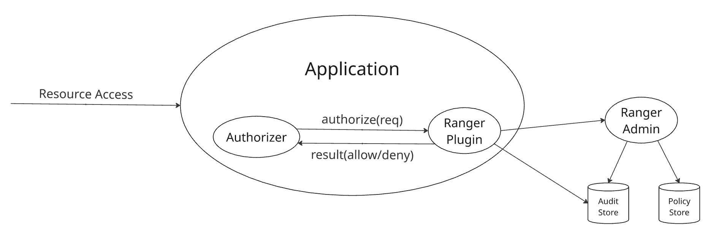
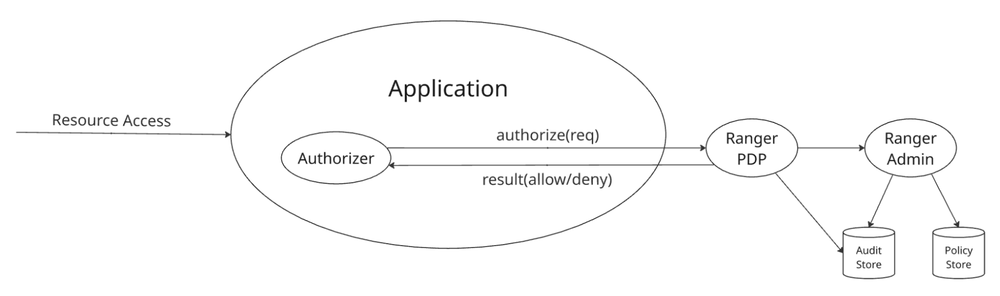

<!---
  Licensed to the Apache Software Foundation (ASF) under one or more
  contributor license agreements.  See the NOTICE file distributed with
  this work for additional information regarding copyright ownership.
  The ASF licenses this file to You under the Apache License, Version 2.0
  (the "License"); you may not use this file except in compliance with
  the License.  You may obtain a copy of the License at

      http://www.apache.org/licenses/LICENSE-2.0

  Unless required by applicable law or agreed to in writing, software
  distributed under the License is distributed on an "AS IS" BASIS,
  WITHOUT WARRANTIES OR CONDITIONS OF ANY KIND, either express or implied.
  See the License for the specific language governing permissions and
  limitations under the License.
-->

# Integrating Applications with Apache Ranger

*Madhan Neethiraj, Apache Ranger committer · Aug 24, 2026*

[← All blogs](blog.md)

## Introduction

Apache Ranger provides a centralized framework for managing authorization policies and controlling access to resources in services such as HDFS, Ozone, HMS, Hive, Impala, Kafka, Solr, KMS, Atlas, Trino and Polaris. Enterprises use Ranger to address their data access governance needs, access auditing, delegated policy management by business users through an intuitive UI. This guide describes how an application can integrate with Apache Ranger to authorize access to its resources.

## 1. Apache Ranger

Apache Ranger provides policy-based authorization for resources managed by applications. An application submits an authorization request identifying the user, resource, and requested access. Ranger evaluates the request against the applicable policies and returns an authorization decision.

Apache Ranger provides centralized policy administration through APIs and UI. Policies can be managed by Ranger administrators, designated administrators for each application and users delegated to manage policies for a limited resource scope.

Apache Ranger can audit access requests and authorization decisions. Audit records can include information such as the user, resource, requested access, authorization result, and request context.

Apache Ranger policies can control access based on:

1. resource names and resource hierarchies.
2. tags associated with resources.
3. attributes and groups associated with users.
4. attributes associated with resources.
5. request context and policy conditions.

Apache Ranger supports several types of data-access policies:

1. Access policies determine whether a user is allowed or denied access to a resource.
2. Data masking policies determine how data should be masked when returned to an authorized user.
3. Row-filtering policies determine which rows of a dataset are visible to a user.

The application is responsible for enforcing the authorization, masking, and filtering decisions returned by Ranger. For more on Ranger policy concepts, see the [Apache Ranger Policy Model](policy-model.md) blog.

## 2. Integration: Overview

An application integrates with Ranger in three basic steps:

1. Register the application's authorization model with Ranger.
2. Request authorization decisions from Ranger.
3. Enforce the decisions returned by Ranger.

The application's authorization model is represented by a Ranger service definition. A service definition describes the resources protected by the application, the access types that can be authorized, and optional data-masking and row-filtering capabilities. Ranger's service-definition model includes resources, access types, service configurations, context enrichers, custom conditions, data-mask definitions, and row-filter definitions.

### 2.1 Register Application's Service Definition

The application defines its authorization model using a Ranger service definition.

The service definition describes:

- resources
- access types
- data-masking capabilities
- row-filtering capabilities
- service configuration properties

A service definition can be registered and managed through Apache Ranger's service-definition APIs. Apache Ranger exposes APIs for creating, retrieving, updating, and deleting service definitions.

For example, an application managing datasets might define:

```text
Resources:
    catalog
    database
    table
    column

Access types:
    create
    alter
    drop
    select
    update
```

Once the service definition is registered, administrators can create policies using these resources and access types.

### 2.2 Request Authorization Decisions

An application can obtain authorization decisions using either a Ranger plugin or the Ranger PDP APIs.

#### Ranger Plugin

Ranger plugin integration approach is typically used by Java applications. The plugin is embedded in the application and evaluates authorization requests locally using policies obtained from Ranger admin server. The plugin can generate audit events that are delivered to configured audit destinations.



*Fig 1. Apache Ranger embedded plugin authorization flow*

#### Ranger PDP

Apache Ranger PDP server provides authorization service that applications can invoke through REST APIs. This integration approach is suitable for:

- non-Java applications
- applications that do not want to embed Ranger libraries
- applications requiring a smaller client-side footprint



*Fig 2. Apache Ranger PDP server authorization flow*

### 2.3 Enforce the Authorization Decision

Ranger returns an authorization decision; it does not enforce the decision on behalf of the application. The application must ensure that a denied request does not proceed.

## 3. Integration: Service Definition

A Ranger service definition describes the authorization model exposed by an application or service. It tells Ranger what resources can be protected, what operations can be authorized, and what additional authorization capabilities the service supports.

The primary Java model is [RangerServiceDef](https://github.com/apache/ranger/blob/release-ranger-2.9.0/agents-common/src/main/java/org/apache/ranger/plugin/model/RangerServiceDef.java), containing definitions for resources, access types, service configurations, context enrichers, custom conditions, data masking, and row filtering. A service definition can be registered with Apache Ranger using the service-definition APIs. Ranger provides REST APIs to create, retrieve, update, and delete service definitions.

A good way to design a service definition is to start with the application's authorization model and then map that model to Apache Ranger concepts.

Refer to following service-definitions for existing integrations, in JSON files, for details of available options:

- [HDFS](https://github.com/apache/ranger/blob/master/agents-common/src/main/resources/service-defs/ranger-servicedef-hdfs.json)
- [Ozone](https://github.com/apache/ranger/blob/master/agents-common/src/main/resources/service-defs/ranger-servicedef-ozone.json)
- [Hive](https://github.com/apache/ranger/blob/master/agents-common/src/main/resources/service-defs/ranger-servicedef-hive.json)
- [Trino](https://github.com/apache/ranger/blob/master/agents-common/src/main/resources/service-defs/ranger-servicedef-trino.json)
- [Polaris](https://github.com/apache/ranger/blob/master/agents-common/src/main/resources/service-defs/ranger-servicedef-polaris.json)

### 3.1 Resources

A resource definition identifies a resource that can appear in a Ranger policy. For example, here are few resources in Apache Hive service definition:

```json
"resources": [
  {
    "itemId":         1,
    "name":           "database",
    "parent":         "",
    "matcherOptions": { "wildCard": true, "ignoreCase": true },
    "label":          "Hive Database",
    "isValidLeaf":    true
  },
  {
    "itemId":         2,
    "name":           "table",
    "parent":         "database",
    "matcherOptions": { "wildCard": true, "ignoreCase": true },
    "label":          "Hive Table",
    "isValidLeaf":    true
  },
  {
    "itemId":         3,
    "name":           "column",
    "parent":         "table",
    "matcherOptions": { "wildCard": true, "ignoreCase": true },
    "label":          "Hive Column",
    "isValidLeaf":    true
  }
]
```

### 3.2 Access Types

Access types define the operations that can appear in a Ranger policy. For example, here are few access types in Apache Hive service definition:

```json
"accessTypes": [
  { "itemId": 1, "name": "select", "label": "Select" },
  { "itemId": 2, "name": "update", "label": "Update" },
  { "itemId": 3, "name": "create", "label": "Create" },
  { "itemId": 4, "name": "drop",   "label": "Drop" },
  { "itemId": 5, "name": "alter",  "label": "Alter" },
  { "itemId": 6, "name": "all",    "label": "All",
    "impliedGrants": [ "select", "update", "create", "drop", "alter" ]
  }
]
```

impliedGrants enable grouping of multiple accessTypes with a logical name, such as all in the example above. Reference to an accessTypes in policies are equivalent to referencing all its impliedGrants.

### 3.3 Data Masking

A service can expose data-masking capabilities through the dataMaskDef section in its service definition. This section defines:

- resources to which masking can apply
- supported mask types
- access types for which masking is relevant

For example, here is a sample dataMaskDef section from Apache Hive service definition:

```json
"dataMaskDef": {
  "resources": [
    {
      "name":           "database",
      "matcherOptions": { "wildCard": "false" },
      "uiHint":         "{ \"singleValue\":true }"
    },
    {
      "name":           "table",
      "matcherOptions": { "wildCard": "false" },
      "uiHint":         "{ \"singleValue\":true }"
    },
    {
      "name":           "column",
      "matcherOptions": { "wildCard": "false" },
      "uiHint":         "{ \"singleValue\":true }"
    }
  ],
  "maskTypes": [
    {
      "itemId":      1,
      "name":        "MASK",
      "label":       "Redact",
      "transformer": "mask({col})"
    },
    {
      "itemId":      2,
      "name":        "MASK_SHOW_LAST_4",
      "label":       "Partial mask: show last 4",
      "transformer": "mask_show_last_n({col}, 4, 'x', 'x', 'x', -1, '1')"
    },
    {
      "itemId":      3,
      "name":        "MASK_SHOW_FIRST_4",
      "label":       "Partial mask: show first 4",
      "transformer": "mask_show_first_n({col}, 4, 'x', 'x', 'x', -1, '1')"
    },
    {
      "itemId":      4,
      "name":        "MASK_HASH",
      "label":       "Hash",
      "transformer": "mask_hash({col})"
    },
    {
      "itemId":      5,
      "name":        "MASK_DATE_SHOW_YEAR",
      "label":       "Date: show only year",
      "transformer": "mask({col}, 'x', 'x', 'x', -1, '1', 1, 0, -1)"
    },
    {
      "itemId": 6,
      "name":   "MASK_NULL",
      "label":  "Nullify"
    },
    {
      "itemId": 7,
      "name":   "MASK_NONE",
      "label":  "Unmasked (retain original value)"
    },
    {
      "itemId": 8,
      "name":   "CUSTOM",
      "label":  "Custom"
    }
  ],
  "accessTypes": [
    { "name": "select" }
  ]
}
```

### 3.4 Row Filtering

A service can expose row-filtering capabilities through the rowFilterDef section in its service definition. This section defines:

- Resources to which row-filtering can apply
- Access types for which row-filtering is relevant

For example, here is a sample rowFilterDef section from Apache Hive service definition:

```json
"rowFilterDef": {
  "resources": [
    {
      "name":           "database",
      "matcherOptions": { "wildCard": "false" },
      "uiHint":         "{ \"singleValue\":true }"
    },
    {
      "name":           "table",
      "matcherOptions": { "wildCard": "false" },
      "uiHint":         "{ \"singleValue\":true }"
    }
  ],
  "accessTypes": [
    { "name": "select" }
  ]
}
```

### 3.5 Service Configurations

A service definition can define configuration properties required to lookup resources in the application, for auto-completion in policy UI as users enter resource values. These configurations include the endpoint (JDBC, HTTP, ..) the application can be reached at, credentials to use while connecting to the application.

```json
"configs": [
  {
    "itemId":    1,
    "name":      "username",
    "type":      "string",
    "mandatory": true,
    "label":     "Username"
  },
  {
    "itemId":    2,
    "name":      "password",
    "type":      "password",
    "mandatory": true,
    "label":     "Password"
  },
  {
    "itemId":       3,
    "name":         "jdbc.driverClassName",
    "type":         "string",
    "mandatory":    true,
    "defaultValue": "org.apache.hive.jdbc.HiveDriver"
  },
  {
    "itemId":       4,
    "name":         "jdbc.url",
    "type":         "string",
    "mandatory":    true,
    "defaultValue": ""
  }
]
```

## 4. Integration: Plugin

Ranger plugin is the preferred integration mechanism for Java applications that want to perform authorization locally i.e. in-process. The core APIs, including following classes, are provided by Ranger libraries [org.apache.ranger:ranger-authz-api](https://mvnrepository.com/artifact/org.apache.ranger/ranger-authz-api) and [org.apache.ranger:authz-embedded](https://mvnrepository.com/artifact/org.apache.ranger/authz-embedded).

```text
org.apache.ranger.authz.api.RangerAuthorizer
org.apache.ranger.authz.embedded.RangerEmbeddedAuthorizer
org.apache.ranger.authz.model.RangerAccessContext
org.apache.ranger.authz.model.RangerAccessInfo
org.apache.ranger.authz.model.RangerAuthzRequest
org.apache.ranger.authz.model.RangerAuthzResult
org.apache.ranger.authz.model.RangerAuthzResult.AccessDecision
org.apache.ranger.authz.model.RangerUserInfo
```

### 4.1 Initializing the Plugin

Ranger plugin instance is typically created and initialized during initialization of the application. Here is an example of Polaris plugin initialization:

```java
RangerAuthorizer authorizer = new RangerEmbeddedAuthorizer(properties);
authorizer.init();
```

Ranger plugin downloads policies from Ranger admin server during initialization, builds a policy engine in-memory for faster evaluation. The plugin periodically polls the Ranger admin server, asynchronously, for any policy changes and keeps its policy engine updated.

### 4.2 Creating an Authorization Request

The application converts its native access request into a Ranger authorization request. For example:

```java
String              table  = "table:sales/customers/accounts";
RangerUserInfo      user   = new RangerUserInfo("alice");
RangerAccessInfo    access = new RangerAccessInfo(table, "QUERY", "select");
RangerAccessContext ctx    = new RangerAccessContext("trino", "sales_trino");
RangerAuthzRequest request = new RangerAuthzRequest(user, access, ctx);
```

Notes:

- `alice`, the username referenced must represent the authenticated caller of the application.
- `trino`, the serviceType referenced is the name of the service-definition registered with Ranger.
- `select`, the permission referenced must be one of accessTypes in the service-definition.
- `sales_trino`, the serviceName referenced represents a deployment of the Trino application. Remember, Ranger can support multiple deployments of an application type, such as `marketing_trino`, `support_trino`, `test_trino` - each with a different set of policies, policy administrators.

Additional information can be included in the authorization request, for example:

Context can include the following:

- client IP
- client type
- request time
- cluster name

User can include the following:

- groups the user belongs to
- user attributes, like department, location

Resource can include the following:

- subResources, such as column names
- resource attributes, such as OWNER
- matchingScope, such as SELF, SELF_OR_ANY_DESCENDANT

### 4.3 Evaluating the Request

The plugin evaluates the request:

```java
RangerAuthzResult result = authorizer.authorize(request);
```

The result contains the authorization decision and additional information that can be used by the application or audit subsystem.

When the result doesn't allow the requested access, applications should treat it as an authorization failure and must enforce that decision before accessing the protected resource.

```java
if (!AccessDecision.ALLOW.equals(result.getDecision())) {
  throw new AccessDeniedException();
}
```

When the result includes masking and/or row-filter expression, the application must include these into the query before executing.

```java
RowFilterResult rowFilter = result.getPermissions("select").getRowFilter();

if (rowFilter != null && StringUtils.isNotBlank(rowFilter.getFilterExpr())) {
  // application must include the returned filter expression into the query
}

DataMaskResult dataMask = result.getPermissions("select").getDataMask();

if (dataMask != null && StringUtils.isNotBlank(dataMask.getMaskType())) {
  // application must apply the returned data mask expression into the query
}
```

authorize() method is thread-safe, hence can be called from multiple threads simultaneously.

### 4.4 Plugin Configuration

Ranger plugin requires configuration identifying:

- Ranger Admin endpoint
- Policy refresh settings
- Authentication configuration
- Audit configuration

Depending on the Ranger version and deployment configuration, the plugin's Ranger Admin client can use authentication mechanisms such as Basic authentication, JWT, or Kerberos, together with SSL/TLS.

A typical deployment would include following configurations:

```properties
ranger.authz.service.sales_trino.policy.rest.url=https://ranger.example.com
ranger.authz.service.sales_trino.policy.pollIntervalMs=30000
ranger.authz.service.sales_trino.policy.cache.dir=/etc/trino/policy_cache
# Choose the authentication mechanism appropriate for the deployment
# Basic authentication
ranger.authz.service.sales_trino.policy.rest.client.username=
ranger.authz.service.sales_trino.policy.rest.client.password=
```

```properties
# JWT authentication
ranger.authz.service.sales_trino.policy.rest.client.jwt.source=env|file|cred
ranger.authz.service.sales_trino.policy.rest.client.jwt.env=TRINO_JWT
ranger.authz.service.sales_trino.policy.rest.client.jwt.file=/etc/trino/trino.jwt
ranger.authz.service.sales_trino.policy.rest.client.jwt.cred.file=
ranger.authz.service.sales_trino.policy.rest.client.jwt.cred.alias=
# Kerberos authentication
ranger.authz.service.sales_trino.ugi.initialize=true
ranger.authz.service.sales_trino.ugi.login.type=keytab
ranger.authz.service.sales_trino.ugi.keytab.principal=trino@MYDOMAIN.COM
ranger.authz.service.sales_trino.ugi.keytab.file=/etc/keytabs/trino.keytab
```

```properties
# audit configuration
ranger.authz.audit.is.enabled=true
ranger.authz.audit.destination.solr=true
ranger.authz.audit.destination.solr.urls=
ranger.authz.audit.destination.hdfs=true
ranger.authz.audit.destination.hdfs.dir=
```

### 4.5 Existing Authorizer Implementations

Several complete authorizer implementations are available in Apache Ranger repository and other application repositories. Here are a few that can be good references for anyone looking to use the Ranger plugin approach.

API version note: Apache Ranger currently has two integration patterns in use. The newer authorization API introduced in Apache Ranger 2.9.0 uses authz-api/authz-embedded API shown in this guide. Polaris authorizer implementation uses this new API. Many existing Ranger plugins, including HDFS, Hive, HBase, Kafka, and Ozone, use the older ranger-plugins-common/RangerBasePlugin API.

For new integrations, use the authorization API appropriate to the Ranger version being integrated with. The examples in this guide use the newer authz-api/authz-embedded API.

| Application | Implementation Classes | Notes |
|---|---|---|
| Polaris | [RangerPolarisAuthorizer](https://github.com/apache/polaris/blob/main/extensions/auth/ranger/src/main/java/org/apache/polaris/extension/auth/ranger/RangerPolarisAuthorizer.java) | Iceberg catalog authorization |
| Trino | [RangerSystemAccessControl](https://github.com/trinodb/trino/blob/master/plugin/trino-ranger/src/main/java/io/trino/plugin/ranger/RangerSystemAccessControl.java) | SQL engine authorization, column-masking, row-filtering |
| HDFS | [RangerHdfsAuthorizer](https://github.com/apache/ranger/blob/master/hdfs-agent/src/main/java/org/apache/ranger/authorization/hadoop/RangerHdfsAuthorizer.java) | Authorize access to path resources |
| Ozone | [RangerOzoneAuthorizer](https://github.com/apache/ranger/blob/master/plugin-ozone/src/main/java/org/apache/ranger/authorization/ozone/authorizer/RangerOzoneAuthorizer.java) | Relatively compact RangerBasePlugin integration |
| Hive | [RangerHiveAuthorizer](https://github.com/apache/ranger/blob/master/hive-agent/src/main/java/org/apache/ranger/authorization/hive/authorizer/RangerHiveAuthorizer.java) | Authorize access to hierarchical resources, resource filtering, column masking, row filtering |
| HBase | [RangerAuthorizationCoprocessor](https://github.com/apache/ranger/blob/master/hbase-agent/src/main/java/org/apache/ranger/authorization/hbase/RangerAuthorizationCoprocessor.java) | Authorize access to columnar data |
| Kafka | [RangerKafkaAuthorizer](https://github.com/apache/ranger/blob/master/plugin-kafka/src/main/java/org/apache/ranger/authorization/kafka/authorizer/RangerKafkaAuthorizer.java) | Authorize event streaming in Kafka |

## 5. Integration: PDP Server

Ranger PDP server provides a remote authorization model, using REST APIs, for applications that can't or don't prefer embedding a Ranger authorizer. For example:

- The application is not written in Java.
- Embedding Ranger plugin Java libraries is undesirable or not feasible.
- A small client-side footprint is preferred.

The tradeoff is that each authorization request involves communication with the Ranger PDP server via REST APIs. Applications should therefore consider latency, availability, connection management, and timeout behavior. Unlike embedded plugin authorization, remote authorization introduces a network dependency into the authorization path. An application must define how it behaves when the PDP is unavailable or a request times out.

A PDP communication failure is not an authorization decision. Applications should not treat failure to obtain a decision as an implicit allow. For protected operations, a fail-closed approach is generally appropriate unless the application has an explicitly designed alternative.

Applications can use the supported PDP APIs appropriate to their implementation language.

- A non-Java application can use the REST APIs defined in [RangerPdpREST](https://github.com/apache/ranger/blob/master/pdp/src/main/java/org/apache/ranger/pdp/rest/RangerPdpREST.java) directly.
- Java applications can use Java APIs in [org.apache.ranger:authz-remote](https://mvnrepository.com/artifact/org.apache.ranger/authz-remote) library.
- Python applications can use Python APIs in [apache-ranger](https://pypi.org/project/apache-ranger/) library.

### 5.1 PDP REST APIs

Applications that prefer a minimal footprint in using Ranger policies to authorize access should consider directly calling REST APIs provided by Ranger PDP server. The PDP request contains essentially the same authorization information used by the embedded plugin:

- user
- resource
- permissions (access types defined in service definitions)
- context

```text
For example:
POST /v1/authorize
{
  "user": { "name": "alice" },
  "access": {
    "resource":    { "name": "table:sales/customers/accounts" },
    "action":      "QUERY",
    "permissions": [ "select" ]
  },
  "context": {
    "serviceType": "trino",
    "serviceName": "sales_trino"
  }
}
```

Response:

```json
{
  "decision": "ALLOW"
}
```

Ranger PDP server evaluates the request against the applicable Ranger policies and returns the authorization result. The exact wire format should follow the PDP API supported by the Ranger version being deployed.

Note that only trusted users, as configured in PDP server, are allowed the following:

1. authorize for other users i.e, "user.name" is different from the caller
2. provide groups the user belongs to
3. provide attributes of the user or the resource

This distinction is important because the PDP server must not blindly trust a caller to assert another user's identity, groups, or attributes. Such fields should only be accepted from callers that are explicitly trusted by the PDP configuration.

### 5.2 PDP Java APIs

Ranger PDP client Java APIs provide convenient wrappers over corresponding Ranger PDP REST APIs. These are provided by libraries [org.apache.ranger:ranger-authz-api](https://mvnrepository.com/artifact/org.apache.ranger/ranger-authz-api) and [org.apache.ranger:authz-remote](https://mvnrepository.com/artifact/org.apache.ranger/authz-remote).

These APIs look very similar to the APIs used in plugin integration detailed earlier - except for the authorizer initialization, as seen in the example below:

```java
// initialize once during application startup
RangerAuthorizer authorizer = new RangerRemoteAuthorizer(properties);
```

```java
authorizer.init();
```

```java
// authorize an access
String              table  = "table:sales/customers/accounts";
RangerUserInfo      user   = new RangerUserInfo("alice");
RangerAccessInfo    access = new RangerAccessInfo(table, "QUERY", "select");
RangerAccessContext ctx    = new RangerAccessContext("trino", "sales_trino");

RangerAuthzRequest request = new RangerAuthzRequest(user, access, ctx);

RangerAuthzResult result = authorizer.authorize(request);
```

```java
if (!AccessDecision.ALLOW.equals(result.getDecision())) {
  throw new AccessDeniedException();
}

RowFilterResult rowFilter = result.getPermissions("select").getRowFilter();

if (rowFilter != null && StringUtils.isNotBlank(rowFilter.getFilterExpr())) {
  // application must include the returned filter expression into the query
}

DataMaskResult dataMask = result.getPermissions("select").getDataMask();

if (dataMask != null && StringUtils.isNotBlank(dataMask.getMaskType())) {
  // application must apply the returned data mask expression into the query
}
```

Configurations to connect to Ranger PDP server, including authentication details, must be populated in properties referenced above:

```properties
ranger.authz.remote.pdp.url=https://ranger-pdp.example.com
ranger.authz.remote.authn.type=jwt|kerberos|header
ranger.authz.remote.authn.jwt.source=
ranger.authz.remote.authn.jwt.env=
ranger.authz.remote.authn.kerberos.principal=
ranger.authz.remote.authn.kerberos.keytab=
ranger.authz.remote.authn.header.<trusted-header>=
```

### 5.3 PDP Python APIs

Ranger PDP Python APIs are provided by RangerPdpClient class in [apache-ranger](https://pypi.org/project/apache-ranger/) library.

Here is an example of PDP Python APIs to authorize access to Hive table:

```python
from apache_ranger.client.ranger_pdp_client import RangerPDPClient
from apache_ranger.model.ranger_authz import (
RangerAccessContext,
RangerAccessInfo,
RangerAuthzRequest,
RangerResourceInfo,
RangerUserInfo,
)
from requests_kerberos import HTTPKerberosAuth
```

```python
pdp = RangerPDPClient("https://ranger-pdp.example.com", auth=HTTPKerberosAuth())
```

```python
user     = RangerUserInfo({"name": "alice"})
resource = RangerResourceInfo({"name": "table:sales/customers/accounts"})
access   = RangerAccessInfo({"resource":    resource,
                             "action":      "QUERY",
                             "permissions": [ "select" ]})

ctx = RangerAccessContext({"serviceType": "trino", "serviceName": "sales_trino"})
```

```python
req = RangerAuthzRequest({"user": user, "access": access, "context": ctx })
res = pdp.authorize(req)
```

```python
print(res.decision)
```

## 6. Policy Administration

Before an application can use Ranger policies, the Ranger service corresponding to the application must be registered and configured. This involves three administrative steps.

### 6.1 Register service definition

The application's service definition must first be registered with Ranger Admin. The service definition describes the application's authorization model, including:

- resources that can be protected
- access types
- data-masking capabilities
- row-filtering capabilities
- configuration properties used by the service

Registering, updating, or deleting a service definition requires Ranger administrator privileges. Typically, the application/integration developer provides the service definition, while a Ranger administrator registers it in the Ranger Admin service. Another option is to include the service definition in Apache Ranger git repository, which will be loaded by Ranger admin service during its initialization.

Once registered, the service definition becomes the template from which Ranger service instances can be created.

### 6.2 Create a Ranger service

A Ranger service represents a particular instance of an application or service for which policies are managed. For example, an application might have separate Ranger services for different environments:

```text
Service definition: trino
Services:           dev_trino, prod_trino, sales_trino, mktg_trino
```

Creating a Ranger service requires Ranger administrator privileges. When creating a service, the administrator provides application specific configurations, including the details required by Ranger admin to connect to the application for resource lookup. Following configurations can be used to specify list of users and groups whose members can create, update, delete, and read policies for the service:

```text
service.admin.users
service.admin.groups
```

### 6.3 Delegated policy administration

Ranger supports delegated administration, which allows policy management privileges to be restricted to a subset of resources and permissions within a service. For example, consider prod_hive service containing resources from several business domains:

```text
prod_hive
  |
  |--- finance
  |     +-- payroll
  |     +-- expenses
  |
  |___ hr
  |     +-- employees
  |     +-- benefits
```

A service administrator can create a policy with delegated-administration privileges for the contents of a database named finance, granting users in the finance-admin group permission to manage policies. Users in the finance-admin group can then create and modify policies for resources within their delegated resource and permissions scope only.

### 6.4 Roles

Ranger supports roles as a way to manage grants to a set of users and groups. A role can contain multiple users, groups or other roles. Roles are useful when the same set of permissions needs to be assigned to multiple users or groups without creating separate policies for each user.

For example, a Ranger administrator can create roles and assign users and groups to roles:

```text
sales-data-reader
      |
      +-- add group analysts
      +-- add group reporting users

sales-data-writer
      |
      +-- add group data-engineers
```

A user with service policy administrator privileges can grant permissions a role:

```text
sales-data
      |
      +-- grant read  permission to sales-data-reader and sales-data-writer
      +-- grant write permission to sales-data-writer
```

The application does not need to implement role evaluation itself. Ranger evaluates the roles associated with the requesting user when determining whether an access request is allowed.

### 6.5 Security Zones

For larger deployments, Ranger can also organize services and resources into [security zones](https://cwiki.apache.org/confluence/display/RANGER/Introduction+of+Security+Zones+in+Ranger). A security zone can provide an additional administrative boundary spanning resources, potentially across multiple services.

Applications do not need to implement anything special for security-zone support; the important consideration is that the service definition and resource model expose the resources in a way that allows administrators to place them into the appropriate policy scope.

## References

- [Apache Ranger: Java client libraries](https://cwiki.apache.org/confluence/display/RANGER/Ranger+Client+Libraries)
- [Apache Ranger: Python client library](https://pypi.org/project/apache-ranger/)
- Apache Ranger: REST API documentation
- [Apache Ranger: security zones](https://cwiki.apache.org/confluence/display/RANGER/Introduction+of+Security+Zones+in+Ranger)
- [Apache Ranger: row-filter and data-masking policies](https://cwiki.apache.org/confluence/pages/viewpage.action?pageId=65868896)
- [Apache Ranger Policy Model](policy-model.md)
