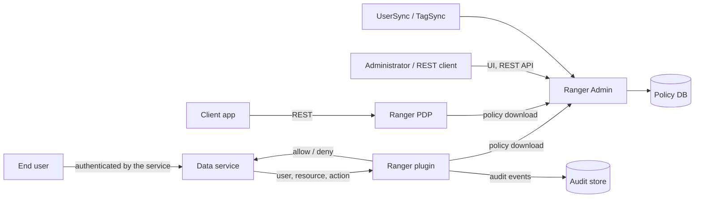

<!---
  Licensed to the Apache Software Foundation (ASF) under one or more
  contributor license agreements.  See the NOTICE file distributed with
  this work for additional information regarding copyright ownership.
  The ASF licenses this file to You under the Apache License, Version 2.0
  (the "License"); you may not use this file except in compliance with
  the License.  You may obtain a copy of the License at

      http://www.apache.org/licenses/LICENSE-2.0

  Unless required by applicable law or agreed to in writing, software
  distributed under the License is distributed on an "AS IS" BASIS,
  WITHOUT WARRANTIES OR CONDITIONS OF ANY KIND, either express or implied.
  See the License for the specific language governing permissions and
  limitations under the License.
-->

# Security

Apache Ranger is security software: it decides who may access data across many services. A bug in Ranger can
therefore expose data that the policies say should be protected. This page explains how to report a suspected
vulnerability privately, what happens after you report it, and what the project's threat model does and does
not promise. Published vulnerabilities and the releases that fix them are listed in
[Vulnerabilities found in Apache Ranger](cve-list.md).

## Reporting a vulnerability

Ranger follows the [ASF security process](https://www.apache.org/security/), as stated in the repository's
[`SECURITY.md`](https://github.com/apache/ranger/blob/master/SECURITY.md).

- Report suspected vulnerabilities **privately** by email to `security@apache.org`.
- Do **not** open a public GitHub issue, pull request, JIRA or mailing-list thread for a security report.
- Before reporting, read the [threat model](#threat-model) below: findings that fall outside it (for example,
  a compromised plugin host or a malicious top-level administrator) are closed as out of scope.

A useful report contains:

- the Ranger version (or commit) and component (Admin, a plugin, UserSync, TagSync, KMS, PDP, audit);
- the deployment configuration that matters (authentication mode, TLS on or off, audit destination);
- step-by-step reproduction, including the role of the caller (unauthenticated peer, authenticated user,
  auditor, delegated admin, plugin identity);
- which security property from the threat model is violated and the impact;
- a proof of concept if you have one.

### What happens next

The ASF security team acknowledges the report and forwards it to the Ranger PMC. The PMC triages the finding
against the threat model, works on a fix in private, requests a CVE id if the issue is confirmed, and includes
the fix in the next release. Once the release is available, the vulnerability is announced on
`oss-security@lists.openwall.com` and the Ranger mailing lists and added to the [CVE list](cve-list.md) with credit to the
reporter. Please keep the details confidential until then; the ASF guidance on
[vulnerability handling](https://www.apache.org/security/committers.html) describes the process in detail.

## Threat model

The project maintains a threat model in
[`THREAT_MODEL.md`](https://github.com/apache/ranger/blob/master/THREAT_MODEL.md). It was drafted by the ASF
security team, reviewed and answered by the Ranger PMC, and is the reference used to triage reports. The
sections below summarize it; the file is authoritative.

### What Ranger is, in security terms

Ranger is a distributed policy decision and enforcement system. The Ranger Admin server is the policy
*decision authority*: it stores policies and serves them to plugins. *Enforcement* happens inside each guarded
service, where a Ranger plugin (the policy enforcement point) evaluates locally cached policies for every
access request and returns allow or deny. The Ranger PDP server offers the same evaluation over a network API
for applications that cannot embed a plugin.

### Scope

In scope: Ranger Admin (web app and REST API), the PDP server and `authz-*` libraries, all plugins and plugin
shims, UserSync and TagSync, the audit framework and audit server, Ranger KMS, the authentication modules, and
also `ranger-examples` and `ranger-tools`.

Out of scope: build, packaging, install and migration tooling (`distro`, `agents-installer`, `migration-util`,
Docker build scripts) and the UserSync utilities `filesourceusersynctool` and `ldapconfigchecktool`; the guarded
services' own attack surface; authentication of end users (the host service does that); network transport
security as a Ranger guarantee; the internals of LDAP/AD, databases, audit stores and HSMs; and defense of a
plugin against a fully compromised host.

### Trust boundaries

| Boundary | Trust assumption |
|---|---|
| End user → data service → plugin | The service authenticates the user; Ranger trusts that identity. The resource name and action are attacker-influenced input. |
| Plugin / PDP ↔ Ranger Admin | Policy download requires an authenticated plugin identity (Kerberos, JWT, or header-based with a trusted proxy). Once authenticated, a plugin is fully trusted. |
| Admin UI / REST client ↔ Ranger Admin | The highest-value boundary: whoever can author policy can grant access to all guarded data. Endpoints are session-authenticated with role-based checks; auditors cannot write. |
| Client ↔ PDP | Authenticated; only configured trusted callers may assert another user's identity, groups or attributes. |
| UserSync/TagSync → Admin, Admin → DB, audit sink, key store | Identity and tag sources and the backing stores are trusted for their integrity. |

Caller roles distinguished by the model: security administrator (trusted for the instance), delegated
administrator (trusted only within the delegated scope), auditor (read-only), key admin (KMS only), deployed
plugin (fully trusted once authenticated), end user (untrusted), identity source (trusted).

### Adversaries considered

- An end user of a guarded service trying to reach data they are not authorized for, by manipulating resource
  names or actions or exploiting policy-evaluation edge cases.
- A network peer trying to reach the Admin REST API or policy download without proper authentication, or to
  impersonate Admin or a plugin.
- A low-privilege or delegated administrator trying to exceed their scope.
- Someone able to inject into UserSync/TagSync inputs to forge group or role membership.
- A KMS client trying to obtain key material it is not authorized for.

Not considered: an attacker with code execution on a plugin host, a malicious top-level administrator, direct
compromise of the database, audit store or key store, and side-channel or timing attacks.

### Properties Ranger claims

1. **Decisions reflect the authored policy.** A deny policy, or the absence of a grant, that nonetheless
   yields access is a CVE-class vulnerability.
2. **Policy is distributed faithfully.** Plugins apply the policy authored in Admin and fall back to the last
   cached policy when Admin is unreachable, rather than failing open.
3. **Administrative actions are access-controlled.** Authoring policy, managing users and roles and reading
   audits require an appropriately authorized identity; delegated admins stay within their scope.
4. **Access decisions are audited.** A non-administrator able to tamper with or forge audit records is a
   security finding.
5. **KMS releases keys only per policy.** Unauthorized key retrieval is a CVE-class vulnerability.
6. **Policy evaluation is bounded and thread-safe.** Super-linear cost in policy size or resource-string
   length is not a bug; a hang inside the host service may be.

### Properties Ranger does not claim

- No authentication of end users: Ranger authorizes an already-authenticated principal.
- No protection against a malicious top-level administrator.
- No defense of a plugin against its own compromised host.
- No transport security by default: plain HTTP is the shipped default; TLS is supported and recommended.
- No guarantee about the guarded service's own attack surface.

Important consequences ("false friends"):

- A Ranger deny is not a sandbox: a code path in the guarded service that does not consult the plugin is not
  protected.
- Cached policy means revocation is not instantaneous; the delay is the policy poll interval, by design.
- Audit is a record, not a control.
- Tag-based policy is only as trustworthy as the tag source (Atlas/TagSync).

### Defaults and known non-findings

- When Ranger is the enforcer and no policy matches, the result is **deny**, except in HDFS, where evaluation
  falls through to the native HDFS ACLs.
- If a plugin can evaluate neither fresh nor cached policy it denies (again except HDFS).
- The installer requires an explicit, complexity-checked admin password; a default or seeded password is
  **not** a supported posture, so a report about it is not waved off.
- Reports that plugins run with the host service's privileges, that plugins serve stale policy while Admin is
  down, that port 6080 is plain HTTP by default, or that lookup endpoints return user/group/role names to any
  authenticated user (needed for UI typeahead) are documented non-findings.
- Resource-name canonicalization between a service and the policy engine is a shared responsibility with the
  host service.

### Triage dispositions

Every report is routed to one of: `VALID`, `VALID-HARDENING`, `OUT-OF-MODEL` (trusted input, adversary not in
scope, unsupported component, non-default build), `BY-DESIGN` (a disclaimed property), `KNOWN-NON-FINDING`, or
`MODEL-GAP`, which triggers a revision of the threat model itself.

## Operator responsibilities

The threat model's guarantees hold only if the deployment keeps its assumptions true. As an operator you
should:

- expose the Admin REST API and policy download endpoints only to trusted networks, and deploy plugins only on
  administered cluster nodes;
- enable TLS on UI↔Admin and plugin↔Admin channels, and authenticate plugins (Kerberos or JWT);
- configure and verify the upstream authentication layer (Kerberos, LDAP/AD) that establishes user identity;
- set strong credentials for the built-in accounts (`admin`, `rangerusersync`, `rangertagsync`, `keyadmin`)
  and rotate them;
- confirm the no-match behavior (deny, or fall-through to native ACLs for HDFS) matches your intent for each
  service;
- secure the policy database, audit stores and KMS key store independently;
- scope delegated administrators deliberately;
- size the policy poll interval to the sensitivity of the data, since revocation takes effect on the next
  successful pull;
- keep audit enabled if you rely on it for compliance.

## Staying informed

- Subscribe to `dev@ranger.apache.org` and `user@ranger.apache.org` (see [Community](community.md)) to receive
  release and vulnerability announcements.
- Check the [CVE list](cve-list.md) and the [release notes](../release-notes/index.md) before and after upgrading.
- Security fixes are delivered in releases, so plan to upgrade when a fix affecting your deployment is
  announced.
